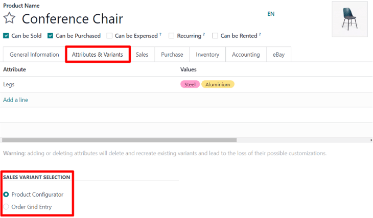

# Product variants on quotations and sales orders

Before getting into detail about how to use product variants on quotations and sales orders, it's
recommended to learn about [Biến thể sản phẩm](applications/sales/sales/products_prices/products/variants.md) in Odoo.

Once familiarized with the basics surrounding product variants, the following covers how product
variants can be added to quotations and sales orders using the *product configurator* or *order grid
entry*.

#### NOTE
It should be noted that the setting is titled, *Variant Grid Entry* on the *Sales* app settings
page, and titled, *Order Grid Entry* on product forms. So, be sure to keep that in mind.

## Cài đặt

When working with product variants, Odoo uses the product configurator, by default. To add the
variant grid entry option, that feature **must** be enabled in the Odoo *Sales* application. The
variant grid entry option provides a pop-up window on the quotation/sales order to simplify the
variant selection process.

To enable that setting, go to Sales app ‣ Configuration ‣ Settings, and scroll
to the Product Catalog section. Then, check the box next to the Variant Grid
Entry option, and click Save.

#### NOTE
Of course, the Variants feature **must** also be activated, in order to use product
variants on quotations and sales orders.

## Cấu hình sản phẩm

Once the Variant Grid Entry setting is enabled, both options (*Product Configurator* and
*Order Grid Entry*) become available on every product form.

To configure a product form to use either a product configurator or variant grid entry, start by
navigating to Sales app ‣ Products ‣ Products to view all the products in the
database.

Then, select the desired product to configure, or click New, to create a new product
from scratch. Once on the product form, click into the Attributes & Variants tab, where
product variants can be viewed, modified, and added.

At the bottom of the Attributes & Variants tab, there is a Sales Variant
Selection section with two options: Product Configurator and Order Grid
Entry.

#### NOTE
It should be noted that these options **only** appear if at least two values of an attribute have
been added to the record.

These options determine which method is used when adding product variants to quotations or sales
orders.

The Product Configurator provides a pop-up window that neatly displays all the available
product variants for that particular product when it's added to a quotation. However, only one
variant can be selected/added at a time.

The Order Grid Entry provides the same information as the Product
Configurator in a table layout, allowing the user to select larger numbers of unique product
variants, and add them to a quotation/sales order, in a single view.

## Trình cấu hình sản phẩm

The product configurator feature appears as a Configure pop-up window, as soon as a
product with (at least two) variants is added to a quotation or sales order, but **only** if the
Product Configurator option is selected on its product form.

#### NOTE
This Configure pop-up window also appears if the Order Grid Entry setting
is **not** activated, as it is the default option Odoo uses when dealing with product variants on
quotations and/or sales orders.

The Product Configurator option lets salespeople choose exactly which product variant to
add to the quotation or sales order using a format similar to online shopping.

## Order grid entry

The order grid entry feature appears as a Choose Product Variants pop-up window, as soon
as a product with (at least two) variants is added to a quotation or sales order, but **only** if
the Order Grid Entry option is selected on its product form.

The Choose Product Variants pop-up window features all the variant options for that
particular product. From this pop-up window, the salesperson can designate how many of each variant
they'd like to add to the quotation/sales order at once.

When all the desired quantities and variants have been selected, the salesperson simply clicks
Confirm, and those orders are instantly added to the quotation/sales order in the
Order Lines tab.

#### SEE ALSO
[Biến thể sản phẩm](applications/sales/sales/products_prices/products/variants.md)
