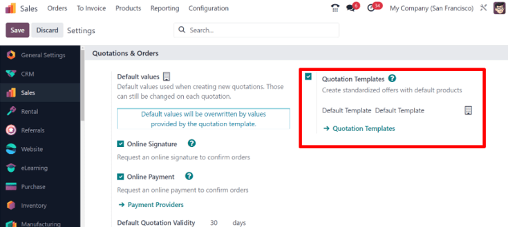
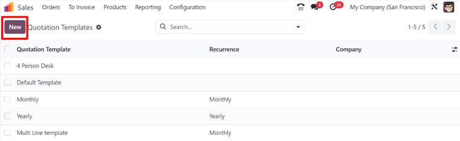
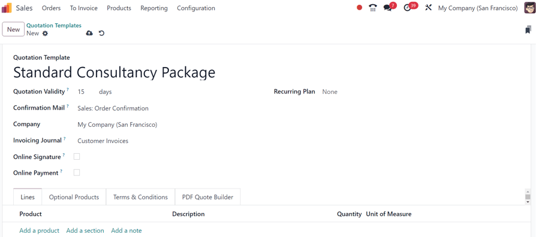
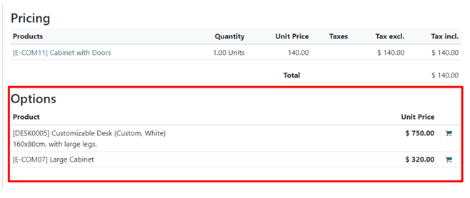
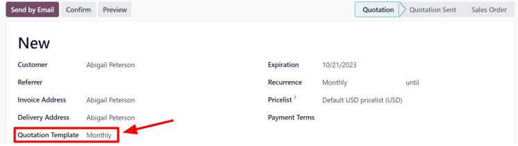
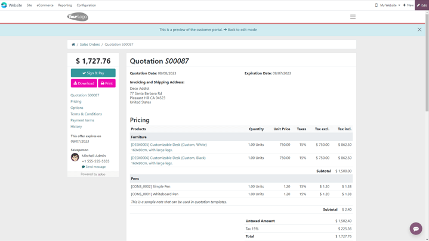
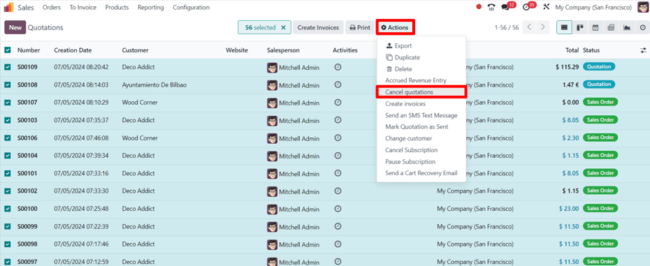

# Mẫu báo giá

In Odoo *Sales*, salespeople have the ability to create reusable quotation templates for common
products or services that the business offers.

By using these templates, quotations can be tailored and sent to customers at a much faster pace,
without having to create new quotations from scratch every time a sales negotiation occurs.

## Cấu hình

Begin by activating the setting in Sales app ‣ Configuration ‣ Settings, and
scroll to the Quotations & Orders heading.

In that section, check the box beside the Quotation Templates option. Doing so reveals a
new Default Template field, in which a default quotation template can be chosen from a
drop-down menu.

Also, upon activating the Quotation Template feature, an internal ➡️
Quotation Templates link appears beneath the Default Template field.

Clicking that link reveals the Quotation Templates page, from which templates can be
created, viewed, and edited.

Before leaving the Settings page, don't forget to click the Save button to
save all changes made during the session.

## Create quotation templates

Click the Quotation Templates link on the Settings page, or navigate to
Sales app ‣ Configuration ‣ Quotation Templates. Both options reveal the
Quotation Templates page, where quotation templates can be created, viewed, and edited.

To create a new quotation template, click the New button, located in the upper-left
corner. Doing so reveals a blank quotation template form that can be customized in a number of ways.

Start by entering a name for the template in the Quotation Template field.

Then, in the Quotation Validity field, designate how many days the quotation template
will remain valid for, or leave the field on the default `0` to keep the template valid
indefinitely.

Next, in the Confirmation Mail field, click the blank field to reveal a drop-down menu.
From the drop-down menu, select a pre-configured email template to be sent to customers upon
confirmation of an order.

If working in a multi-company environment, use the Company field to designate to which
company this quotation template applies.

If a journal is set in the Invoicing Journal field, all sales orders with this template
will invoice in that specified journal. If no journal is set in this field, the sales journal with
the lowest sequence is used.

If the Online Signature and/or Online Payment features are activated in the
Settings (Sales app ‣ Configuration ‣ Settings), those options are
available on quotation template forms.

Check the box beside Online Signature to request an online signature from the customer
to confirm an order.

Check the box beside Online Payment to request an online payment from the customer to
confirm an order. When Online Payment is checked, a new percentage field appears, in
which a specific percentage of payment can be entered.

Both options, Online Signature and Online Payment can be enabled
simultaneously, in which case the customer must provide **both** a signature **and** a payment to
confirm an order.

In the Recurring Plan field, choose from a variety of pre-configured amounts of time
(e.g. Monthly, Quarterly, etc.) to designate how often this quotation
template should occur.

#### NOTE
The Recurring Plan field **only** applies to subscription plans. For more
information, check out the documentation on [Gói cước đăng ký](../../subscriptions/plans.md).

### Lines tab

In the Lines tab, products can be added to the quotation template by clicking
Add a product, organized by clicking Add a section (and dragging/dropping
section headers), and further explained with discretionary information (such as warranty details,
terms, etc.) by clicking Add a note.

To add a product to a quotation template, click Add a product in the Lines
tab of a quotation template form. Doing so reveals a blank field in the Product column.

When clicked, a drop-down menu with existing products in the database appear. Select the desired
product from the drop-down menu to add it to the quotation template.

If the desired product isn't readily visible, type the name of the desired product in the
Product field, and the option appears in the drop-down menu. Products can also be found
by clicking Search More... from the drop-down menu.

#### NOTE
When a product is added to a quotation template, the default Quantity is `1`, but
that can be edited at any time.

Then, drag-and-drop the product to the desired position, via the six squares icon,
located to the left of each line item.

To add a *section*, which serves as a header to organize the lines of a sales order, click
Add a section in the Lines tab. When clicked, a blank field appears, in
which the desired name of the section can be typed. When the name has been entered, click away to
secure the section name.

Then, drag-and-drop the section name to the desired position, via the six squares icon,
located to the left of each line item.

To add a note, which would appear as a piece of text for the customer on the quotation, click
Add a note in the Lines tab. When clicked, a blank field appears, in which
the desired note can be typed. When the note has been entered, click away to secure the note.

Then, drag-and-drop the note to the desired position, via the six squares icon.

To delete any line item from the Lines tab (product, section, and/or note), click the
🗑️ (trash can) icon on the far-right side of the line.

### Optional Products tab

The use of *optional products* is a marketing strategy that involves the cross-selling of products
along with a core product. The aim is to offer useful and related products to customers, which may
result in an increased sale.

For instance, if a customer wants to buy a car, they have the choice to order massaging seats, as
well, or ignore the offer and simply buy the car. Presenting the choice to purchase optional
products enhances the customer experience.

Optional products appear as a section on the bottom of sales orders and eCommerce pages. Customers
can immediately add them to their online sales orders themselves, if desired.

In the Optional Products tab, Add a line for each cross-selling product
related to the original items in the Lines tab, if applicable. The products added here
ideally complement the original offering as added value for the prospective buyer.

Clicking Add a line reveals a blank field in the Product column.

When clicked, a drop-down menu with products from the database appear. Select the desired product
from the drop-down menu to add it as an optional product to the quotation template.

To delete any line item from the Optional Products tab, click the 🗑️ (trash
can) icon.

#### NOTE
Optional products are **not** required to create a quotation template.

### Terms & Conditions tab

The Terms & Conditions tab provides the opportunity to add terms and conditions to the
quotation template. To add terms and conditions, simply type (or copy/paste) the desired terms and
conditions in this tab.

#### SEE ALSO
[Default terms and conditions (T&C)](../../../finance/accounting/customer_invoices/terms_conditions.md)

#### NOTE
Terms and conditions are **not** required to create a quotation template.

### PDF Quote Builder tab

The PDF Quote Builder tab provides options to compose an attractive quotation, with more
information and visually-pleasing elements, to highlight products and/or services.

To upload customer Header pages and Footer pages, click the ✏️
(pencil) icon to the right of the respective pages. Click the 🗑️ (trash) icon to delete
an uploaded PDF.

#### SEE ALSO
[PDF quote builder](pdf_quote_builder.md)

## Use quotation templates

When creating a quotation (Sales app ‣ New), choose a pre-configured template in
the Quotation Template field.

To view what the customer will see, click the Preview button at the top of the page to
see how the quotation template appears on the front-end of the website through Odoo's customer
portal.

When all blocks and customizations are complete, click the Save button to put those
configurations into place.

There is also a blue banner at the top of the quotation template design with a link to quickly
return Back to edit mode. When clicked, Odoo returns to the quotation form in the
back-end of the *Sales* application.

## Mass cancel quotations/sales orders

Cancel multiple quotations (or sales orders) by navigating to the Sales app ‣
Orders ‣ Quotations dashboard, landing, by default, in the list view. Then, on the left side of
the table, tick the preferred checkboxes for removal.

Then, with the desired quotations (or sales orders) selected from the list view on the
Quotations page, click the <i class="fa fa-cog"></i> Actions button to reveal a
drop-down menu.

From this drop-down menu, select Cancel quotations.

#### NOTE
This action can be performed for quotations in *any* stage, even if it is confirmed as a sales
order.

Upon selecting the Cancel quotations option, a Cancel quotations
confirmation pop-up window appears. To complete the cancellation, click the Cancel
quotations button.

#### NOTE
An error pop-up message appears when attempting to cancel an order for an ongoing subscription
that has an invoice.

#### SEE ALSO
- [Online signatures for order confirmations](get_signature_to_validate.md)
- [Online payment order confirmation](get_paid_to_validate.md)
