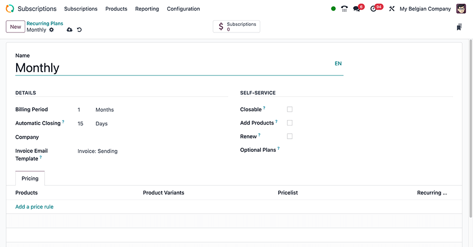
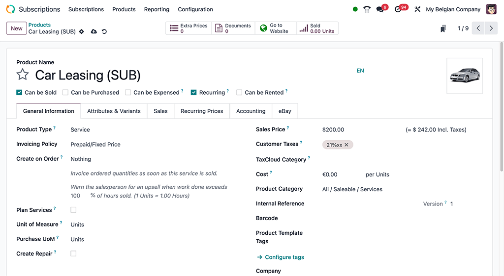
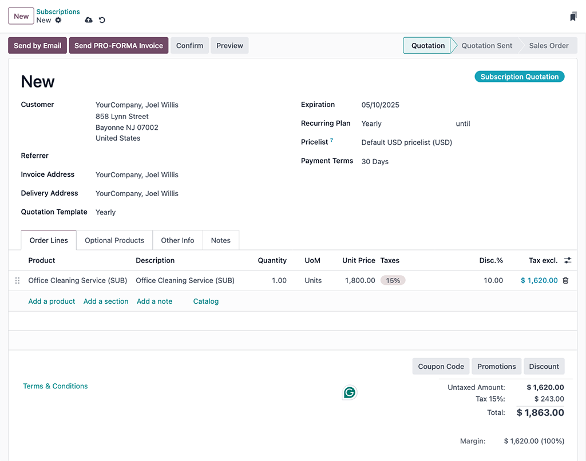

# Đăng ký

The Odoo **Subscriptions** app is designed to manage recurring revenue through subscription-based
products or services. It supports automated invoicing, renewal management, and customer lifecycle
tracking.

Subscriptions can be created manually or automatically through online sales, with varying options
for recurring billing. The app integrates with other Odoo modules such as **Invoicing**, **CRM**,
**Sales**, and **Helpdesk** to support end-to-end subscription workflows.

#### SEE ALSO
- [Odoo Tutorials: Subscriptions](https://www.odoo.com/slides/subscription-20)

## Set up recurring plans

To get started with subscription products in Odoo, *recurring plans* (previously known as
*recurrence periods*) must first be configured.

Recurring plans are the time windows in which subscriptions are active before they renew again.
While a subscription is active, customers receive products or services, and may also have access to
additional benefits such as support desk triage. In terms of payment, these recurring plans
designate how often the customer is charged in order to maintain the benefits of their subscription.

To configure recurring plans, go to Subscriptions app ‣ Configuration ‣
Recurring Plans.

By default, the **Subscriptions** app includes a number of common recurring plans already available,
such as Monthly and Yearly.

Create a new recurring plan by clicking New on the Recurring Plans
dashboard, to reveal a blank form where the plan Name, DETAILS,
SELF-SERVICE and Pricing field values are specified.

#### IMPORTANT
The `Days` unit of measure *cannot* be used as a Billing Period for subscription
products. The daily recurrence period in Odoo is designated for rentals, and **cannot** be added
to subscription-based sales orders.

This limitation is there to avoid sales orders that would generate daily invoices.

### DETAILS section

After giving the recurring plan a suitable Name (e.g. `Monthly`, `Bi-weekly`,
`Quarterly`, etc.), proceed to the form's DETAILS section to fill out the following
configuration fields:

- Billing Period: determines the recurrence period of the recurring plan. Set the
  numerical value in the text field and contextualize the quantity with a unit of time in the
  corresponding drop-down menu, in Weeks, Months, or Years.
- Automatic Closing: a numerical value, in days, where the subscription is set to close
  automatically if payment is not made.
- Company: optional assignment, if the database has [Multi-company](applications/general/multi_company.md) functionality enabled. Assigning this value will make the recurring
  plan available for that company's location, specifically.
- Invoice Email Template: assigns a specific email template to be used in subscriptions
  invoicing communications. The default assignment here is `Invoice: Sending` which contains various
  dynamic fields that autopopulate specific variables across the Subject field and
  Content tab, such as the customer's name, invoice number, total amount invoiced, etc.

### SELF-SERVICE section

The following optional fields enable customers to take administrative actions on their own
subscriptions. Enabling any of these options may decrease customer service request volume or
increase customer lifetime value (LTV).

- Closable: checking this box will give customers the power to close their own
  subscriptions. Consider enabling this option to reduce customer service requests and improve the
  overall customer experience; customers that can manage their own subscriptions in this way helps
  offload tedious tasks for sales and support teams, and reduces the likelihood of negative reviews.
- Add Products: allows customers to add new products or edit existing product quantities
  to their recurring sales orders, thereby enabling customer-driven upselling. When enabled,
  [Upsell quotations](applications/sales/subscriptions/upselling.md) are generated in Odoo whenever a customer
  performs a quantitative adjustment on their sales order product lines.
- Renew: enabling this allows customers to manually create a [Renewal quotation](applications/sales/subscriptions/renewals.md) for their subscription.
- Optional Plans: adding values here from the drop-down field menu enables customers to
  switch their subscription plans, in which case a new subscription quotation or renewal quote is
  created to accommodate the change request.

### Pricing tab

Make product-specific pricing adjustments, as part of the recurring plan, by adding them to the
Pricing tab order lines. Sequentially add the Products, along with any
respective Product Variants, and then assign a Pricelist (if available) and
a Recurring Price.

#### NOTE
Price rules that are added here take precedent over the default pricing information on the
subscription product's form. This is meant to accommodate deals, discounts, and similar pricing
adjustment strategies that would incentivize customers to purchase the recurring plan.

## Product form configuration

With recurring plans set up, create a subscription product by navigating to
Subscriptions app ‣ Products ‣ Products, and click either an existing product
to edit, or make a new one by clicking New to open up the subscription product's form.

#### NOTE
By default, the Recurring option is already enabled, prompting Odoo to recognize it
as a subscription product. Be sure to leave the Recurring and Can be Sold
options enabled.

On the product form, configure the following items in the General Information tab so the
subscription product will function correctly:

- Product type: this value is typically set to a Service, however other
  product types may be used depending on the purpose of the subscription (e.g., physical product box
  subscriptions, eLearning course, etc.).
- [Invoicing policy](applications/sales/sales/invoicing/invoicing_policy.md): set this value to when the customer
  should be charged for their subscription.
- Unit of Measure: how the product should be counted in Odoo, for stock purposes. For
  most subscriptions, the  will be Units.
- Sales Price: enter the recurring cost of the subscription that the customer will pay
  per recurrence period.

Optionally set up information on the [Attributes & Variants](applications/sales/sales/products_prices/products/variants.md) tab if the subscription contains multiple choices for
customers (i.e. food delivery, tailored fashion boxes, etc.).

In the Recurring Prices tab, clarify the pricing options for the subscription. For each
option available, click Add a price rule to add a new row.

Last, if the subscription is meant to be purchased on the **eCommerce** website, click the
<i class="fa fa-globe"></i> Go To Website smart button and in the product page header, click
the gray slider from Unpublished to the green Published status.

## Create a subscriptions quotation

Manually create a new customer subscription by navigating to either the Sales or
Subscriptions app dashboards, and then clicking New.

#### NOTE
Products that have been marked as Recurring on their product forms, and are also sold
on the **eCommerce** website will *automatically* create and confirm subscription quotations in
the backend of Odoo.

#### IMPORTANT
Sales orders with a defined recurring plan automatically become subscriptions.

On the quotation form, fill in the necessary fields such as Customer and
Recurring Plan, as well as the Order Lines tab.

Optionally, specify a:

- [Quotation Template](applications/sales/sales/send_quotations/quote_template.md), if one is readily available to
  help populate the form fields.
- Expiration date, to indicate when the subscription offer is no longer valid.
- [Pricelist](applications/sales/sales/products_prices/prices/pricing.md#sales-product-prices-pricelist), if one is available and appropriate to use
  (i.e., summer sale discount, VIP customer, etc.).
- Payment Terms, to set a specified time window for when the subscription must be paid.
  This is not to be confused for when the quotation is *confirmed* and becomes a sales order, to
  where, payment may then be obtained immediately or within a certain amount of days, weeks, months,
  etc.

## Xác nhận

Send the quotation to the customer for confirmation by clicking on Send By Email, or
confirm it immediately by clicking on Confirm.

If an Online signature or Online payment is required to confirm the
quotation, set the checkboxes next to either (or both) of these labels in the Other Info
tab, under the :SALES section.

* [Subscriptions in the eCommerce shop](applications/sales/subscriptions/ecommerce.md)
* [Gói cước đăng ký](applications/sales/subscriptions/plans.md)
* [Đăng ký bán thêm](applications/sales/subscriptions/upselling.md)
* [Gia hạn đăng ký](applications/sales/subscriptions/renewals.md)
* [Đóng đăng ký](applications/sales/subscriptions/closing.md)
* [Quy tắc tự động hoá](applications/sales/subscriptions/automatic_alerts.md)
* [Tác vụ đã lên lịch](applications/sales/subscriptions/scheduled_actions.md)
* [Báo cáo đăng ký](applications/sales/subscriptions/reports.md)
* [Nhà cung cấp dịch vụ thanh toán](applications/sales/subscriptions/payment_providers.md)
  * [Chuyển khoản ngân hàng](applications/sales/subscriptions/payment_providers/wire_transfer.md)
  * [Ghi nợ trực tiếp SEPA](applications/sales/subscriptions/payment_providers/sdd.md)
