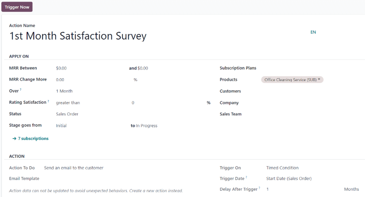

# Quy tắc tự động hoá

With subscriptions up-and-running, it is important to stay up-to-date with customers. It is\
efficient to use automation to avoid having to manually go through the list of subscribers to see\
how things are going. That is where Odoo's _automation rules_ feature comes into play.

The Odoo _Subscriptions_ application allows users to set up automatic emails, create tasks for\
salespeople, and even send satisfaction surveys for subscribers to evaluate their experience.

## Tạo quy tắc tự động

To create an automated rule, start by navigating to Subscriptions app ‣\
Configuration ‣ Automation Rules. This is where all the automation rules for subscriptions can be\
found.

The Automation Rules page shows each rule's Name, Action To Do,\
what the automated rule will Trigger On, and the Company to which the rule\
applies.

To view or modify any existing automation rule, simply click the desired rule from this page.

#### NOTE

When modifying an existing automation rule, Odoo "grays-out" the Action section of\
the form, and provides the following warning: _Action data can not be updated to avoid unexpected_\
_behaviors. Create a new action instead._

To create a new automation rule, click New.

Clicking New reveals a blank Automation Rules form with numerous fields to\
configure.

### Automation rule form fields

* Action Name: title of the automated action rule.

#### Apply On section

The Apply On section dictates which subscription orders/customers this automated action\
applies to.

* MRR Between: designate a range of monthly recurring revenue to target.
* MRR Change More: designate a change of monthly recurring revenue to target, in either\
  percentage or unit of currency.
* Over: choose a period of time over which the designated KPIs (Key Performance\
  Indicators) are calculated.
* Rating Satisfaction: designate satisfaction as greater than or\
  less than a percentage.
* Status: select the status of the subscriptions to be included in this automation rule.\
  The options are: Quotation, Quotation Sent, Sales Order, and\
  Cancelled.
* Stage goes from: designate when the automation rule should be activated using two\
  fields that represent two different stages of the subscription.
* Subscription Plans: choose specific subscription plans to target with the automation\
  rule.
* Products: select specific product(s) to target with the automation rule.
* Customers: select specific customer(s) to target with the automation rule.
* Company: in a multi-company environment, select a specific company's subscription data\
  to target with the automation rule.
* Sales Team: select the data of specific sales team(s) to target with the automation\
  rule.

#### NOTE

If any field is left blank, the rule applies to every subscription without that specific\
designation.

#### Action section

The Action section dictates what action occurs when an automated rule is triggered.

In the Action To Do field, choose the action that will occur once the automated rule is\
triggered. When clicked, the following options become available on a drop-down menu:

* Create next activity: creates the next activity to occur, which is configured in the\
  Activity section that appears at the bottom of the automation rule form.
* Send an email to the customer: sends an email to the customer(s) who fit the specified\
  criteria of the automation rule.
* Send an SMS Text Message to the customer: sends an SMS message to the customer(s) who\
  fit the specified criteria of the automation rule.
* Set Contract Health value: set the health value of the subscription contract.

If Send an email to the customer is selected in the Action To Do field, the\
following field appears:

* Email Template: create (and edit) a new email template _or_ select from a list of\
  pre-configured email templates to send to the customer(s).

If Send an SMS Text Message to the customer is selected in the Action To Do\
field, the following field appears:

* SMS Template: create (and edit) a new SMS template _or_ select from a list of\
  pre-configured SMS templates to send to the customer(s).

If Set Contract Health value is selected in the Action To Do field, the\
following field appears:

* Health: designate the health of the subscription by choosing one of the following\
  options: Neutral, Good, or Bad.

In the Trigger On field, decide whether the automated rule should be triggered on a\
Modification or Timed Condition.

#### NOTE

A Trigger Now button appears at the top of the automation rule form _only_ when a\
trigger has been configured for the rule.

#### WARNING

When the Trigger Now button is clicked, Odoo will trigger the action on _all_ linked\
subscriptions, regardless of possible timed conditions.

#### NOTE

Sending a SMS text message in Odoo requires In-App Purchase (IAP) credit or tokens. For more\
information on , visit [Mua hàng trong ứng dụng (IAP)](applications/essentials/in_app_purchase.md).\
For more information on sending SMS messages, visit[SMS Marketing](applications/marketing/sms_marketing.md).

If Timed Condition is selected in the Trigger On field, the following fields\
appear:

* Trigger Date: represents when the condition should be triggered. If left blank, the\
  action is created upon subscription creation _and_ updates.
* Delay After Trigger: select a delayed amount of time (Minutes,\
  Hours, Days, or Months) for Odoo to wait before triggering the\
  configured action. If a negative number is entered, the "delay" will occur _before_ the\
  Trigger Date.

**Activity section**

If Create next activity is selected in the Action To Do field, an\
Activity section appears at the bottom of the Automation Rules form.

* Activity Type: select an pre-configured activity type from the drop-down menu.
* Title: enter a custom title for the chosen activity.
* Note: leave a note for the employee to whom the activity is assigned.
* Due Date In: enter an amount of days within which the activity should be completed.
* Assign To: choose to assign the specified activity to either: Subscription\
  Salesperson, Sales Team Leader, or Specific Users.

#### NOTE

If Specific Users is selected as the Assign To option, a new\
Specific Users field appears beneath it, where a specific employee(s) can be chosen\
as the assignee(s) for the configured activity.

#### SEE ALSO

* [Đăng ký](applications/sales/subscriptions.md)
* [Gói cước đăng ký](applications/sales/subscriptions/plans.md)
* [Mua hàng trong ứng dụng (IAP)](applications/essentials/in_app_purchase.md)
