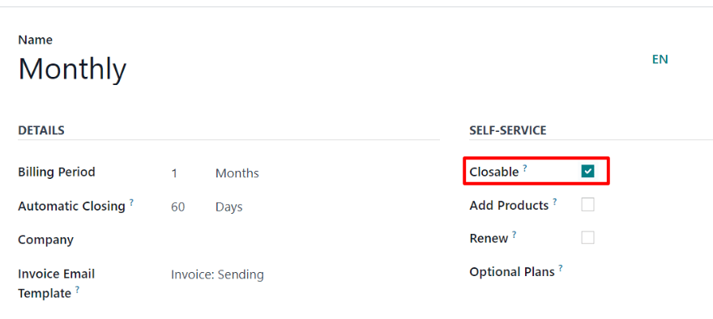
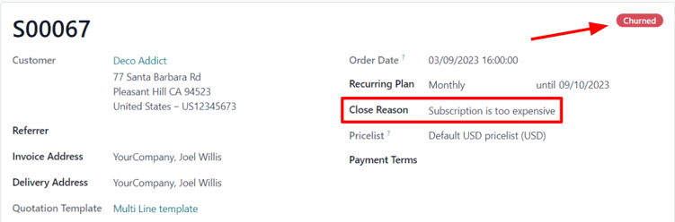
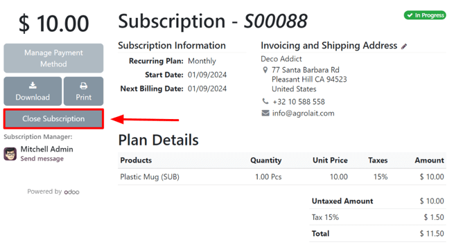

# Đóng đăng ký

Odoo *Subscriptions* provides flexibility for businesses to decide whether customers can self-manage
their subscriptions, or restrict that ability entirely.

## Cấu hình

Start by navigating to Subscriptions app ‣ Configuration ‣ Recurring Plans.
From there, either create a new plan by clicking New or select an existing one to modify
it.

Once on the Recurring Plans form, enable the Closable option, in the
Self-Service section, to allow customers to close their own subscriptions using the
customer portal.

#### SEE ALSO
[Configure recurring plans](plans.md)

## Close a subscription

### Administrator view

After a quotation for a subscription product has been confirmed, it becomes a sales order, and the
subscription status changes to In Progress.

At that point, the ability to close the subscription becomes available, via the Close
button at the top of the subscription order, near the row that contains In Progress and
other stages. This option is also available after the order has been invoiced and the payment has
been registered.

Clicking the Close button prompts a Close Reason pop-up window to appear,
allowing administrators to input the reason for closing the subscription, or choose from the
drop-down menu of options in the Reason field.

When the desired Reason is entered, click the Submit button.

Clicking Submit on the Close Reason pop-up window updates the subscription
sales order to show Churned status tag, along with the specified Close
Reason.

That same close reason can be found in the *Chatter* of the sales order, as well.

### Customer view

#### NOTE
As an administrator, the ability to visualize what customers see when managing their
subscriptions is accessible via the Preview button, located at the top of the
subscription sales order.

From the customer's point of view, in the customer portal, the Close Subscription button
is located on the left side of the sales order.

When the customer clicks the Close Subscription button, a Close Subscription
pop-up window appears, in which the customer has to choose from a select list of reasons why they
are choosing to close the subscription.

#### NOTE
Customers can *only* chose a pre-configured reason why the subscription is being closed. They can
*not* enter a custom reason from the customer portal. These selections can be adjusted by
navigating to Subscriptions ‣ Configuration ‣ Close Reasons.

Once the customer has chosen a close reason, they would click the Submit button on the
pop-up window.

Upon closure, the subscription order in the customer portal is tagged as Closed.

In addition, the specified Close Reason appears on the subscription order in the
*Subscriptions* app in the backend (Administrator's view).

#### SEE ALSO
- [Đăng ký](./)
- [Gói cước đăng ký](plans.md)
