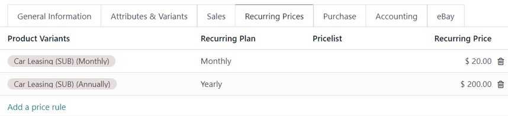
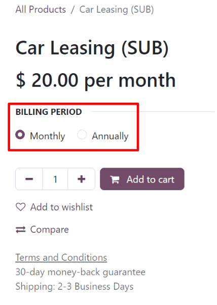

# Subscriptions in the eCommerce shop

Subscription products can be sold in the Odoo *eCommerce* shop just like regular sales products.

However, by default, the eCommerce product page **only** displays the shortest recurrence period
listed in the Recurring Prices tab of the product form.

For example, if a subscription product has *monthly* and *annaul* recurrence periods configured,
then *only* the monthly price appears on the eCommerce page for that product, by default.

To add more recurrence periods to the eCommerce product page, create a *product variant* for each
recurrence period.

#### SEE ALSO
- [Configure subscription products](../subscriptions.md)
- [Product variants](../sales/products_prices/products/variants.md)

## Create recurrence periods as product variants

To set up each recurrence period as a product variant, go to Subscriptions app ‣
Products ‣ Products, and select a product. In the Attributes & Variants tab, click
Add a line.

Then proceed to create an Attribute called `Billing Period` (or something similar), by
typing in the name, and clicking Create from the mini drop-down menu that appears. This
attribute name appears as option heading on the product page of the eCommerce shop.

Next, create Values that correspond to the recurrence periods that are configured in
the Recurring Prices tab of the product form.

To do that, type in the name of the recurrence period in the Values column, on the same
Attribute line, in the Attributes & Variants tab. Then, click
Create from the mini drop-down menu that appears.

These value names appear as selectable options on the product page of the eCommerce shop.

With those configurations in place and saved, a Product Variants column appears in the
Recurring Prices tab. Proceed to assign the different Product Variants to
their corresponding recurrence Period and Price.

After following those aforementioned steps, the product variants are available for selection on the
eCommerce product page.

