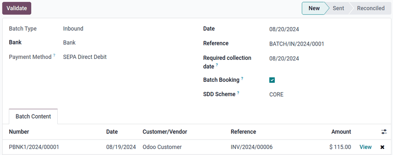

# Ghi nợ trực tiếp SEPA

*SEPA*, or Single Euro Payments Area, is a payment-integration initiative of the European Union for
simplifying bank transfers denominated in euros.

*SEPA Direct Debit (|sdd|)* is a payment provider that allows future payments to be collected from
customers' bank accounts by signing a mandate. This allows recurring payments to be automatically
gathered and processed using .

#### IMPORTANT
To create [direct debit mandates](#subscriptions-sepa-sdd-payment), the **Accounting** app
**must** be installed.

## Cấu hình

#### IMPORTANT
Before using , the database must be configured to allow the use of Euros on sales orders. To
do so, a [pricelist](../../point_of_sale/pricing/pricelists.md) must be created for Euros.

This can be done using the **Sales** or **Point of Sales** apps. From either app, navigate to
Configuration ‣ Settings.

In the Pricing section, underneath the Pricelists feature, click
<i class="fa fa-arrow-right"></i> Pricelists. Then, click the New button to open a
new pricelist form. Add a name for the pricelist in the top field, then set the drop-down menu
next to Currency to EUR.

To use the wire transfer payment method, first ensure the  payment method is enabled. To do so,
navigate to Accounting app ‣ Configuration ‣ Settings, scroll to the
Customer Payments section, and tick the SEPA Direct Deposit (SDD) checkbox.
Then, set a creditor identifier number in the field labeled, Creditor Identifier. Then,
click Save.

Next, enable SEPA Direct Debit from the *Payment Providers* page in either the **Accounting**,
**Website**, or **Sales** apps.

For example, navigate to Accounting app ‣ Configuration ‣ Payment Providers,
then click the SEPA Direct Debit card.

Next, set the State to Enabled to enable . Use the drop-down menus next
to the Company and Website fields to set where  can be used.

The options in the Configuration tab can be configured to customize how  is used.
Optionally, tick the checkbox next to Enable QR Codes to enable the use of QR codes when
paying by , if desired.

Use the drop-down menu next to the Communication field to select the communication type
used on sales orders. Choose Based on Document Reference to use the sales order (or
invoice number), or Based on Customer ID to use the customer identifier. With either
method selected, communication is given to the customer, once they choose the  payment method.

The configuration options listed under the Availability section are used to set payment
restrictions, and are optional. Use the Maximum Amount field to set a maximum payment
value, and the Countries field to restrict payment from any particular countries, if
desired.

#### IMPORTANT
The Currencies field should be left with the default EUR tag to ensure
 is only accessible when customers pay with Euros.

The Payment Journal field in the Payment followup section can be used to
select the journal in which the successful transactions are posted.

In the Messages tab, the Pending Message field can be used to add a message
that is displayed, if the order remains pending after the payment is processed. By default,
this field contains the message: Please make an unique payment transfer to
confirm the SEPA mandate.

Once all necessary configuration settings are complete, the <i class="fa fa-eye-slash"></i>
Unpublished smart button, located at the top of the page automatically changes to
<i class="fa fa-globe"></i> Published to show the  payment option is now visible to customers.
Only keep the payment method published if payments are ready to be received.

#### NOTE
The  configuration menu can also be accessed by navigating to Settings app
‣ Website, and in the Shop - Payment section, click the <i class="fa fa-arrow-right"></i>
View other providers button. Then, click the  card. Alternatively, navigate to
Website app ‣ Configuration ‣ Settings to access the same button.

### Chế độ kiểm tử

The  payment method can be tested before it is accessed by customers. First, ensure the test
creditor identifier is [configured](#subscriptions-sepa-sdd-configuration) before continuing.

#### WARNING
It is recommended to use the Test Mode setting on a duplicate (or test) database to
avoid potential issues with invoice numbering.

Next, select the Test Mode option in the State field on the form. Upon
selecting Test Mode, an orange Test mode banner appears in the upper-right
corner of the form.

#### NOTE
By default, the payment provider remains Unpublished in Test Mode, so it
is not visible to visitors.

Navigate to Sales app ‣ Orders ‣ Quotations, and click the New
button to create a new sales order.

Select a Customer. Select any pay period in the drop-down menu next to
Recurring Plan and select the pricelist using EUR in the drop-down menu next to
Pricelist.

Finally, select a subscription product in the Order Lines tab of the sales order.

Next, confirm the sales order by clicking the Confirm button, then click the
Preview button to open a preview of the customer invoice. Scroll down to the
Anticipate payment section to find the SEPA Direct Debit payment method.

Next, enter a test IBAN number, such as `GB33BUKB20201555555555`, and click Pay. Return
to the sales order in the **Sales** app, and confirm the In Progress tag is present on
the sales order form. At this point, the flow is complete.

To re-enable normal function after testing, navigate back to the *SEPA Direct Debit* form, and
change the *State* setting to Enabled.

## Pay by SEPA Direct Debit

Once  has been [configured](#subscriptions-sepa-sdd-configuration) and enabled, 
appears as a payment method during checkout in **eCommerce**, and as a payment method on invoices in
the **Sales** app. The option is presented to customers, and prompts them to enter their IBAN
number.

Once a customer clicks *Pay*, the sales order is marked with a *In Progress* tag until the mandate
has been closed.

Mandates automatically close after the end date is reached. If the *End date* field is not set, the
mandate remains in an *Active* state until it is *Closed* or *Revoked*.

 payments can also be registered manually by navigating to the desired invoice and clicking the
Register Payment button. Next, select SEPA Direct Debit as the
Payment Method and click the Create Payment button. The invoice now displays
a green In Payment banner.

## Submit payments

All  payments can be processed at once by uploading an `.xml` file containing a batch of all
posted  payments to an online banking interface. To generate this file, navigate to
Accounting app ‣ Customers ‣ Batch Payments. A list of all posted 
payments appears. Tick the checkbox next to every payment to be included in the batch, or tick the
checkbox at the top of the list to select all entries at once.

Next, click Create Batch. A new batch payment form appears with the selected payments
added to the list in the Batch Content tab.

This form also contains optional fields to customize the batch payment:

- Bank: Select the bank the payment is sent to.
- Date: Set the current date.
- Reference: Set a custom reference number for the payment.
- Required collection date: Set a date when the company expects to receive the payment
  of this batch.
- Batch Booking: Request batch booking from the bank for the related bank statements.
- SDD Scheme: The B2B scheme is an optional scheme, offered exclusively to business
  payers. Some banks/businesses might not accept B2B .

Once the payment is configured, click Validate to generate the `.xml` file, which
appears in the chatter. Finally, click the <i class="fa fa-download"></i> (download) icon next to
the file in the chatter to download the file.

This file can now be uploaded to the desired online banking interface to process the payments.

#### NOTE
The files generated by Odoo follow the SEPA Direct Debit **PAIN.008.001.02** specifications, as
required by the SEPA customer-to-bank [implementation guidelines](https://www.europeanpaymentscouncil.eu/document-library/implementation-guidelines/sepa-credit-transfer-customer-psp-implementation),
which ensures compatibility with the banks.

#### SEE ALSO
- [Batch payments: SEPA Direct Debit (SDD)](../../../finance/accounting/payments/batch_sdd.md)
- [Thanh toán online](../../../finance/accounting/payments/online/)
