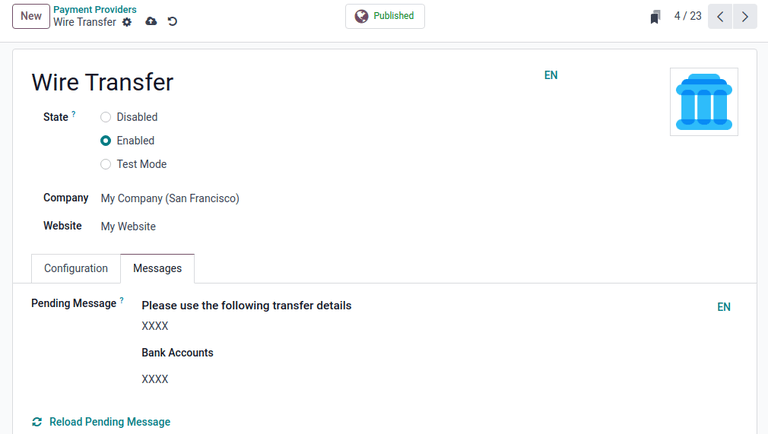
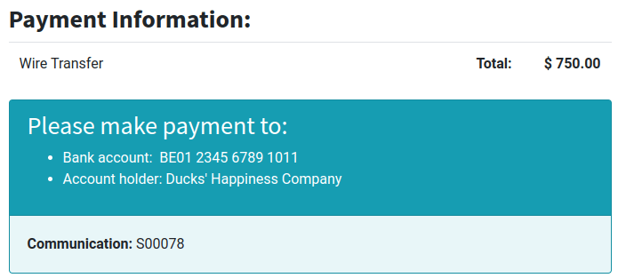

# Chuyển khoản ngân hàng

The *wire transfer* payment method allows for payment instructions to be shared with a customer
after purchasing a product. With a subscription, these payment instructions are shared every time
the payment is renewed.

#### NOTE
The wire transfer payment method requires minimal setup, but in most cases, it is inefficient
compared to other online payment providers. It is recommended to use another payment provider
with subscriptions, due to wire transfers requiring manual confirmation for each payment.

## Cấu hình

To use the wire transfer payment method, first ensure the *Wire Transfer* payment method is enabled.

To do so, begin by navigating to the *Payment Providers* page in either the **Accounting**,
**Website**, or **Sales** apps.

For example, navigate to Accounting app ‣ Configuration ‣ Online Payments:
Payment Providers, then click the Wire Transfer card.

Next, set the State to Enabled to enable wire transfers. Use the drop-down
menus next to the Company and Website fields to set where wire transfers can
be used.

The options in the Configuration tab can be used to customize the wire transfer.
Optionally tick the checkbox next to Enable QR Codes to enable the use of QR codes when
paying by wire transfer, if desired.

Sử dụng menu thả xuống bên cạnh trường Thông tin trao đổi để chọn loại thông tin sử dụng trên đơn hàng. Chọn Dựa vào mã chứng từ để sử dụng mã số đơn bán hàng (hoặc số hóa đơn), hoặc Dựa vào ID khách hàng để sử dụng mã định danh khách hàng.  Dù chọn bất kỳ phương pháp nào, thì thông tin này cũng sẽ được cung cấp cho khách hàng khi họ chọn phương thức thanh toán chuyển khoản ngân hàng.

The configuration options listed under the Availability section are used to set payment
restrictions, and are optional. Use the Maximum Amount field to set a maximum payment
value, the Currencies field to restrict any currencies from being used for payment, and
the Countries field to restrict payment from any particular countries, if desired.

In the Messages tab, use the Pending Message field to add a message
containing wire transfer information. This message is displayed to the customer after confirming
their order, as well as if the order is marked as pending after the payment is processed.

If [a bank account](applications/finance/accounting/bank.md) has already been defined, the account
number is automatically added to the default message generated by Odoo. A bank account can also be
added afterwards, and the message updates with the appropriate bank information by clicking
<i class="fa fa-refresh"></i> Reload pending message.

Once all necessary configuration settings are complete, the <i class="fa fa-eye-slash"></i>
Unpublished smart button located at the top of the page automatically changes to
<i class="fa fa-globe"></i> Published to show the wire transfer payment option is now visible
to customers. Only keep the payment method published if payments are ready to be received.

### Chế độ kiểm tử

The wire transfer payment method can be tested before it is accessed by customers by selecting the
Test Mode option in the State field on the form. Upon selecting
Test Mode, an orange Test mode banner appears in the upper-right corner of
the form.

Next, enter the credentials for a bank account with accessible transactions in the
Messages tab. To re-enable normal function after testing, change the State
setting to Enabled.

#### NOTE
By default, the payment provider remains Unpublished in Test Mode, so it
is not visible to visitors.

#### WARNING
It is recommended to use the Test Mode setting on a duplicate (or test) database to
avoid potential issues with invoice numbering.

## Pay by wire transfer

With wire transfers [enabled and published](#subscriptions-wire-transfer-configuration),
customers see wire transfers as an available payment method at checkout when purchasing a product.

When this method is selected by a customer, they are shown the *Pending Message* set in the
[wire transfer configuration page](#subscriptions-wire-transfer-configuration), after
confirming their purchase. Once the purchase is confirmed, a sales order is created.

#### IMPORTANT
Online orders remain in the *Quotation sent* (i.e. unpaid order) stage until both the payment is
received, *and* the order is confirmed manually, using the Confirm button on the
sales order.

To begin processing the payment, navigate to Sales app ‣ Orders ‣ Orders, and
click the corresponding sales order. Ensure the sales order is correct, then click
Confirm to confirm the sales order.

Next, click the new Create Invoice button, then choose Regular invoice, and
click Create Draft Invoice. A draft of the invoice appears. Click Confirm to
validate the invoice.

To send this invoice to the customer, click the Send & Print button. A Send
pop-up window appears, with an email template configured, and a PDF invoice attached.

Ensure the information is correct, then click Send & Print. The pop-up window
disappears, and the Send & Print button turns gray to show the invoice has been sent.

Next, click the Register payment button on the invoice page. A pop-up window titled,
Register Payment, appears with options for selecting the type of payment. In the
Journal field, select Bank from the drop-down menu. Next, set the
Payment Method to Manual. Ensure the Amount and
Payment Date are correct, then click the Create Payment button.

The customer invoice is revealed with a green In Payment banner in the upper-right
corner. At this point, the flow is now complete.

#### NOTE
Nếu khoản thanh toán đã được nhận trước khi gửi hóa đơn, chẳng hạn như thanh toán bằng tiền mặt, bạn vẫn có thể ghi nhận thanh toán trong Odoo bằng cách nhấp nút Ghi nhận thanh toán và tạo thanh toán *trước khi* nhấp Gửi & in. Khi đó, khi hóa đơn được gửi bằng nút Gửi & in, một dòng mới sẽ tự động được thêm vào thông báo hóa đơn để thông báo rằng hóa đơn đã được thanh toán.
