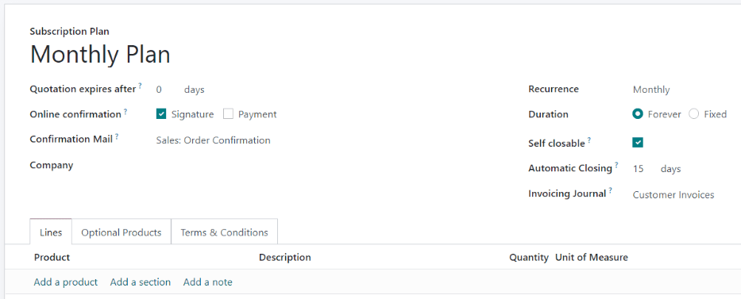

# Gói cước đăng ký

*Subscription plans* are [quotation templates](applications/sales/sales/send_quotations/quote_template.md) used to preconfigure quotations with
subscription products. Use subscription plans to quickly create subscription orders.

## Configure subscription plans

To configure subscription plans, go to Subscriptions ‣ Configuration ‣ Plans.
Then, click New to create a new plan, or select an existing plan to edit it.

Since the Odoo *Subscriptions* app is integrated closely with the *Sales* app, subscription plans
use the same form as quotation templates.

The subscription plan form contains the following options:

- Name: Enter a name for the subscription plan at the top of the page.
- Quotation expires after: Enter the number of days after which the quotation expires,
  starting from the day the quotation is sent to the customer. Leave this field at zero for the
  quotation to never expire.
- Online Confirmation: Check the boxes next to Signature or
  Payment to enable the customer to confirm their subscription order by signing or
  paying for the quotation. Enable both to leave the choice to the customer. Enable neither to only
  confirm the quotation in the backend.
- Confirmation Mail: Select an [email template](applications/general/companies/email_template.md) for the confirmation email that is
  automatically sent to the customer after the quotation is confirmed. Leave this field blank to
  send nothing.
  - To create a new email template, enter a name for the template, then click Create and
    edit.
  - To edit an existing email template, select one from the drop-down menu, then click on the
    Internal link arrow at the end of the line.
- Recurrence: Select the recurrence period used for the plan. The recurrence periods
  available here are the same ones that are configured in Subscriptions ‣
  Configuration ‣ Recurrence Periods.

Selecting a Recurrence turns the quotation template into a subscription plan and enables
the following additional options:

- Duration: Choose whether the subscription plan has no end date (Forever)
  or a Fixed duration.
  - If the duration is Forever, then the subscription plan will continually renew until
    either the customer or the company manually ends the subscription.
  - If the duration is Fixed, then enter an End After date, which determines
    the amount of time after which the subscription will automatically end.
- Self Closable: Check this box to enable the customer to terminate their subscription
  from the [customer portal](applications/websites/ecommerce/customer_accounts.md).
- Automatic Closing: Enter the number of days after which *unpaid* subscriptions *past*
  the due date are automatically closed.
- Invoicing Journal: Select the accounting journal in which invoices for this
  subscription plan are recorded. Leave this field blank to use the sales journal with the lowest
  sequence.

In the Lines tab, create the order lines for the quotation. Click Add a
product, select a product to include in the plan, and then enter the Quantity and
Unit of Measure. Add as many products as desired to the order lines.

In the Optional Products tab, enter any optional products that the customer can add to
their quotation before confirming the order.

If the subscription plan has unique [terms and conditions](applications/finance/accounting/customer_invoices/terms_conditions.md), add them in the
Terms & Conditions tab. If terms conditions are specified on a plan, these will be used
instead of the default terms and conditions set up in the *Sales* app settings.

## Use subscription plans on quotations

Quotations for subscription products can be created in both the *Subscriptions* app and the *Sales*
app.

From the Subscriptions dashboard, click New to create a new quotation. Then,
select a subscription plan in the Subscription Plan field.

The Recurrence, products, and other information from the plan are automatically filled
in. The quotation can then be modified further as needed.

From the Sales dashboard, click New to create a new quotation. Then, select
a subscription plan in the Quotation Template field.

All subscription orders will appear on the Subscriptions dashboard regardless of whether
they were created in the *Subscriptions* app or the *Sales* app.
