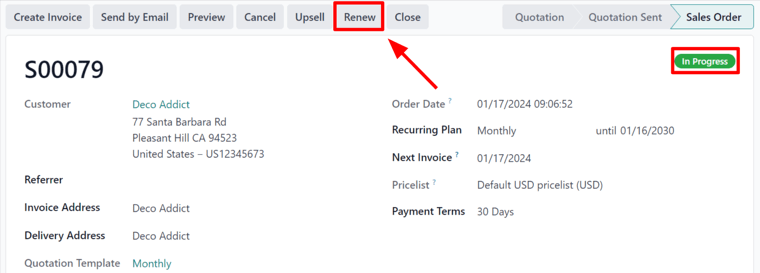
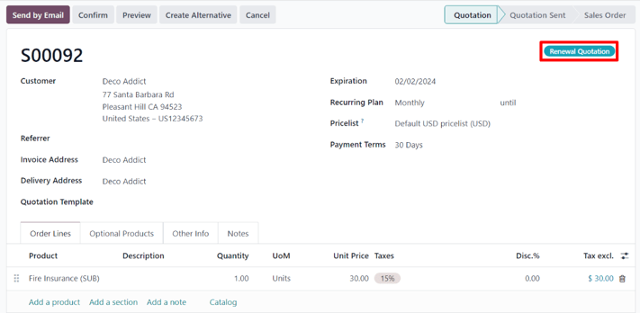
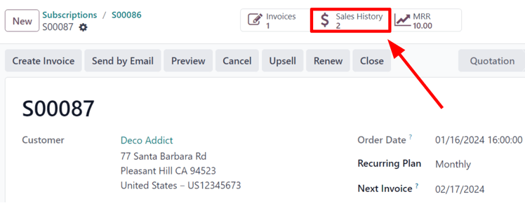
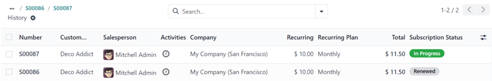
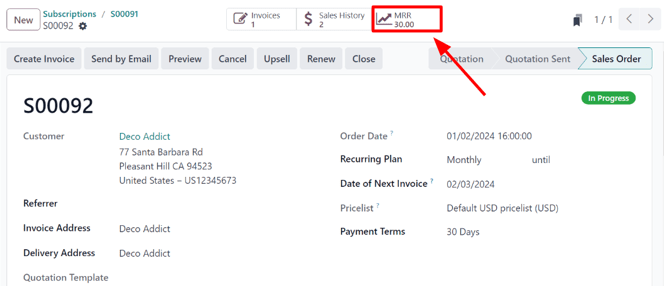
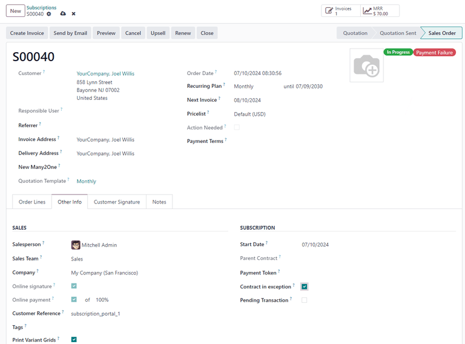

# Gia hạn đăng ký

The foundation of any subscription business model is recurring payments. This is when customers\
reliably pay a regular amount at specific intervals, in exchange for access to a subscription\
product or service.

Subscription renewal is the process customers follow when they willingly choose to continue\
participating in, and paying for, a subscription product or service.

Subscribers experience the renewal process at different intervals -- weekly, monthly, annually, etc.\
\-- depending on the duration of the agreed-upon contract.

Most companies that offer subscriptions prefer to automate the renewal process for customers.\
However, manual subscription renewals are still used in some cases.

With the Odoo **Subscriptions** application, a company can manage all of its subscriptions in one\
place. Renewals can be processed automatically, or manually, include additional products or upsells\
per renewal order, and be filtered in batch views to quickly locate customers who need to renew\
their subscriptions.

## Gia hạn đăng ký

In order to renew a subscription, a quotation with a subscription product **must** be confirmed,\
with a configured _Recurring Plan_ selected.

To open a subscription quotation, navigate to Subscriptions app ‣ Subscriptions\
‣ Quotations, and select the desired quotation from the list. Or, create a new one by clicking\
New to open a new quotation form.

#### NOTE

* Only a singular product is required.
* A subscription service counts as a product, as it is considered a recurring product.

Subscription quotations **must** be confirmed, and payment from the customer for the\
initial subscription **must** be invoiced and registered in order to successfully open a _Renewal_\
_Quotation_.

#### SEE ALSO
For more information on the above process of confirming quotations and invoicing payments,
see:
- [Tạo báo giá](../sales/send_quotations/create_quotations.md)
- [Online payment order confirmation](../sales/send_quotations/get_paid_to_validate.md)

For more information on the above process of confirming quotations and invoicing payments,\
see:

* [Tạo báo giá](applications/sales/sales/send_quotations/create_quotations.md)
* [Online payment order confirmation](applications/sales/sales/send_quotations/get_paid_to_validate.md)

Once the payment from the subscription quotation is confirmed, the quotation turns into a sales\
order. An In Progress tag is applied to the sales order form, and a series of buttons\
also appear at the top of the sales order, including a Renew button.

When the Renew button is clicked, Odoo instantly presents a new renewal quotation,\
complete with a Renewal Quotation tag.

From here, a standard sales flow can occur to confirm the quotation. This typically begins\
by clicking Send by Email, which sends a copy of the quotation to the customer, by\
email, for them to confirm, and eventually, pay for.

#### NOTE

In the chatter of the Renewal Quotation, it is mentioned that this subscription is\
the renewal of the subscription from the original sales order.

Once the Renewal Quotation is confirmed, it becomes a sales order, and a\
Sales History smart button appears at the top of the page.

When that Sales History smart button is clicked, Odoo reveals a separate page,\
showcasing the different sales orders attached to this subscription, along with their individual\
Subscription Status.

Additionally, once the Renewal Quotation is confirmed, an MRR smart button\
also appears at the top of the sales order.

When clicked, Odoo reveals an MRR Analysis page, detailing the monthly recurring revenue\
related to this specific subscription.

#### IMPORTANT

On rare occasions, automatic payment can fail, which results in a _Payment Failure_ tag on the\
top-right of the sales order, if there is an error in the payment method.

This is done to prevent the system from charging the customer again the next time a scheduled\
action is run. Because the status of the payment is unknown, Odoo requests a manual operation to\
check if the payment has been made, before the payment can be used again.

To do this, navigate to Subscriptions app ‣ Subscriptions ‣ Quotations.\
Click into the desired subscription, then check the _Chatter_ to see if the payment was made.

If the payment was **not** made, first enter [debug mode](../../general/developer_mode.md).
Then, click the Other Info tab, and untick the checkbox next to Contract
in exception. Reload the sales order, and the Payment Failure tag is gone.

Nếu thanh toán **đã** được thực hiện, cần phải tạo và ghi nhận hóa đơn mới theo cách thủ công. Thao tác này sẽ tự động cập nhật ngày phát hành hóa đơn tiếp theo của gói đăng ký. Sau khi tạo xong, hãy truy cập [chế độ gỡ lỗi](../../general/developer_mode.md) và đi tới đơn bán hàng mới. Chọn tab Thông tin khác và bỏ chọn ô Hợp đồng ngoại lệ. Khi tải lại đơn hàng, nhãn Lỗi thanh toán sẽ không còn hiển thị.

In both cases, once the Contract in exception option is no longer selected, Odoo\
handles renewals automatically again. If the subscription remains in _payment failure_, it is\
skipped by Odoo until the sales order is closed.

#### SEE ALSO
- [Đăng ký](../subscriptions.md)
- [Gói cước đăng ký](plans.md)
