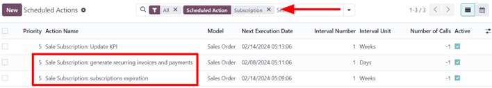
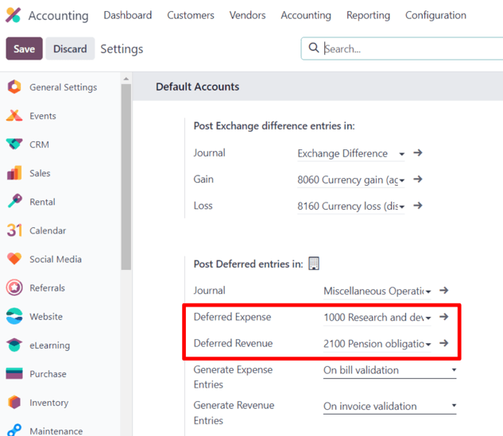

# Tác vụ đã lên lịch

*Scheduled actions* are pre-configured processes that allow users to automate certain tasks within a
database, based on a designated schedule or number of occurrences. These tasks can include sending
emails, generating invoices, data clean-up, and so much more.

In Odoo, some scheduled actions are active, by default, to ensure that certain functions are
triggered automatically, however there are *also* many scheduled action options that appear in the
database that are **not** activated by default.

In Odoo *Subscriptions*, there are two scheduled actions that initiate the billing process for
active recurring subscriptions, as well as when billing should stop due to subscription expiration.

They are turned on, by default and can be deactivated at any time in order to manage subscriptions
manually.

## Access scheduled actions

#### IMPORTANT
In order to access scheduled actions, [developer mode](../../general/developer_mode.md#developer-mode) **must** be
activated.

With developer mode activated, navigate to Settings app ‣ Technical ‣ Scheduled
Actions.

Doing so reveals a dedicated Scheduled Actions dashboard. On this page, there is a
complete list of scheduled actions for the entire database.

From here, enter `Subscription` in the search bar. Doing so provides three subscription-specific
results. The following documentation focuses on the last two results in the list:

- Sale Subscription: generate recurring invoices and payments
- Sale Subscription: subscriptions expiration

Determine if a scheduled action is active by looking under the Active column, in the
it's corresponding row on the Scheduled Actions dashboard, for a ticked checkbox; if
the checkbox is green with a check mark, the scheduled action is active.

If a scheduled action needs to be activated, click into the desired scheduled action from the list.

Then, from the scheduled action form, toggle the switch in the Active field to the
right. Doing so turns the switch green, indicating that the scheduled action is now `Active`.

The ability to set up how often the scheduled action runs is also available on the scheduled action
form, in the Execute Every field.

#### IMPORTANT
The scheduled action does **not** function correctly if the execution time is less than five
minutes. This is a general rule for all scheduled actions.

For more information, read the [Frequent Technical Questions](../../../administration/odoo_sh/advanced/frequent_technical_questions.md) documentation.

## Generate recurring invoices and payments

In order for the Sale Subscription: generate recurring invoices and payments scheduled
action to properly generate recurring invoices and payments on subscriptions, the *Deferred Expense*
and *Deferred Revenue* accounts **must** be set up, in order for Odoo to process various invoices
and payments related to subscriptions.

To set up *Deferred Expense* and *Deferred Revenue* accounts, navigate to Accounting
app ‣ Configuration ‣ Settings. Both accounts can be configured in the Default
Accounts section.

Once the correct accounts are entered in the Deferred Expense and Deferred
Revenue drop-down menu fields, click Save in the upper-left corner.

### Tạo hóa đơn

Elements related to the Sale Subscription: generate recurring invoices and payments
scheduled action can be found on confirmed subscription sales orders.

To examine these elements, open any confirmed sales order in the *Subscriptions* application to
reveal the subscription sales order form.

On a confirmed subscription sales order form, focus on the Recurring Plan and
Date of Next Invoice fields.

The scheduled action creates an invoice when today's date is the same date as the Date of
Next Invoice.

Odoo uses the information in the Recurring Plan field to update the next invoice date
accordingly.

#### WARNING
If the product invoicing policy is set to *Based on Delivered Quantities (Manual)*, and the
delivered quantity is `0`, Odoo does **not** create an invoice, and the customer is not charged.

Instead, the subscription is processed as a free recurring product, and is reflected as such in
the *chatter* of the subscription sales order.

When this occurs, the following message appears: `Automatic renewal succeeded. Free subscription.
Next invoice:[date]. No email sent.`

Once the invoice for the subscription sales order is created, the invoice can be viewed by clicking
the Invoices smart button that appears at the top of the subscription sales order.

An email is sent to the customer notifying them of the recurring subscription charge, *if* there is
a Payment Token on the account.

To check if there is a Payment Token, open the Other Info tab, and look at
the Payment Token field, under the Subscription section.

If there is no Payment Token, the invoice is created, and sent to the customer. The
payment **must** be registered manually in this case.

### Closing invoices

The Sale Subscription: generate recurring invoices and payments scheduled action also
has the ability to close a subscription, if the following conditions are met:

- If the subscription has no Payment Token, create and post the invoice.
- If the subscription has a Payment Token, try to charge.
  > - If the charge is successful, create and post the invoice.
  > - If the charge fails, send reminders periodically.
  >   > - Close the subscription if it continues to fail for more than fourteen days.

## Ngày hết hạn đăng ký

The Sale Subscription: subscriptions expiration scheduled action checks for all other
conditions that may cause a subscription to close automatically. If certain conditions are met, the
scheduled action closes that subscription.

First, the Sale Subscription: subscriptions expiration scheduled action checks to see if
the end date has passed, which is configured on the subscription sales order.

Then, the Sale Subscription: subscriptions expiration scheduled action checks if the
invoice has not been paid within the payment terms deadline.

To access the invoices attached to a subscription, access the sales order for the subscription
product, and click the Invoices smart button. Then, look at the Invoice Date
column.

Unpaid subscriptions with an Invoice Date that are past the determined number of days in
the Automatic Closing field of a Recurring Plan are automatically closed by
the Sale Subscription: subscriptions expiration scheduled action.

For example, if the next invoice date is July 1st, and the Automatic Closing is set to
'30 Days', the scheduled action would close the subscription on August 1st.

#### SEE ALSO
- [Đăng ký](./)
- [Gói cước đăng ký](plans.md)
- [Quy tắc tự động hoá](automatic_alerts.md)
