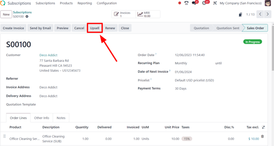

# Đăng ký bán thêm

Subscriptions are recurrent, and go on indefinitely. As time passes, customers may want to modify\
them. With that in mind, it's imperative to have the ability to adapt prices, or change quantities,\
to accommodate any need. That's where the opportunity to upsell a subscription can come into play.

Upselling may prove beneficial to the following customer types:

1. _Khách hàng thân thiết_\
   These are customers who already trust the company/brand, and because they have established a\
   pattern of paying for products/services, there's more confidence behind the attempt to sell\
   them a more expensive product/service.\

2.  _Khách hàng mới_\
    For brand new customers unfamiliar with the company/brand, a new, attractive tactic must be\
    employed to entice them to purchase a more expensive product/service.\

    > In these instances, discounts can be useful. Typically, subscriptions end after a certain period\
    > of time.

    > So, if these more expensive products/services are offered to new customers at a discount, it\
    > can result in a sale, while establishing a strong sense of trust between the customer and the\
    > company/brand. In turn, this can increase customer retention, as they'll grow more comfortable\
    > and trustworthy over time.

## Discount configuration

In order to have the ability to upsell a subscription to a new customer, with the aid of a discount,\
the _Discounts_ feature **must** be activated.

To activate the _Discounts_ feature, navigate to Sales app ‣ Configuration ‣\
Settings, scroll to the Pricing section, and tick the checkbox beside\
Discounts. Then, click Save.

With that feature activated, the ability to grant discounts on sales order lines.

### Đăng ký bán thêm

Before upselling a subscription, check out our documentation on how to [Create a quotation](../subscriptions.md) using subscription products.

When a quotation with a subscription is confirmed, it officially becomes a sales order, and a new\
subscription is created in the Odoo _Subscriptions_ application.

#### NOTE

The subscription sales order **must** be invoiced _before_ an upsell can occur.

When the subscription sales order is opened, either in the _Sales_ or _Subscriptions_ application,\
the ability to upsell that subscription is available, via the Upsell button at the top\
of the sales order.

When the Upsell button is clicked, a new quotation form appears, with an\
Upsell status banner in the upper-right corner. The initial subscription product is\
already in the Order Lines tab.

There is also a warning reminding the user that the recurring products are discounted, according to\
the prorated period of time, located beneath the initial subscription product in the\
Order Lines tab.

#### IMPORTANT

The prorated amount is **only** applied to _Service_ product types. It is **not** applied t&#x6F;_&#x43;onsumable_ or _Storable_ product types, even if the message appears.

From this new upsell quotation form, add new subscription products in the Order Lines\
tab, by clicking Add a product, and selecting the desired subscription product.

Once the desired upsell subscription product(s) have been added, it can be sent to the customer for\
approval by clicking the Send by Email button.

#### IMPORTANT

When the quotation is confirmed by the customer, the upsell products are added to the initial\
subscription. Quotation prices are then prorated to the remaining time of the current invoicing\
period.

#### NOTE

Before sending the new quotation to the customer, the unit price, taxes, and even discount can be\
applied.

Once the customer approves, click the Confirm button on the quotation, making it a sales\
order. When that's clicked, a Sales History smart button appears, displaying how many\
sales orders are attached to this initial subscription order.

When the Sales History smart button is clicked, Odoo reveals a separate page containing\
a list of the related sales orders, clearly showcasing their individual Subscription\
Status.

#### SEE ALSO

* [Đăng ký](../subscriptions.md)
* [Gói cước đăng ký](plans.md)
