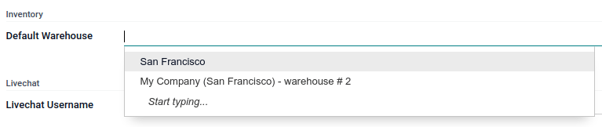

# Quản lý sản phẩm

When field service workers perform tasks on-site, they commonly use products to complete their work.
Odoo Field Service allows them to record these products using the **product catalog** and **default
warehouse** features. Doing so keeps your inventory up-to-date in real-time and automatically adds
the products to the invoice.

## Danh mục sản phẩm

To activate the product catalog for Field Service, go to Field Service ‣
Configuration ‣ Settings and enable the Time and Material Invoicing feature.

To add products to a task, proceed as follows:

1. Go to Field Service and open a task.
2. Click the Products smart button.
3. Click Add on a product card to add it to your task.
4. If needed, adjust the number of products using the - and + buttons.

Going back to your task, the smart button now displays the amount of products you added and the
price. You can return to the product catalog at any time to edit the product selection.

## User default warehouse

Setting up a **default warehouse** can be useful for field technicians who keep a supply on the go
in their van or those who always resupply from the same warehouse. It also allows field workers to
switch between warehouses from their profiles.

Products in sales orders created during field interventions are always pulled from the default
warehouse, keeping the inventory accurate.

#### SEE ALSO
[Tồn kho](../../inventory_and_mrp/inventory.md)

## Cấu hình

To set up a user default warehouse, the [storage locations](../../inventory_and_mrp/inventory/warehouses_storage/inventory_management/use_locations.md)
feature needs to be activated in the **Inventory** app. It is also necessary to have more than one
warehouse in your database.

You can either set it up [for your profile](#default-warehouse-my-profile), or [for all
users](#default-warehouse-all-users).

#### SEE ALSO
[Vị trí](../../inventory_and_mrp/inventory/warehouses_storage/inventory_management/use_locations.md)

### For your profile

To set up a default warehouse for yourself, click your **profile icon** in the upper right corner of
the screen, then, go to My Profile ‣ Preferences ‣ Default Warehouse. Select
the default warehouse from the drop-down menu.

### For all users

To set up a default warehouse for a specific user, go to Settings ‣ Users ‣
Manage users, select a user, then go to the Preferences tab. Scroll down to
Inventory, and select the default warehouse from the drop-down menu.

## Use in field service tasks

Once a default warehouse has been configured for a user, the materials used for a sales order
related to a Field Service task are pulled from that specific warehouse. Open the related sales
order, go to the Other Info tab, then scroll down to Delivery. The default
warehouse is applied correctly.

Once the Field Service task is marked as done, the stock of the default warehouse is automatically
updated.
