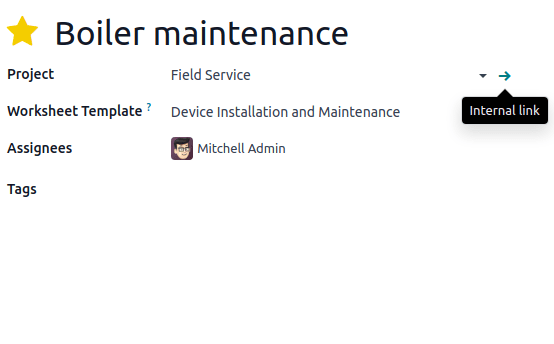

# Bảng công tác

**Worksheets** help your field service workers perform and report their on-site tasks. They can
feature various information, such as instructions, to-do lists, etc. You can also format your
worksheet using checkboxes, bullet points, blank fields to fill in, HTML, and add files, images,
links, and more.

It is common for businesses to have their workers perform the same type of field service
repeatedly. Making custom **worksheet templates** eliminates the need to recreate the same
worksheet each time you plan a similar field service task.

## Cấu hình

To use worksheets in Field Service, go to Field Service ‣ Configuration ‣
Settings, enable the Worksheets feature, and click Save.

#### WARNING
Worksheet templates are designed using **Studio**. Enabling the Worksheets
feature automatically installs the **Studio** app, which may impact your price plan.

### Create a worksheet template

To create your **worksheet templates**, go to Field Service ‣ Configuration ‣
Worksheet Templates. Click New and give your worksheet template a name. Manually save,
then click Design Template to open **Studio** and customize your worksheet template.

In Studio, drag and drop the desired fields from the left column into your worksheet on the right.
To rearrange the fields on the worksheet, drag and drop them in the desired order. Click a field to
customize its [properties](../../studio/fields.md#studio-fields-properties).

When your worksheet template is complete, click Close in the top right corner of the
page to leave **Studio**.

#### SEE ALSO
[Fields and widgets in Studio](../../studio/fields.md)

## Add a worksheet template to a field service task

Go to your field service task, select a Worksheet Template, and click Save.

By default, the Default Worksheet template is selected. To define another default
worksheet template, click the ➔ (Internal link) icon that appears when you
hover your mouse over the Project field on the task form.

Then, in the Settings tab,  scroll down to the Field service section and
select the Worksheet Template you want to set up as default.

## Use worksheets on site

To complete the worksheet on site, access the task and click the Worksheet smart button.

#### NOTE
- As soon as you save a worksheet, the label of the Worksheet smart button on
  the task changes to Worksheet Complete instead, even if some fields are
  left blank.
- Any field defined as Required has to be filled for a worksheet to be saved.
