# Dịch vụ hậu mãi

*After-Sales* services can be configured in the *Helpdesk* application for individual teams. Once
enabled, users can [issue refunds](#helpdesk-refunds), [generate coupons](#helpdesk-coupons), [process returns](#helpdesk-returns), and [schedule repairs](#helpdesk-repairs) or [field service interventions](#helpdesk-field) directly from a ticket.

## Set up after-sales services

Start by enabling the after-sales services on a specific *Helpdesk* team, by going to
Helpdesk app ‣ Configuration ‣ Helpdesk Teams and click on the team the
services should be applied to. Then, scroll to the After-Sales section on the team's
settings page, and choose which of the following options to enable:

- Refunds: issues credit notes to refund a customer, or adjust the remaining amount due.
- Coupons: offers discounts and free products through an existing coupon program.
- Returns: initiates a product return from a customer through a reverse transfer.
- Repairs: creates repair orders for broken or faulty products.
- Field Service: plans onsite intervention through the *Field Service* application.

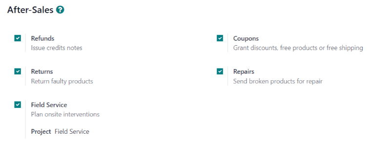

## Issue refund with credit note

A *credit note* is a document issued to a customer informing them that they have been credited a
certain amount of money. They can be used to provide a full refund to a customer, or to adjust any
remaining amount due. While they are usually created through the *Accounting* or *Invoicing*
applications, they can be created through a *Helpdesk* ticket, as well.

#### IMPORTANT
Invoices **must** be posted before a credit note can be generated.

To create a credit note, navigate to a ticket on the Helpdesk app, and click the
Refund button in the top-left corner of the ticket form. This opens a
Refund pop-up window.

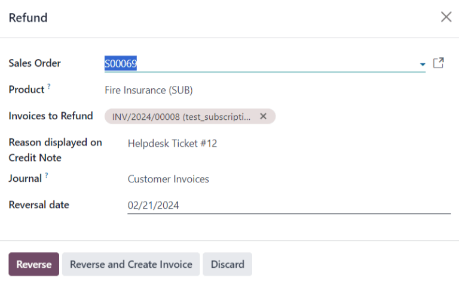

Fill out the fields with the necessary information:

> - Sales Order: if a sales order was referenced on the original ticket, it automatically
>   populates in this field.
> - Product: the product the ticket is about. If an item is selected in this field, only
>   the sales orders, deliveries, and invoices including this product can be selected.
> - Lot/Serial Number: this field is **only** visible if the Product selected
>   has associated lot or serial numbers.
> - Invoices to Refund: this field is **required**. If no invoices are available in the
>   drop-down, it indicates this customer currently has no posted invoices, or the
>   Product has no related invoices.
> - Reason displayed on Credit Note: this field automatically populates with the ticket
>   number, though it can be edited with additional information.
> - Journal: the accounting journal where the credit note should be posted. After an
>   invoice is selected, this field defaults to the journal listed on the original invoice, though it
>   can be changed, if necessary.
> - Reversal date: when this field is clicked, use the pop-up calendar that appears to
>   select a date for the credit note invoice. This field is **required**.

After the necessary fields are filled in, click Reverse or Reverse and Create
Invoice.

Reverse creates a credit note in a draft state that can be edited before it is posted.
This option can be used to provide a partial refund.

Reverse and Create Invoice creates a credit note that is automatically posted as well as
an invoice in a draft state. The invoice contains the same information as the original invoice,
though this information can be altered.

Once the credit note has been posted, a Credit Notes smart button is added to the
*Helpdesk* ticket.

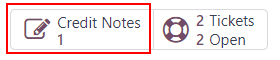

#### SEE ALSO
[Credit notes and refunds](../../../finance/accounting/customer_invoices/credit_notes.md)

## Generate coupons from a ticket

Coupons can be used to alter the price of products or orders. Conditional rules define the usage
constraints of a coupon. *Coupon Programs* are configured in the *Sales*, *Point of Sale*, or
*Website* applications.

#### IMPORTANT
The *eCommerce* module **must** be installed to create coupon codes from the *Website*.

To generate a coupon, open a *Helpdesk* ticket and click on the Coupon button in the
top-left corner. Select an option from the Coupon Program drop-down menu in the
Generate a Coupon pop-up window that appears.

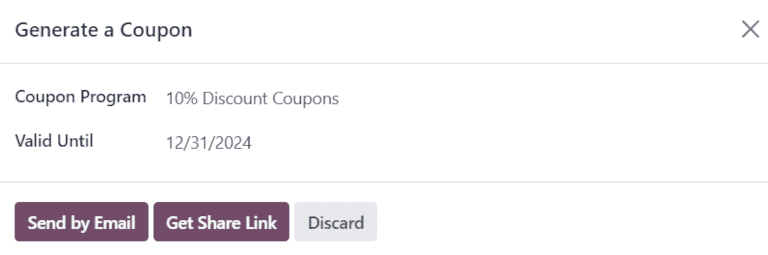

#### NOTE
> To create a new Coupon Program, navigate to Sales app ‣ Products
> ‣ Discount & Loyalty and click New. To make the program available to share with
> *Helpdesk* customers, the Program Type **must** be set to Coupons. This
> generates single-use coupon codes that grant immediate access to rewards and discounts.

Coupon programs can also be created in the *Point of Sale* application or *Website* application.
Refer to [discount and loyalty programs](../../../sales/sales/products_prices/loyalty_discount.md) for more information.

Click on the Valid Until field, and use the pop-up calendar to select an expiration date
for this coupon code. If this field is left blank, the code does **not** expire.

Click Send by Email to compose an email to send to the customer with the coupon code.

#### NOTE
When emailing a coupon code, **all** the followers of the ticket are added as recipients to the
email. Additional recipients can be added to the email as well, in the Recipients
field of the Compose Email pop-up window. If an expiration date was selected for the
code, it is included in the message template.

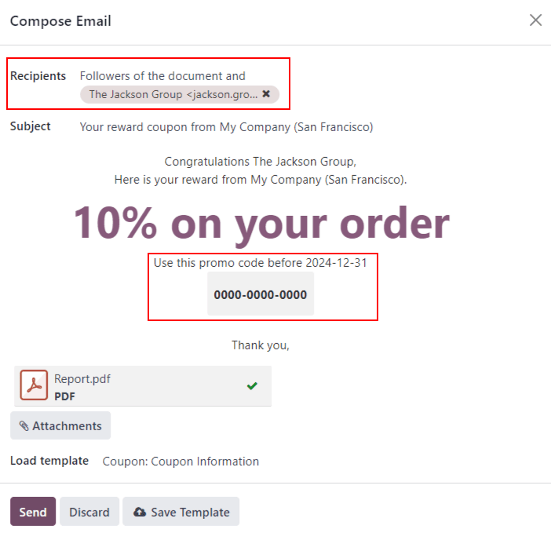

Click Get Share Link to generate a link to send directly to the customer. Doing so opens
a Share Coupons pop-up window. Click the Copy button next to the
Share Link field and paste the results to any communication with the customer. When the
customer uses the link, the code is automatically applied to their cart.

After a Coupon Code has been generated, a Coupons smart button is added to
the top of the ticket; click the smart button to view the coupon code, expiration date, and
additional information.

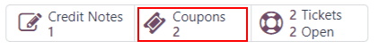

#### SEE ALSO
- [Phiếu giảm giá](https://www.youtube.com/watch?v=KW5cZHg10jQ)
- [Discount and loyalty programs](../../../sales/sales/products_prices/loyalty_discount.md)

## Facilitate a product return with a reverse transfer

Returns are completed through *reverse transfers*, which generate new warehouse operations for the
returning products. Click the Return button in the top-left corner of a ticket to open
the Reverse Transfer pop-up window.

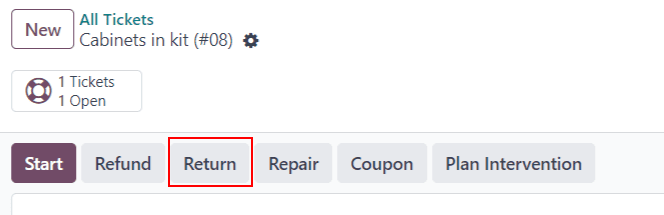

#### IMPORTANT
The Return button **only** appears on a ticket if the customer has a recorded
delivery in the database.

Select a Sales Order or Delivery to Return to identify the products that
need to be returned.

By default, the quantity matches the validated quantity from the delivery order. Update the
Quantity field, if necessary. To remove a line, click the 🗑️ (trash can)
icon.

Select a Return Location where the items should be directed after the return is
completed.

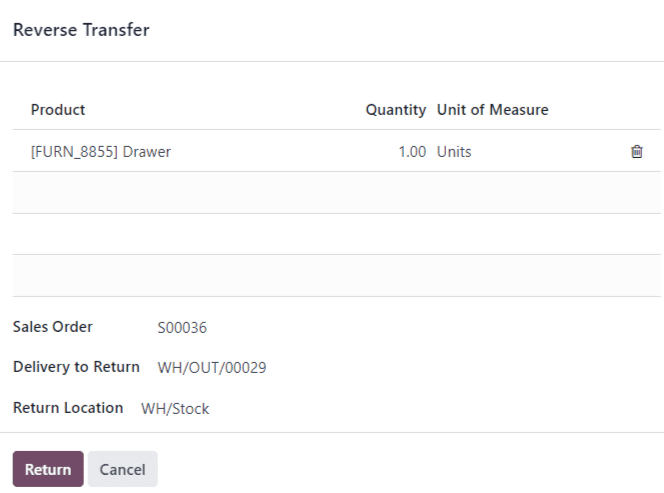

Click Return to confirm the return. This generates a new warehouse operation for the
incoming returned products.

Use the breadcrumbs to return to the helpdesk ticket. A new Return smart button can now
be accessed at the top of the ticket.

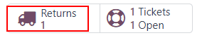

#### SEE ALSO
[Returns and refunds](../../../sales/sales/products_prices/returns.md)

## Send products for repair from a ticket

If the ticket is related to an issue with a faulty or broken product, a *repair order* can be
created from the *Helpdesk* ticket, and managed through the *Repairs* application.

To create a new repair order, open a Helpdesk ticket and click on the
Repair button in the top-left corner. This opens a Repair Reference form.

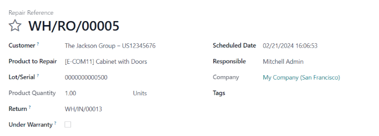

Fill out the fields with the necessary information:

> - Customer: this field carries over from the ticket, though a new contact can been
>   selected from the drop-down menu.
> - Product to Repair: if a product was specified in the Product field on the
>   ticket, it is added to this field automatically. If not, click into the field to select a product
>   from the drop-down menu.
> - Lot/Serial: this field is **only** visible if the products being repaired are
>   tracked, via lot or serial numbers.
> - Return: return order from which the product to be repaired comes from.
> - Under Warranty: if this box is checked, the sale price for all products from the
>   repair order are set to zero.
> - Scheduled Date: this field defaults to the current date. To select a new date, click
>   into the field and select a date using the drop-down calendar.
> - Responsible: assign a user from the drop-down menu to manage the repair.
> - Tags: click into this field to assign an existing tag or create a new one. Multiple
>   tags can be assigned.

If parts are required for the repair, they can be added in the Parts tab. Additional
information for the internal repair team can be added to the Repair Notes tab.

Once the form is complete, click Confirm Repair. To create, edit, and send a quote for
this repair, click Create Quotation.

A Repairs smart button is then added to the ticket, linking to the repair order.

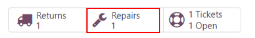

## Create field service task from a ticket

On-site interventions can be planned from a ticket and managed through the *Field Service*
application. Customers with [portal access](../../../general/users/portal.md) are able to track
the progress of a *Field Service* task just as they would a *Helpdesk* ticket.

To create a new *Field Service* task, navigate to a Helpdesk ticket. Click
Plan Intervention to open the Create a Field Service task pop-up window.

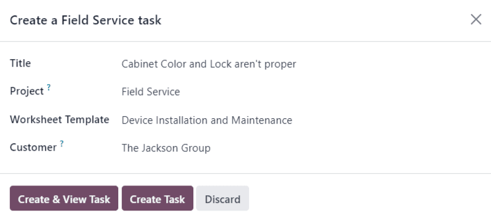

Confirm or update the task Title.

The Project field on the Create a Field Service task pop-up window defaults
to the same *Field Service* project that was identified on the team's settings page. To change the
project for this specific task, select one from the Project field.

If applicable, select a Worksheet Template from the drop-down menu.

#### NOTE
*Field Service Worksheets* are reports that detail the work completed during an on-site task.
When work is completed, worksheets are signed by the customer to confirm the job is done and the
customer is satisfied.

If the *Field Service* project assigned to the *Helpdesk* team has worksheets enabled, and has a
default template assigned, that template automatically appears in the Worksheet
Template drop-down field. Even so, the field can be edited, and another template can be
selected.

If the *Field Service* project does **not** have worksheets enabled, the Worksheet
Template field does not appear on the Create a Field Service task pop-up window.

Click Create Task or Create & View Task.

After the task is created, a Tasks smart button is added to the ticket, linking the
Field Service task to the ticket.

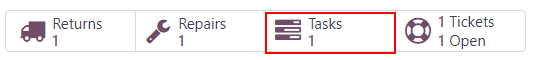

#### SEE ALSO
[Field Service](https://www.odoo.com/slides/slide/advanced-settings-862?fullscreen=1)
