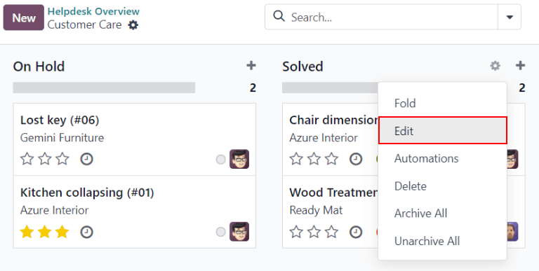
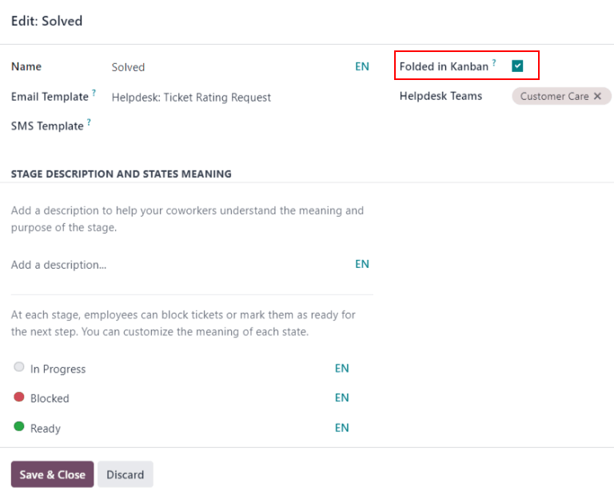
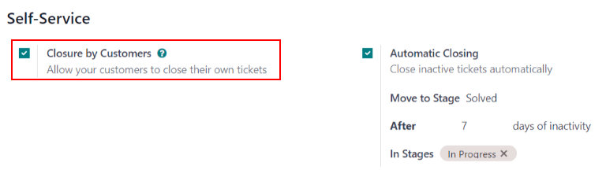
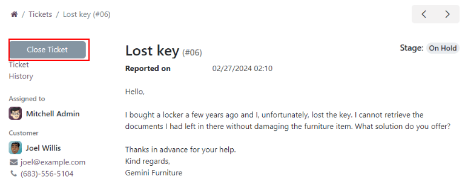

# Close tickets

Once work has been completed on a *Helpdesk* ticket in Odoo, there are several ways it can be
closed.

In addition to manually closing solved tickets, automatically closing inactive tickets keeps the
pipeline up-to-date. At the same time, allowing customers to close their own tickets minimizes
confusion around whether an issue is considered solved or not. This results in increased operational
capacity for support teams, and higher customer satisfaction.

## Manually close solved tickets

As work on a ticket progresses, it is moved along to the next stage in the pipeline. Once the issue
is solved, the ticket is moved to a *folded* stage. This marks the ticket as *closed*.

To fold a stage, navigate to the Helpdesk app dashboard, and click on a team to
open the to reveal that team's pipeline on a separate page.

From the pipeline page, hover over a stage's heading, and click the ⚙️ (gear) icon that
appears in the top-right corner of that stage's Kanban column.

From the menu that appears, select Edit. This opens the stage's settings in a pop-up
window.

In the pop-up window, check the box labeled, Folded in Kanban, towards the top of the
window. Then, click Save & Close to confirm the changes.

Tickets that reach this stage are now considered: *closed*.

#### WARNING
Clicking the ⚙️ (gear) icon also displays the option to Fold the stage.
This setting folds the stage *temporarily* to simplify the Kanban view. This does **not** close
the tickets in this stage. It also does **not** permanently fold the stage. If a stage needs to
be folded, so the tickets can be marked as *closed*, the Folded in Kanban checkbox
**must** be checked on the stage's settings.

## Automatically close inactive tickets

Tickets that are inactive for a set period of time can be automatically closed. At that point, they
are moved to a folded stage.

To have Odoo automatically close inactive tickets, go to the desired team's settings page, by
navigating to Helpdesk app ‣ Configuration ‣ Helpdesk Teams, and selecting the
desired team to configure. Under the Self-Service section, enable Automatic
Closing.

After ticking the box for Automatic Closing, three new fields appear beneath:

- Move to Stage
- After (#) days of inactivity
- In Stages

If one of the team's stages is set to be folded in the Kanban view, the folded stage is the default
selection in the Move to Stage field. If the team has more than one folded stage, the
folded stage that occurs first in the pipeline is the default. If no stage is folded, the default
selection is the last stage in the pipeline.

The After (#) days of inactivity field defaults to `7`, but can be adjusted if
necessary.

#### WARNING
The After (#) days of inactivity field does **not** take the working calendar into
account when tracking the amount of time a ticket has been inactive.

If only certain stages should be used to track days of inactivity, they can be added to the
In Stages field.

## Allow customers to close their own tickets

Enabling the Closure by Customers setting allows customers to close their own tickets
when they determine that their issue has been resolved.

To allow customers to close their own tickets, start by navigating to Helpdesk app
‣ Configuration ‣ Helpdesk Teams, and click on a team to open the team's settings page. Next,
scroll to the Self-Service section, and check the box for Closure by
Customers.

Once the ticket closing settings are enabled, a Close Ticket button is available for
customers when they view their ticket through the customer portal.

#### NOTE
Customers are able to view their tickets by clicking the View the ticket link they
receive by email. The link is included in the Helpdesk: Ticket Received template,
which is added to the first stage of a team by default. This link does **not** require a customer
to have access to the portal to view or respond to their ticket.

Customers with access to the portal can view their tickets under My Account ‣
Tickets.
