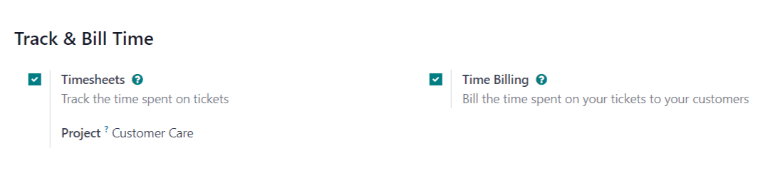
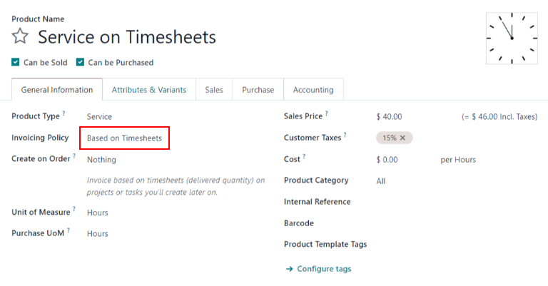
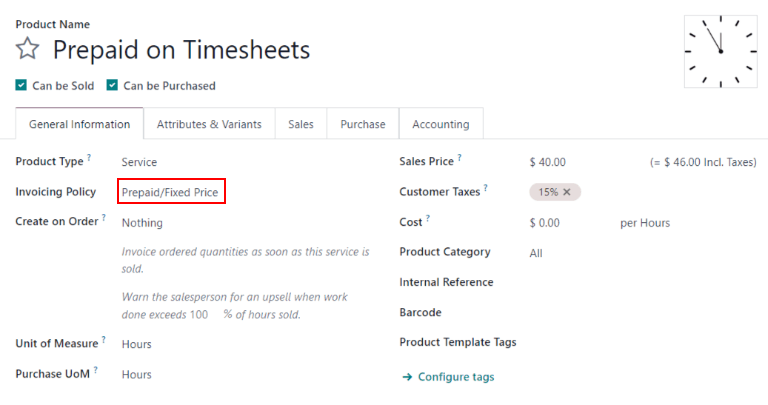
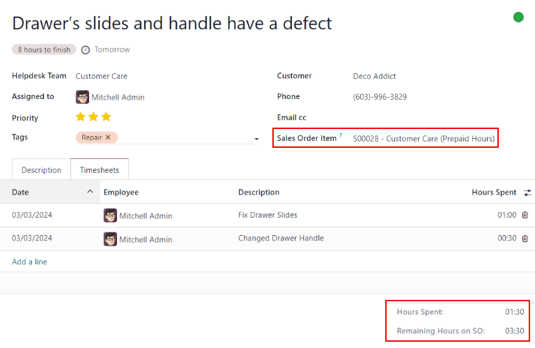
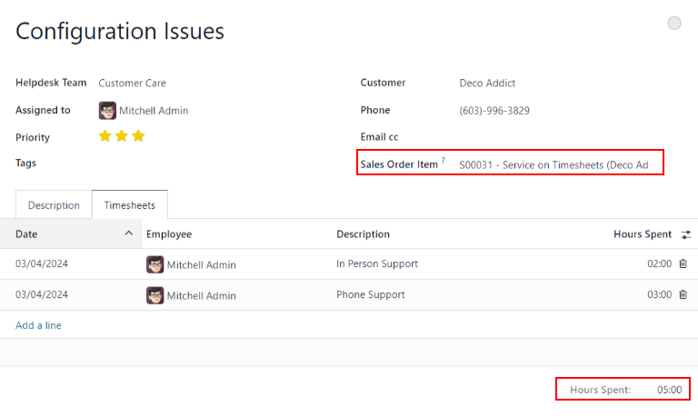
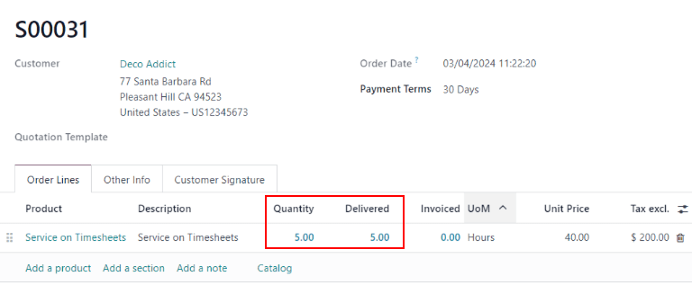
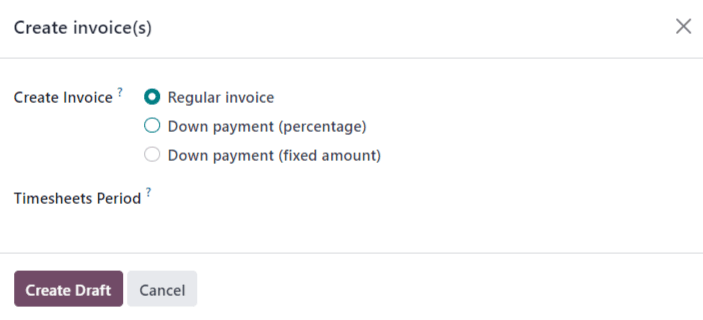

# Track and bill time

Odoo *Helpdesk* provides teams with the ability to track the amount of hours spent working on a
ticket, and to bill a customer for that time. Through integrations with the *Sales*, *Timesheets*,
*Project* and *Accounting* applications, customers can be charged once the work is completed, or
before it has even begun.

#### WARNING
Since the *Track & Bill Time* features require integration with other applications, enabling them
may result in the installation of additional modules or applications.

Installing a new application on a *One-App-Free* database triggers a 15-day trial. At the end of
the trial, if a paid subscription has not been added to the database, it will no longer be active
or accessible.

## Configure track and bill time features

Before a customer can be invoiced for support services, the *Track & Bill Time* features **must** be
enabled on each *Helpdesk* team individually.

### Enable track and bill time on a helpdesk team

To view and enable the *Track & Bill Time* features on a *Helpdesk* team, first navigate to
Helpdesk app ‣ Configuration ‣ Helpdesk Teams. Then, select a team from the
list, or create a [new one](../). This reveals a team's settings page.

On the team's settings page, scroll to the Track & Bill Time section. Check the boxes
labeled Timesheets and Time Billing.

Once the Timesheets box is checked, a new field appears, labeled Project.

#### NOTE
If this is the first time this feature has been enabled on this database, the page may need to be
manually saved and refreshed before the Project field appears.

The project selected in this field represents where all the timesheets for this team's tickets are
recorded. Click into the Project drop-down menu to select a project.

To create a new project where the timesheets are recorded, click into the Project
drop-down menu, type a name for the project, and then click Create from the drop-down
menu beneath.

#### Configure service products

Khi tính năng Tính phí theo thời gian được kích hoạt, một sản phẩm mới sẽ được tạo trong ứng dụng *Bán hàng* có tên *Dịch vụ theo Bảng chấm công*. Sản phẩm này có thể được tìm thấy tại Ứng dụng Bán hàng ‣ Sản phẩm ‣ Sản phẩm. Sau đó, tìm kiếm `Dịch vụ theo Bảng chấm công` trong thanh Tìm kiếm.... Đây là sản phẩm được sử dụng để lập hóa đơn cho *dịch vụ hỗ trợ trả sau* **sau khi** chúng đã được hoàn thành.

Select Service on Timesheets from the product page. This reveals the product detail
form. The product is configured with the Product Type set to Service and the
Invoicing Policy set to Based on Timesheets. Make any necessary changes to
the product record, such as the Cost or Sales Price.

In order to invoice for support services **before** the work has been completed (also known as
*prepaid support services*), a separate product with a different invoicing policy must be created.

To create a new service product, go to Sales app ‣ Products ‣ Products, and
click New. This reveals a blank product detail form.

On the new product form, add a Product Name, and set the Product Type to
Service. Then, set the Invoicing Policy to Prepaid/Fixed Price.
This means an invoice can be generated and payment can be received for this product before any
timesheets entries have been recorded for these services.

Finally, set the Sales Price, and confirm that the Unit of Measure is set to
Hours.

## Invoice prepaid support services

When support services are billed on a fixed price, an invoice can be created before any work is
completed on the issue. In this case, a service product with the *Invoicing Policy* set to
*Prepaid/Fixed Price* would be used, just like [the section above](#helpdesk-configure-service-products).

### Create a sales order with prepaid product

To invoice a customer for prepaid support services, first create a sales order (SO) with the support
services product. To do this, go to Sales app ‣ Orders ‣ Quotations. Then,
click New to reveal a blank quotation form.

Then, fill out the quotation form with the customer information.

Go to the Order Lines tab of the quotation and click Add a Product. Then,
select the *prepaid services product* configured in the steps above. Update the Quantity
field with the number of hours.

After updating any other necessary information, Confirm the quotation. This converts the
quotation into an .

### Create and send an invoice for prepaid services

Once the  has been confirmed, click the Create Invoice button.
This opens a Create invoices pop-up window.

If no down payment is collected, the Create Invoice type can remain as
Regular Invoice. If a [down payment](../../../sales/sales/invoicing/down_payment.md)
is collected, choose between either Down payment (percentage) or Down payment
(fixed amount).

When the necessary information has been entered, click Create Draft Invoice.

The invoice can then be sent to the customer for payment.

### Create helpdesk ticket for prepaid services

To create a *Helpdesk* ticket for prepaid services, navigate to Helpdesk and click
the Tickets button to reveal a specific team's pipeline. Click New to create
a new ticket.

On the blank ticket form, create a ticket Title, and enter the Customer
information.

When the customer name is added, the Sales Order Item field automatically populates with
the most recent prepaid sales order item that has time remaining.

### Track hours on helpdesk ticket

Time spent working on a *Helpdesk* ticket is tracked on the *Timesheets* tab on the specific ticket.

On the ticket detail form, click on the Timesheets tab and click Add a line.
Choose an Employee, add a Description of the task, and enter the number of
Hours Spent.

As new lines are added to Timesheets tab, the Remaining Hours on SO field,
at the bottom-right of the tab, is automatically updated.

#### NOTE
If the number of hours on the Timesheets tab exceeds the number of hours sold, the
Remaining Hours of SO turns red.

As hours are added to the Timesheets tab, they are automatically updated in the
Delivered field on the , as well.

## Invoice post-paid support services

Khi dịch vụ hỗ trợ được tính phí dựa trên thời gian dành để giải quyết sự cố, bạn không thể tạo hóa đơn trước khi tổng số giờ cần thiết để xử lý vấn đề được ghi lại trên bảng chấm công. Trong trường hợp này, một sản phẩm dịch vụ với *Chính sách lập hóa đơn* được đặt là *Dựa trên bảng chấm công* sẽ được sử dụng, giống như sản phẩm đã được tạo trong [phần trên](#helpdesk-configure-service-products).

### Create a sales order with a time-tracked product

To invoice a customer for post-paid support services, first create a sales order (SO) with the
*support services product*. To do this, go to Sales app ‣ Orders ‣ Quotations.
Then, click New to reveal a blank quotation form.

Fill out the quotation with the customer information.

On the Order Lines tab, click Add a Product. Select the post-paid services
product configured in the steps above. After updating any other necessary information,
Confirm the quotation.

#### IMPORTANT
Unlike with the prepaid services quotation, Odoo does **not** allow an invoice to be created at
this time. That is because no services have been performed; in other words, nothing has been
delivered, therefore, there is nothing to invoice.

### Create a helpdesk ticket for time-tracked services

To record a *Timesheet* entry for time-tracker services, go to the Helpdesk app,
and select the appropriate team for which these services apply.

If there is already an existing ticket for this issue, select it from the Kanban view. This opens
the ticket details form. If there is no existing ticket for this customer issue, click
New to create a new ticket and enter the necessary customer information on the blank
ticket details form.

After selecting or creating a ticket, go to the Sales Order Item drop-down menu. Select
the  created in the previous step.

### Track support hours on a ticket

In order to create an invoice for a product based on timesheets, hours need to be tracked and
recorded. At this point, the service is considered *delivered*. To record hours for this support
service, click on the Timesheets tab of the ticket.

Click Add a Line to record a new entry. Select an Employee from the
drop-down menu, and record the time spent in the Hours Spent column.

Repeat these steps as needed until all time spent on the issues has been recorded.

### Create an invoice for hours tracked on a ticket

After the customer's issue has been solved, and it is determined no new timesheet entries need to be
made, an invoice can be created, and the customer can be billed.

To do this, return to the  by clicking on the Sales Order smart
button at the top of the ticket.

Before creating the invoice, confirm that the number in the Delivered column matches the
total number of Hours Spent listed in the Timesheets tab on the ticket.

Then, click Create Invoice. This opens a Create invoice(s) pop-up window.

If no down payment is collected, the Create Invoice type can remain as
Regular Invoice. If a down payment is collected, choose between either Down
payment (percentage) or Down payment (fixed amount).

#### IMPORTANT
Use the Timesheets Period field if this invoice should **only** include timesheets
from a certain time period. If this field is left blank, **all** applicable timesheets that have
not yet been invoiced will be included.

When the necessary information has been entered, click Create Draft. The invoice can
then be reviewed, edited, and sent to the customer for payment.

#### SEE ALSO
- [Đơn vị tính](../../../inventory_and_mrp/inventory/product_management/configure/uom.md)
- [Khoản trả trước](../../../sales/sales/invoicing/down_payment.md)
