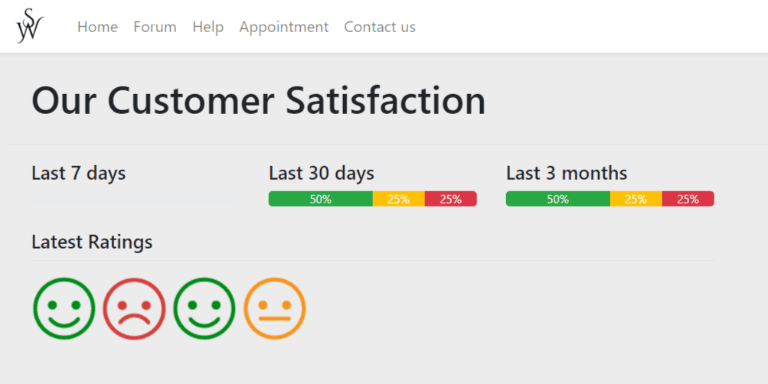

# Đánh giá của khách hàng

Asking customers to rate the support they received from a *Helpdesk* team provides an opportunity to
gauge team performance and track customer satisfaction. Ratings can be published on the portal,
providing customers with a general overview of the team's performance.

## Enable customer ratings on Helpdesk teams

To enable *customer ratings* on a helpdesk team, navigate to Helpdesk app ‣
Configuration ‣ Helpdesk Teams. Select a team from the list and click on it to open the settings
page. Scroll to the Performance section, and tick the Customer Ratings
checkbox.

## Set a ratings request email template on a stage

To automatically request ratings from customers once their tickets have closed, an email template
should be added to the appropriate stage.

After the Customer Ratings [setting has been enabled](#helpdesk-enable-ratings) on
the team's settings page, click the Set an Email Template on Stages link. Select a stage
from the list, or click New to create a new stage.

#### IMPORTANT
Customers should only be asked to rate tickets once an issue has been resolved and their ticket
is *closed*. Therefore, a *ratings request* email should **only** be added to a stage that is
folded in the Kanban, as tickets in a *folded stage* are considered closed.

On the stage's settings page, select the template, `Helpdesk: Ticket Rating Request` in the
Email Template field. This template has been preconfigured with ratings customers can
use to provide feedback. To view the template, click the arrow button to the right of the field.

After the template is added to the stage, it automatically sends a message when a ticket is moved to
that stage. Customers are then asked to rate the support they received with colored icons.

> - *Green smiling face* - Satisfied
> - *Yellow neutral face* - Okay
> - *Red frowning face* - Dissatisfied

After selecting a rating, customers are taken to a webpage where they can provide specific written
feedback to support their rating. The rating is then submitted, and the rating, as well as any
additional comments, are added to the chatter on the ticket.

#### SEE ALSO
[Mẫu Email](../../../general/companies/email_template.md)

## Publish ratings on the customer portal

After enabling the Customer Ratings setting, an option to publish ratings on the team's
website appears. Enabling this setting provides portal users with an overview of the ratings the
team has received over the last thirty days. Specific written feedback will not be included; only
statistics of the team's performance will be visible.

#### IMPORTANT
Để hiển thị đánh giá trên cổng thông tin khách hàng, cài đặt hiển thị của một bộ phận **bắt buộc** phải được đặt thành Người dùng cổng thông tin được mời và tất cả người dùng nội bộ (công khai). Để bật cài đặt này, đi đến Ứng dụng Hỗ trợ ‣ Cấu hình ‣ Bộ phận hỗ trợ. Chọn một bộ phận từ danh sách và nhấp vào đó để mở trang cài đặt. Cuộn xuống phần Hiển thị & phân công và tích vào hộp kiểm Người dùng cổng thông tin được mời và tất cả người dùng nội bộ (công khai).

Next, to publish the ratings, go to Helpdesk app‣ Configuration ‣ Helpdesk
Teams and select a team. Scroll to Performance and tick the checkbox for
Publish this team's ratings on your website.

To view the ratings for a team, a customer will log into the portal and navigate to one of their
tickets. After clicking on the team name in the Managed By field, they will be directed
to a page with the team's ratings over the past thirty days.

#### SEE ALSO
[Portal access](../../../general/users/portal.md)

### Manually hide individual ratings

Individual ratings can be manually hidden from the portal. This allows for specific ratings to be
kept out of the performance metrics shared with customers.

To make a rating visible only to internal users, navigate to the page for a rating. This can be done
in one of the following ways:

> - Go to Helpdesk app ‣ Reporting ‣ Customer Ratings and click on one of the
>   Kanban cards for an individual rating.
> - Navigate to Helpdesk app‣ Tickets ‣ All Tickets and remove the
>   Open filter from the search bar. Then filter by Satisfied,
>   Okay and/or Dissatisfied. Select a ticket from the results. Click the
>   Rating smart button.

Once on the rating details page, check the Visible Internally Only box.

#### SEE ALSO
- [Close tickets](../advanced/close_tickets.md)
- [Báo cáo](reports.md)
