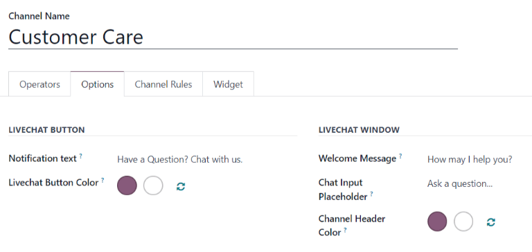
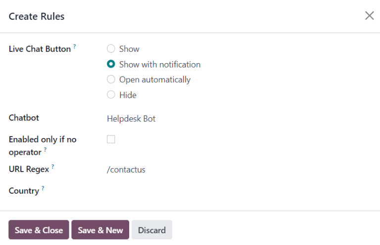
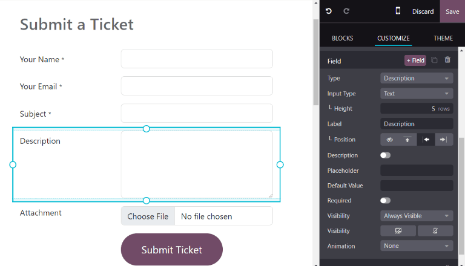
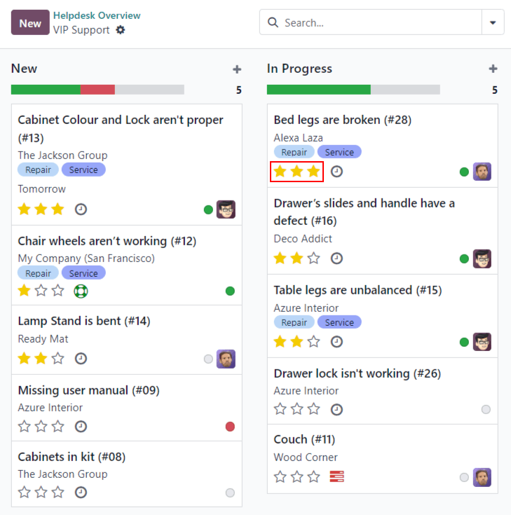

# Receiving tickets

Odoo *Helpdesk* offers multiple channels where customers can reach out for assistance, such as
email, live chat, and through a website's submission form. The variety of these contact options
provides customers with multiple opportunities to receive support quickly while also allowing the
support team to manage multi-channel support tickets from one central location.

## Enable channel options to submit tickets

Go to Helpdesk app ‣ Configuration ‣ Helpdesk Teams, and choose an existing
team, or click New to [create a new team](../).

On the team's settings page, scroll down to the Channels and Help Center
sections. Enable one or more channels by checking the respective boxes.

- [Email Alias](#helpdesk-receiving-tickets-email-alias)
- [Live Chat](#helpdesk-receiving-tickets-live-chat)
- [Website Form](#helpdesk-receiving-tickets-website-form)

### Bí danh email

The *Email Alias* setting creates tickets from messages sent to that team's specified email alias.

#### IMPORTANT
The following steps are for **Odoo Online** and **Odoo.sh** databases. For **On-premise**
databases, external servers are required for email aliases.

When a new *Helpdesk* team is created, an email alias is created for it. This alias can be changed
on the team's settings page.

To change a *Helpdesk* team's email alias, navigate to Helpdesk app ‣
Configuration ‣ Helpdesk Teams, and click on a team name to open its settings page.

Then, scroll to Channels ‣ Email Alias. In the Alias field, type the
desired name for the team's email alias.

#### NOTE
Custom email domains are **not** required in order to use an email alias, however, they can be
configured through the *Settings* app.

If the database does not have a custom domain already configured, click Set an Alias
Domain to be redirected to the Settings page. From there, enable Custom
Email Servers.

When an email is received, the subject line becomes the title of a new *Helpdesk* ticket. The body
of the email is also added to the ticket, under the Description tab, and in the ticket's
chatter.

### Trò chuyện Trực tiếp

The *Live Chat* feature lets website visitors connect directly with a support agent or chatbot.
*Helpdesk* tickets can be instantly created during these conversations using the [response
command](../../../websites/livechat/responses.md) `/ticket`.

To enable *Live Chat*, navigate to the Helpdesk app ‣ Configuration ‣ Helpdesk
Teams list view, select a team, and on the team's settings page, click the checkbox next to
Live Chat, under the Channels section.

#### NOTE
If this is the first time [Live Chat](../../../websites/livechat/) has been enabled on
the database, the page may need to be saved manually and refreshed before any further steps can
be taken.

After the Live Chat setting is enabled on a *Helpdesk* team, a new *Live Chat* channel
is created. Click on Configure Live Chat Channel to update the channel's settings.

#### Live Chat channel configuration

On the channel's settings page, Channel Name can be edited, though, Odoo names the
channel to match the *Helpdesk* team name, by default.

On the channel form, navigate through the tabs to complete the setup.

##### Operators tab

*Operators* are the users who act as agents and respond to live chat requests from customers. The
user who created the live chat channel is added by default.

To add additional users, click on the Operators tab, then click Add.

Click the checkbox next to the users to be added on the Add: Operators pop-up window
that appears, then click Select.

Click New to create new operators, if needed.

When the desired addition is complete, click Save & Close, or Save & New to
add multiple new operators.

Additionally, current operators can be edited or removed by clicking on their respective boxes in
the Operators tab, and then adjusting their form values on the pop-up form that appears,
or by using one of the buttons located at the bottom of the form, such as Remove.

##### Options tab

The Options tab contains the visual and text settings for the live chat window.

- Notification Text: this field updates the greeting displayed in the text bubble when
  the live chat button appears on the website.
- Livechat Button Color: this field alters the color of the live chat button as it
  appears on the website. To change the color, click on a color bubble to open the color selection
  window, then click and drag the circle along the color gradient. Click out of the selection window
  once complete. Click the refresh icon to the right of the color bubbles to reset the colors to the
  default selection.
- Show: the chat button displays on the selected page.
- Show with notification: the chat button is displayed, with the addition of the
  Notification text from the Options tab.
- Open automatically: the chat button is displayed, and automatically opens the chat
  window after a designated amount of time. The amount of time is designated in the Open
  automatically timer field, which appears only when this display option is selected.
- Hide: the chat button is hidden from display on the webpage.

##### Channel Rules tab

The Channel Rules tab determines when the live chat window opens on the website by logic
of when a URL Regex action is triggered (e.g., a page visit).

Edit existing rules by selecting them from the Channel Rules tab, or create a new rule
by clicking Add a line.

Then, proceed to configure the details for how the rule should apply on the pop-up form that
appears.

Choose how the *Live Chat Button* displays on the webpage.

- Show: the chat button displays on the selected page.
- Show with notification: the chat button is displayed, with the addition of the
  Notification text from the Options tab.
- Open automatically: the chat button is displayed, and automatically opens the chat
  window after a designated amount of time. The amount of time is designated in the Open
  automatically timer field, which appears only when this display option is selected.
- Hide: the chat button is hidden from display on the webpage.

To include a Chatbot on this channel, select it from the drop-down menu. If the chatbot
should only be active when no operators are available, check the box labeled Enabled only
if no operator.

#### NOTE
If a [chatbot](../../../websites/livechat/chatbots.md) is added to a live chat channel, a
new Chatbots smart button appears on the channel settings form. Click here to create
and update the chatbot *script*.

Each line in the script contains a Message, Step Type,
Answers, and conditional *Only If* logic that applies when certain pre-filled answers
are chosen.

To create more steps in the script, click Add a line, and fill out the script steps
form, according to the desired logic.

Add the URLs for the pages where the channel should appear in the URL Regex field. Only
the path from the root domain is needed, not the full URL.

If this channel should only be available to users in specific countries, add those countries to the
Country field. If this field is left blank, the channel is available to all site
visitors.

##### Widget tab

The Widget tab on the live chat channel form offers a website widget that can be added
to third-party websites. Additionally, a URL is available, that can provide instant access to a live
chat window.

The live chat Widget can be applied to websites created through Odoo by navigating to
the Website app ‣ Configuration ‣ Settings ‣ Email & Marketing. Then, scroll
to the Live Chat field, and select the channel to add to the site. Click
Save to apply.

To add the widget to a website created on a third-party website, click the Copy button
next to the first listed code, and paste the code into the `<head>` tag on the site.

To send a live chat session to a customer or supplier, click the Copy button next to the
second listed code, and send the URL via email.

#### Create a support ticket from a live chat session

Operators who have joined a live chat channel are able to communicate with site visitors in
real-time.

During the conversation, an operator can use the shortcut [command](../../../websites/livechat/responses.md) `/ticket` to create a ticket without leaving the chat
window. The transcript from the conversation is added to the new ticket, under the
Description tab.

### Biểu mẫu website

Enabling the *Website Form* setting adds a new page to the website with a customizable form. A new
ticket is created once the required form fields are filled out and submitted.

To activate the website form, navigate to a team's settings page under Helpdesk app
‣ Configuration ‣ Helpdesk Teams, and selecting the desired team from the list.

Then, locate the Website Form feature, under the Help Center section, and
check the box.

If more than one website is active on the database, confirm the correct website is listed in the
Website field. If not, select the correct one from the drop-down list.

After the feature is activated, click the Go to Website smart button at the top of the
Teams settings page to view and edit the new website form, which is created
automatically by Odoo.

#### NOTE
After enabling the Website Form setting, the team's settings page may need to be
refreshed before the Go to Website smart button appears.

Additionally, if a *Help Center* is published, the smart button navigates there first. Simply
click the Contact Us button, at the bottom of the forum, to navigate to the ticket
submission form.

#### Website ticket form customization

To customize the default ticket submission form, while on the website, click the Edit
button in the upper-right corner of the page. This opens the editing sidebar on the right side.
Then, click on one of the fields in the form, on the body of the website, to edit it.

To add a new field, go to the Field section of the sidebar, and click +
Field.

Click the 🗑️ (trash can) icon to delete the field, if necessary.

Edit the other options for the new field in the sidebar, as desired:

- Type: matches an Odoo model value to the field (e.g. `Customer Name`).
- Input Type: determine what type of input the field should be, like `Text`, `Email`,
  `Telephone`, or `URL`.
- Label: give the form field a label (e.g. `Full Name`, `Email Address`, etc.). Also
  control the label position on the form by using the nested Position options.
- Description: determine whether or not to add an editable line under the input box to
  provide additional contextual information related to the field.
- Placeholder: add a sample input value.
- Default Value: add common use case values that most customers would find valuable.
  For example, this can include prompts of information customers should include to make it easier to
  solve their issue, such as an account number, or product number.
- Required: determine whether or not to mark a field as required, in order for the form
  to be submitted. Toggle the switch from gray to blue.
- Visibility: allow for absolute or conditional visibility of the field. Nested options,
  such as, device visibility, appear when certain options are selected.
- Animation: choose whether or not the field should include animation.

Once the form has been optimized, and is ready for public use, click Save to apply the
changes. Then, publish the form by toggling the Unpublished switch to
Published at the top of the page, if necessary.

## Prioritizing tickets

All tickets include a Priority field. The highest priority tickets appear at the top of
the Kanban and list views.

The priority levels are represented by stars:

- 0 stars = *Low Priority*
- 1 star = *Medium Priority*
- 2 stars = *High Priority*
- 3 stars = *Urgent*

Tickets are set to low priority (0 stars) by default. To change the priority level, select the
appropriate number of stars on the Kanban card, or on the ticket.

#### WARNING
As priority levels can be used as criteria for assigning [SLAs](sla.md), changing the priority
level of a ticket can alter the  deadline.

#### SEE ALSO
- [Close tickets](../advanced/close_tickets.md)
- [Communication in Odoo by email](../../../general/email_communication/)
- [Trò chuyện Trực tiếp](../../../websites/livechat/)
