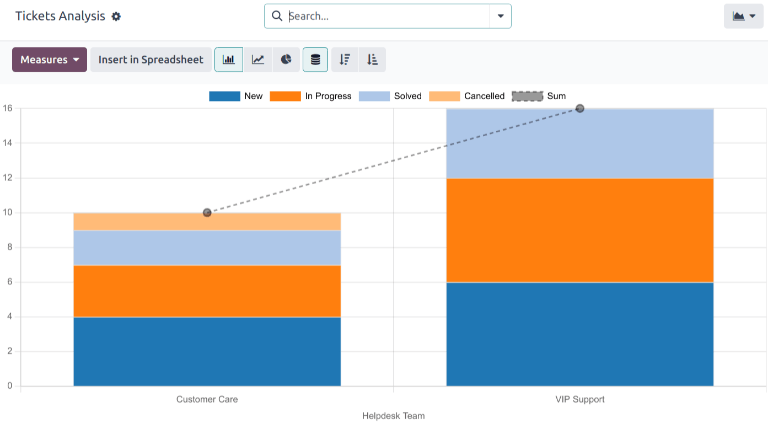
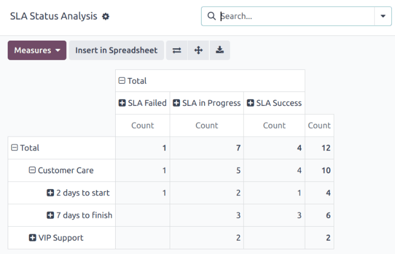
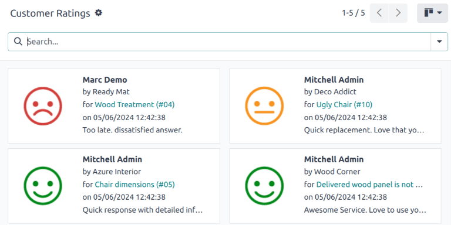
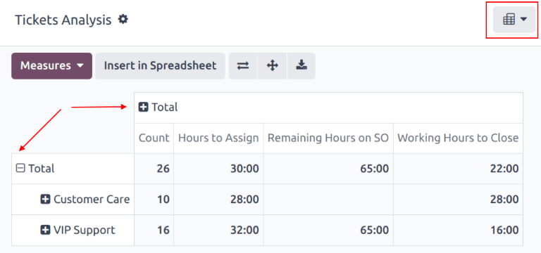
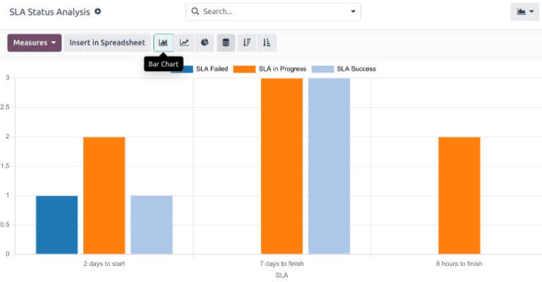
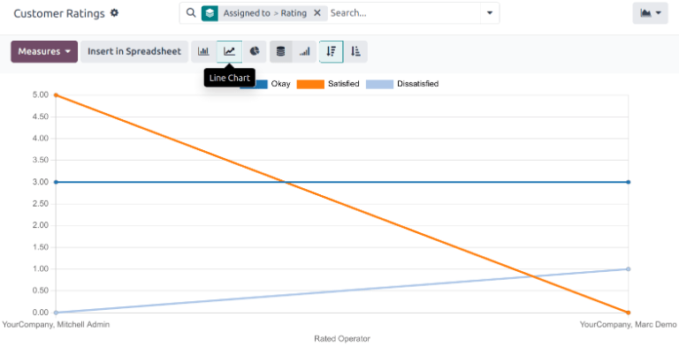
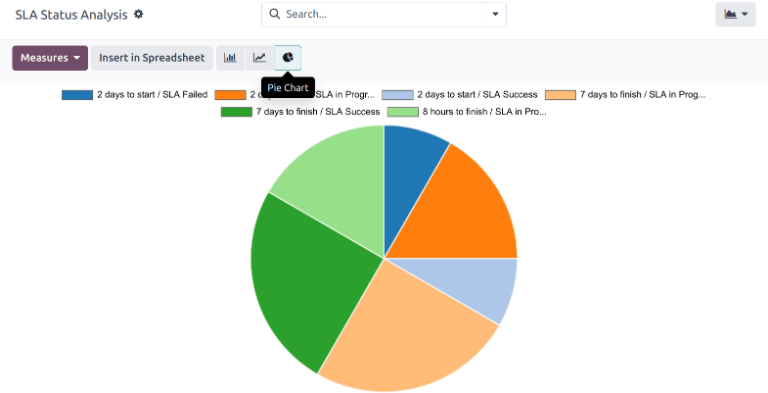
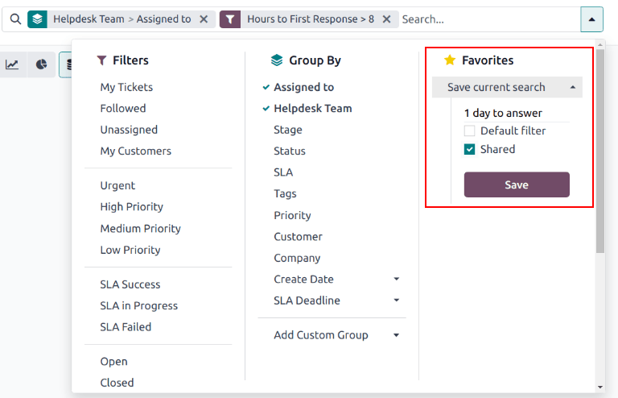

# Báo cáo

Reports in Odoo _Helpdesk_ provide the opportunity to manage employee workloads, identify areas for\
improvement, and confirm if customer expectations are being met.

## Available reports

Details about the reports available in Odoo _Helpdesk_ can be found below. To view the different\
reports, go to Helpdesk app ‣ Reporting, and select one of the following:\
Tickets Analysis, SLA Status Analysis, or Customer Ratings.

### Phân tích phiếu hỗ trợ

The _Tickets Analysis_ report (Helpdesk app ‣ Reporting ‣ Tickets Analysis)\
provides an overview of every customer support ticket in the database.

This report is useful for identifying where teams are spending the most time, and helps determine if\
there is an uneven workload distribution among the support staff. The default report counts the\
number of tickets per team and groups them by stage.

Alternative measures can be selected to track where the most time is spent at different points in\
the workflow. To change the measures used for the report that is currently displayed, or to add\
more, click the Measures button, and select one or more options from the drop-down\
menu:

* Average Hours to Respond: average number of working hours between a message sent from\
  the customer and the response from the support team. _This does not include messages sent when_\
  _the ticket was in a folded stage._
* Hours Open: number of hours between the date the ticket was created and the closed\
  date. If there is no closed date on the ticket, the current date is used. **This measure is not**\
  **specific to working hours.**
* Hours Spent: number of _Timesheet_ hours logged on a ticket. _This_\
  _measure is only available if Timesheets are enabled on a team, and the current user has the access_\
  _rights to view them._
* Hours to Assign: number of working hours between the date the ticket was created and\
  when it was assigned to a team member.
* Hours to Close: number of working hours between the date the ticket was created and\
  the date it was closed.
* Hours to First Response: number of working hours between the date the ticket was\
  received and the date on which the first message was sent. _This does not include email sent_\
  _automatically when a ticket reaches a stage._
* Hours until SLA Deadline: number of working hours remaining to reach the last\
  deadline on a ticket.
* Rating (/5): number out of five to represent customer feedback (Dissatisfied = 1,\
  Okay/Neutral = 3, Satisfied = 5).
* Remaining Hours on SO: hours remaining on a linked sales order.
* Count: number of tickets in total.

#### NOTE

_Working hours_ are calculated based on the default working calendar. To view or change the\
working calendar, go to the Settings application and select\
Employees ‣ Company Working Hours.

### Phân tích trạng thái SLA

The _SLA Status Analysis_ report (Helpdesk app ‣ Reporting ‣ SLA Status\
Analysis) [analyzes the performance](applications/services/helpdesk/overview/sla.md#helpdesk-analyze-sla-performance) of individual SLA\
(Service Level Agreement) policies.

By default, this report is filtered to show the number of failed, in progress, and the number\
that have been successful. The results are grouped by teams.

To change the measures used for the report that is currently displayed, or to add more, click the\
Measures button, and select one or more options from the drop-down menu:

* Number of SLA Failed: number of tickets that have failed at least one .
* Rating (/5): number value representing customer feedback (Dissatisfied = 1,\
  Okay/Neutral = 3, Satisfied = 5).
* Remaining Hours on SO: hours remaining on a linked sales order.
* Working Hours to Assign: number of working hours between the date the ticket was\
  created and when it was assigned to a team member.
* Working Hours to Close: number of working hours between the date the ticket was\
  created and the date it was closed.
* Working Hours to Reach SLA: number of working hours between the date the ticket was\
  created and the date the was satisfied.
* Count: number of tickets in total.

#### SEE ALSO

[Service Level Agreements (SLA)](applications/services/helpdesk/overview/sla.md)

### Đánh giá của khách hàng

The _Customer Ratings_ report (Helpdesk app‣ Reporting ‣ Customer Ratings)\
displays an overview of the ratings received on individual support tickets, as well as any\
additional comments submitted with the rating.

Click on an individual rating to see additional details about the rating submitted by the customer,\
including a link to the original ticket.

The _Customer Ratings_ report is displayed in a Kanban view by default, but can also be displayed\
in graph, list, or pivot view.

#### SEE ALSO

[Ratings](applications/services/helpdesk/overview/ratings.md)

## View and filter options

On any Odoo report, the view and filter options vary, depending on what data is being analyzed,\
measured, and grouped. See below for additional information on the available views for th&#x65;_&#x48;elpdesk_ reports.

#### NOTE

Only one measure may be selected at a time for graphs, but pivot tables can include multiple\
measures.

### Chế độ xem pivot

The _pivot_ view presents data in an interactive manner. All three _Helpdesk_ reports are available\
in pivot view.

The pivot view can be accessed on any report by selecting the (pivot) icon at the top-right of the screen.

To add a group to a row or column to the pivot view, click the (plus) icon next to Total, and then select one of the groups. To remove one,\
click the (minus) icon, and de-select the appropriate option.

### Chế độ xem biểu đồ

The _graph_ view presents data in either a _bar_, _line_, or _pie_ chart.

Switch to the graph view by selecting the (area chart) icon at the\
top-right of the screen. To switch between the different charts, select the _related icon_ at the\
top-left of the chart, while in graph view.

Biểu đồ cột

Biểu đồ đường

Biểu đồ tròn

### Save and share a favorite search

The _Favorites_ feature found on _Helpdesk_ reports allows users to save their most commonly used\
filters, without having to reconstruct them every time they are needed.

To create and save a new _Favorites_ configuration on a report, follow the steps below:

1. Set the necessary parameters using the Filters, Group By and\
   Measures options.
2. Click the (down) icon next to the Search... bar to\
   open the drop-down menu.
3. Under the Favorites heading, click Save current search.
4. If desired, enter a new name for the report.
5. Tick the Default Filter checkbox to have these filter settings automatically\
   displayed when the report is opened. Otherwise, leave it blank.
6. Tick the Shared checkbox to make this filter configuration available to all other\
   database users. If this checkbox is not ticked, only the user who creates the filter can access\
   it.
7. Click Save to preserve the configuration for future use.

#### SEE ALSO

* [Start receiving tickets](applications/services/helpdesk/overview/receiving_tickets.md)
* [Odoo reporting](applications/essentials/reporting.md)
