# Service level agreements (SLA)

A *service level agreement* (SLA) defines the level of service a customer can expect from a
supplier.  provide a timeline that tells customers when they
can expect results, and keeps the support team on target.

#### NOTE
The *SLA Policies* feature is enabled by default on newly created *Helpdesk* teams.

To turn off the feature, or edit the working hours, navigate to Helpdesk app ‣
Configuration ‣ Helpdesk Teams. Click on a team to open that team's configuration page.

From here, scroll to the Performance section. To turn off the  feature for the team, clear the SLA Policies checkbox.

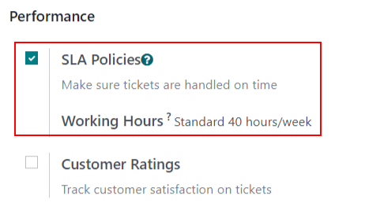

## Create a new SLA policy

To create a new policy, go to Helpdesk app ‣ Configuration ‣ SLA Policies, and
click New.

Alternatively, go to Helpdesk app ‣ Configuration ‣ Helpdesk Teams, and click
on a team. Then, click the SLA Policies smart button at the top of the team's settings
page, and click New.

On the blank  policy form, enter a Title and a
Description for the new policy, and proceed to fill out the form using the steps below.

### Define the criteria for an SLA policy

The Criteria section is used to identify which tickets this policy is applied to.

Fill out the following fields to adjust the selection criteria:

#### NOTE
Unless otherwise indicated, multiple selections can be made for each field.

- Helpdesk Team: a policy can only be applied to one team. *This field is required.*
- Priority: the priority level for a ticket is identified by selecting one, two, or
  three of the ⭐ (star) icons, representing the priority level on the Kanban card or on
  the ticket itself. The  is **only** applied after the
  priority level has been updated on the ticket to match the 
  criteria. If no selection is made in this field, this policy only applies to tickets marked as
  `Low Priority`, meaning those with zero ⭐ (star) icons.
- Tags: tags are used to indicate what the ticket is about. Multiple tags can be applied
  to a single ticket.
- Customers: individual contacts or companies may be selected in this field.
- Sales Order Items: this field is available only if a team has the *Timesheets* app
  enabled. This allows the ticket to link directly to a specific line on a sales order, which must
  be indicated on the ticket in the Sales Order Items field.

### Establish a target for an SLA policy

A *target* is the stage a ticket needs to reach, and the time allotted to reach that stage, in order
to satisfy the  policy. Any stage assigned to a team may be
selected for the Reach Stage field.

Time spent in stages selected in the Excluding Stages field are **not** included in the
calculation of the  deadline.

## Meet SLA deadlines

As soon as it is determined that a ticket fits the criteria of an  policy, a deadline is calculated. The deadline is based on the creation date of the
ticket, and the targeted working hours.

#### NOTE
The value indicated next to the Working Hours field of an  policy is used to determine the deadline. By default, this is determined by the value
set in the Company Working Hours field under Settings app ‣
Employees ‣ Work Organization.

The deadline is then added to the ticket, as well as a tag indicating the name of the  applied.

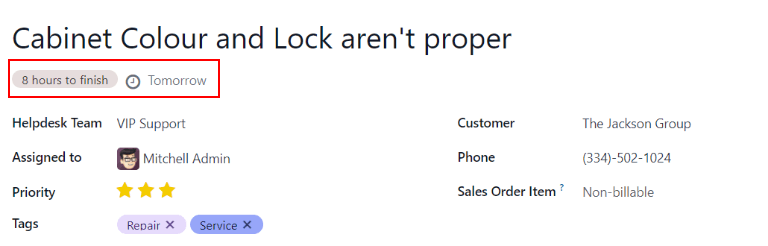

When a ticket satisfies an  policy, the  tag turns green, and the deadline disappears from view on the ticket.

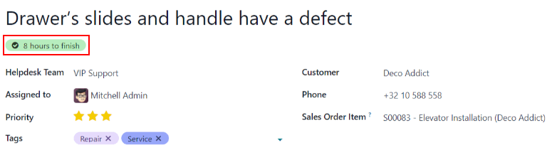

#### IMPORTANT
If a ticket fits the criteria for more than one , the
earliest occurring deadline is displayed on the ticket. After that deadline has passed, the next
deadline is displayed.

If the  deadline passes and the ticket has not moved to the
Reach Stage, the  tag turns red. After the
 has failed, the red tag stays on the ticket, even after the
ticket is moved to the Reach Stage.

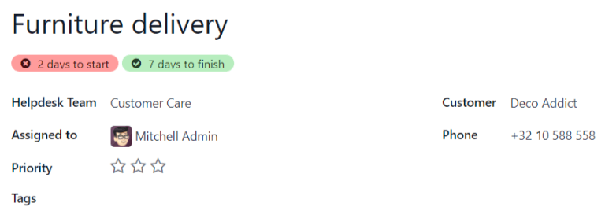

## Analyze SLA performance

The SLA Status Analysis report tracks how quickly an  is fulfilled, as well as the performance of individual team members. Navigate to the
report, and corresponding pivot table, by going to Helpdesk app ‣ Reporting ‣
SLA Status Analysis.

### Chế độ xem pivot

By default, the report displays in a Pivot view. Any  policies in the database with tickets that failed to fulfill a policy, are in progress,
or have satisfied a policy are listed. By default, they are grouped by team and ticket count.

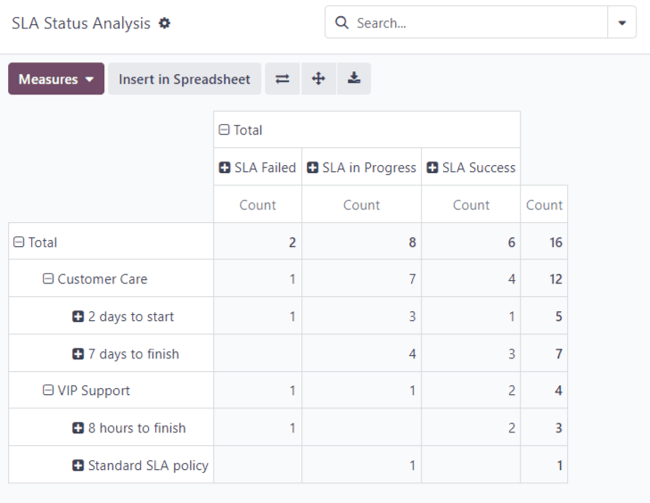

To change the display, or add additional measurements, click the Measures button to
reveal a drop-down menu of reporting criteria, and choose from the options available.

Whenever a measurement is picked, a ✔️ (checkmark) icon appears in the drop-down menu to
indicate that the measurement is included, and a corresponding new column emerges in the pivot table
to show the relevant calculations.

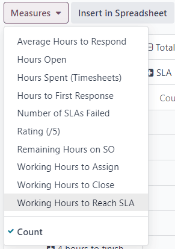

To add a group to a row or column, click the ➕ (plus) icon next to the policy name and
then select one of the groups. To remove one, click the ➖ (minus) icon next to the
policy name.

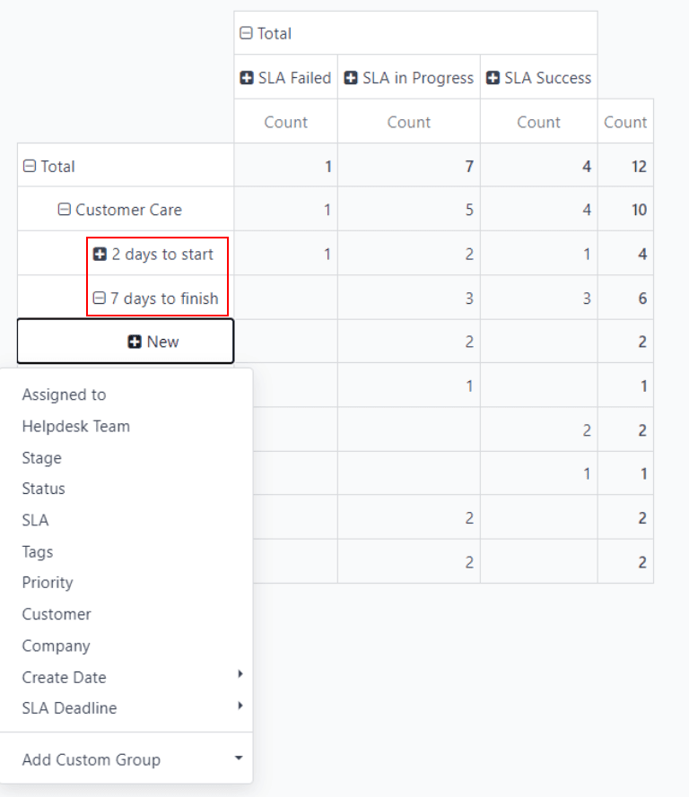

### Chế độ xem biểu đồ

The SLA Status Analysis report can also be viewed as a Bar Chart,
Line Chart, or Pie Chart. Toggle between these views by first selecting the
Graph button at the top-right of the dashboard. Then, select the appropriate chart icon
at the top-left of the graph.

Đồ thị cột

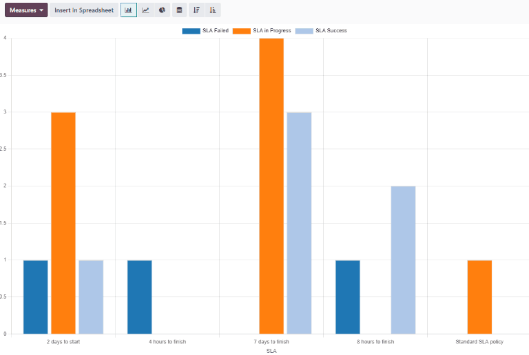

Đồ thị đường

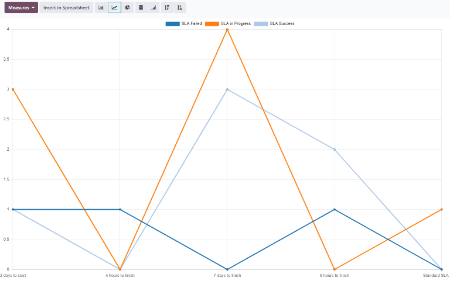

Biểu đồ tròn

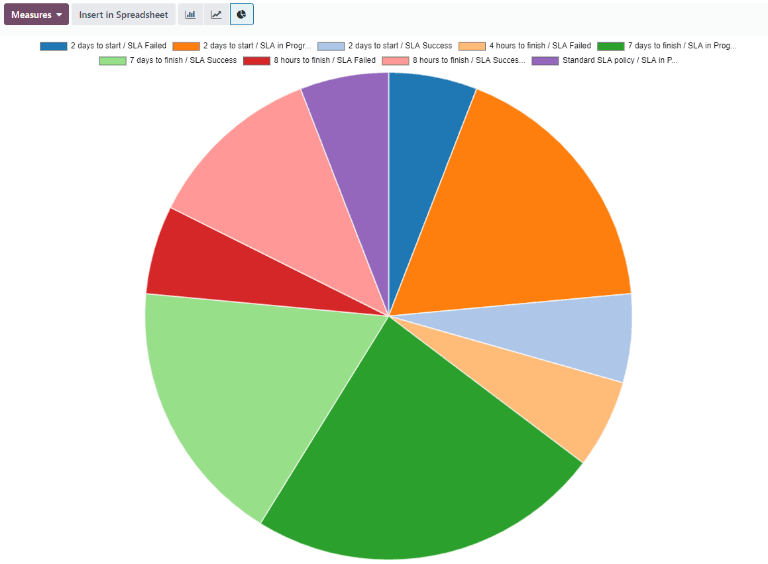

### Cohort view

The Cohort view is used to track the changes in data over a period of time. To display
the SLA Status Analysis report in a Cohort view, click the
Cohort button, represented by (four cascading horizontal lines), in the
top-right corner, next to the other view options.

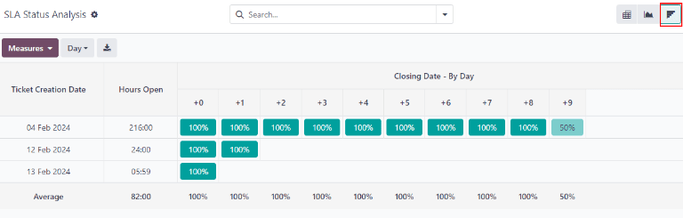

#### SEE ALSO
- [Reporting views](../../../essentials/reporting.md#reporting-views)
- [Allow customers to close their tickets](../advanced/close_tickets.md)
