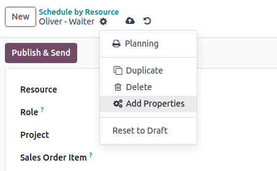
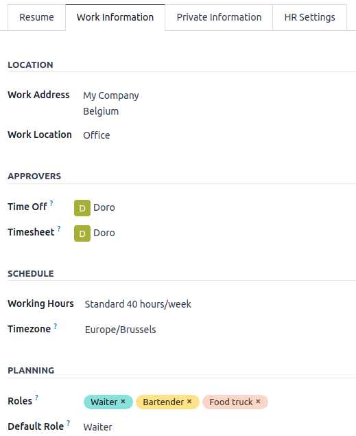
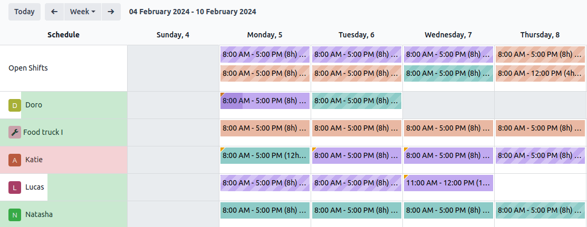

# Lập kế hoạch

**Odoo Planning** allows you to plan your team's schedule and manage shifts and resources.

Handling your team's planning comes with specific requirements that may vary widely depending on
your business needs. The following concepts were introduced in Odoo Planning to meet those needs:

**Shifts** are dispatched to **resources**, which can be either [human](#planning-employees)
(employees) or [material](#planning-materials) (e.g., equipment). The resources are assigned
[roles](#planning-roles), which allows for organization of work within the team.

Once the initial configuration is done, [planning shifts](#planning-shifts) can be done
manually or automated by using the [Auto Plan](#planning-open-shifts) feature.

An integration between the Planning and Sales apps allows the linking of sold services to roles and
shifts in Planning. Additionally, integration with [Project](project.md) allows dedicating
shifts, and thus time and resources, to specific projects.

#### SEE ALSO
[Odoo tutorials: Planning](https://www.odoo.com/slides/planning-60)

## Cấu hình

### Qui tắc

To define the roles your resources perform (e.g., chef, bartender, waiter), go to
Planning ‣ Configuration ‣ Roles, then click New, and fill in the
Name (e.g., assistant, receptionist, manager). Then, choose the Resources
that will perform this role. Resources can be either [Employees](#planning-employees) or
[Materials](#planning-materials).

#### NOTE
- If the Sales app is installed in your database, the Services field appears,
  allowing you to specify which roles are needed to perform services so that the shifts are
  dispatched to the right person.
- Roles are taken into account when using the [Auto Plan feature](#planning-open-shifts).

#### Property fields and roles

**Property fields** allow you to add custom fields to forms across several Odoo applications.
Planning includes the possibility of adding property fields linked to roles to shifts.

To create a property field, switch to the list view from any schedule. From there, click
View on the shift that you wish to edit. If the Role field is empty, fill it
in with the desired role, then click the cog icon and select Add Properties.
[Configure](../productivity/knowledge/properties.md) the new field according to your needs.

The property field is linked to the role and is included in the shift form of all shifts performed
by this role.

### Nhân viên

All employees can be included in the planning and assigned shifts.

To adapt the employee's planning settings, go to Planning ‣ Configuration ‣
Employees, and choose the employee for whom you want to edit the settings. Then, go to the
Work Information tab.

Two sections of the employee's Work Information tab have an impact on Planning:
Schedule (namely, the Working Hours field) and Planning.

#### Giờ làm việc

The Working Hours are taken into account when the Allocated Time and its
percentage is calculated for [shifts](#planning-templates). If the Working Hours
field is left blank, the employee is considered to be working flexible hours.

To create individual Working Hours, for example, for employees working part-time, click
Search more..., then New.

#### NOTE
The Working Hours and the Allocated Time in Planning can impact
**Payroll**, if the employee's contract is configured to generate work entries based on shifts.

#### SEE ALSO
[Payroll documentation on working schedules](../hr/payroll.md#payroll-working-times)

#### Planning roles

Once an employee has one or more Roles:

- When creating a shift for this employee, only the shift templates from the roles chosen in this
  field are displayed.
- When a schedule is published, the employee is only notified of open shifts for the roles that are
  assigned to them.
- When auto-assigning open shifts or planning sales orders, the employee is only assigned shifts for
  the roles assigned to them.

Additionally, when a Default role is defined:

- When creating a shift for the employee, the default role is automatically selected.
- This role also has precedence over the other roles of the employee when auto-assigning open shifts
  or planning sales orders.

#### NOTE
If the Planning roles fields are left empty, there are no restrictions in the shift templates and
open shifts shared with the employee. However, it’s not possible to use the **Auto Plan** feature
for employee with no roles.

### Nguyên liệu

**Materials** are resources that can be assigned shifts and working hours but are not employees.
For example, a construction company could use materials to create shifts for shared machines
(e.g., cranes, forklifts).

Similarly to employees, materials can be assigned roles and working time.

### Mẫu ca làm

To create a shift template, click New on any schedule, then fill in the
[details of the shift](#planning-create-shift). In order for the shift to be saved as a
template, tick Save as Template.

Alternatively, you can go to Planning ‣ Configuration ‣ Shift Templates, then
click New. Fill in the Start Hour and Shift Duration. The
shift’s End Time is then calculated based on the Working Hours, taking into
account working time as well as breaks.

Additionally, for each shift template, you can also configure:

- Role: to link the shift to this specific role.
- Project: to keep track of shifts that are dedicated to work on a project.

## Lập kế hoạch ca làm

On opening the Planning app, the users see their own schedule. Users with admin roles can also see
Schedule by Resource, Role, Project, or Sales Order,
as well as reporting and configuration menus.

#### NOTE
The schedule is displayed in the Gantt view, which allows you to edit (with a drag and drop),
resize, split, and duplicate shifts without having to open them.

The following visual elements are used on the shifts in the schedules:

- **Full color**: shifts that are planned and published.
- **Diagonal stripes**: shifts that are planned but have yet to be published.
- **Grayed-out background**: employees that are on time off.
- **Progress bar**: currently ongoing shifts with timesheets linked to them.
- **Grayed-out shift**: when copying shifts, the copied shifts are shown in full color, whereas
  previously existing shifts are temporarily greyed out. The color changes back to full color or
  diagonal stripes on the next refresh of the page or by removing the filter.

### Create a shift

To create a shift, go to any schedule, then click New. In the pop-up window that opens,
fill in the following details:

- **Templates**: If there is one or more templates existing in your database, they are
  displayed in the upper section of the pop-up window. Once selected, a template prefills the
  shift form accordingly.
- Resource: Resources can be both employees or materials. If this field is left empty,
  the shift is considered an [open shift](#planning-open-shifts).
- Role: Select the role that the resource assigned will be performing. This field is
  used when [auto-planning](#planning-open-shifts) shifts. Once you select a role, the shift
  templates associated with it are displayed in the upper section of the pop-up window.
- Project: If the Project app is installed in your database, this field allows you to
  link the project to the shift is available, allowing you to plan and track shifts dedicated to
  work on the selected project.
- Sales Order Item: If the Sales app is installed in your database, this field allows
  you to link a sales order to the shift.
- Repeat: Tick the checkbox and configure the Repeat Every field according
  to your needs. The following rules apply to recurring shifts:
  - All fields (e.g., Resource, Role, Project) are copied from
    the original shift except for the date, which is adjusted according to the
    Repeat Every field.
  - Recurrences are planned but not published.
  - By default, planned shifts are created six months in advance, after which they are created
    gradually. To change the time frame, [activate the Developer mode](../general/developer_mode.md#developer-mode), then
    go to Planning ‣ Configuration ‣ Settings and edit the
    Recurring Shifts.
- Save as Template: When this option is ticked, a shift template is created with the
  same Start and End hours, Allocated time, Role,
  and Project.
- Additional note sent to the employee: Click on the field to add a note.
- Date: Choose the date and time of your shift. This is the only mandatory field when
  creating a shift.
- Allocated time: Is calculated based on the date and the employee’s Working
  Schedule. See more in [Shift Templates](#planning-templates).

Click Publish & Save to confirm the shift and send the assigned employee their schedule
by email.

#### NOTE
The draft is visible on the admin planning view and can be identified by diagonal lines. The
employee is only notified of the shift once it's published.

Two kinds of notifications are sent to the employees depending on their account configuration:

- Employees without user accounts are redirected to a dedicated **Planning portal**.
- Employees with a user account are redirected to the My Planning view in the
  backend view of Odoo.

### Open shifts and auto planning

The Auto Plan button allows you to assign **Open shifts** (shifts with no resource
assigned) and create and assign shifts linked to sales orders or project.

The following features have an impact on auto planning:

- **Roles**: Open shifts are only assigned to resources (employees or materials) that have the
  corresponding role assigned. It is not possible to use the Auto Plan feature for
  employee with no roles.
- **Default roles**: The default role assigned to a resource is given priority over the other roles
  they have assigned to them.
- **Conflicts**: Employees or materials cannot be assigned multiple shifts at the same time.
- **Time off**: The employees’ time off is taken into account, as well as public holidays.
- **Working hours**: Are taken into account when assigning shifts to employees or materials. It is
  not possible to use the Auto Plan feature for an employee who is working
  [flexible hours](#planning-working-hours).
- **Contracts**: If the employee has an active contract, they won't be assigned shifts that fall
  outside of their contract period.

Click Publish to confirm the schedule and notify the employees of their planning.

### Switching shifts and unassignment

Two features are available to allow employees to make changes to their schedule:
**switching shifts** and **unassignment**.

#### NOTE
These features are mutually exclusive. Switching shifts is possible by default and cannot be
disabled. However, once the **Allow unassignment** feature is enabled, it replaces the option to
switch shifts.

#### Đổi ca làm

Once shifts are planned and published, employees receive an email notification. If an employee
wishes to switch a shift, they can click the unwanted shift and click Ask to switch.

The shift remains assigned to the original employee, but in the schedule, a notification
informing that the assigned employee would like to switch shifts is visible on the shift.

The shift is then displayed to other employees who share the same role, and if they wish to assign
it to themselves, they can click the I take it button.

#### NOTE
The following rules apply:

- Only the shifts matching the employee's roles are displayed as available to them.
- Switching shifts is not available for shifts in the past.

#### Huỷ phân công

To allow employees to unassign themselves from shifts, go to
Planning ‣ Configuration ‣ Settings, then tick the checkbox
Allow Unassignment. Then, specify the maximum number of days that the employees can
unassign themselves before the shift.

Once shifts are planned and published, employees receive an email notification. If shift
unassignment is allowed, the employees can click the I am unavailable button, and the
shift reverts to an open shift.

#### NOTE
The following rules apply:

- Only the shifts matching the employee's roles are displayed in their schedule.
- Unassigning shifts is not available for shifts in the past.
