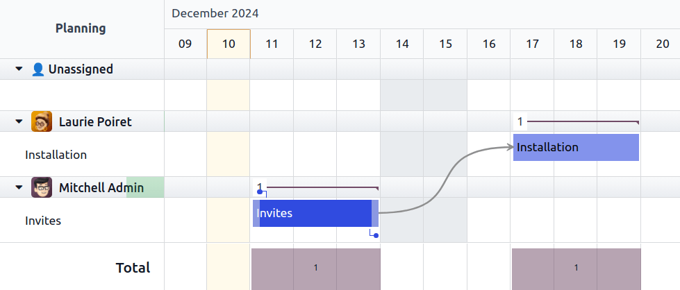

# Task dependencies

Odoo Project allows you to break down projects into tasks and establish relationships between those
tasks to determine the order in which they are executed. Task dependencies ensure that certain tasks
begin only after the preceding tasks are completed.

To enable task dependencies in projects, go to Project ‣ Configuration ‣
Settings, enable Task Dependencies, and click Save.

## Set task dependencies

Task dependencies can be created from the task form or the project's Gantt view by linking the
successor task (i.e., the task blocked by other tasks) to its predecessor task(s) (i.e., the tasks
blocking the successor task).

To create task dependencies from the task form, access the desired task and, in the
Blocked by tab, click Add a line. Click View to access the
predecessor task. To access the successor tasks from the predecessor task, click the
Blocking Tasks smart button.

To create a task dependency from the Gantt view, hover your mouse over the predecessor task, then
click one of the dots that appear around it. Drag and drop the dot onto the successor task. An arrow
appears, indicating the dependency from the predecessor task to the successor.

Odoo automatically manages task progress based on their dependency. Successor tasks are assigned the
Waiting status and cannot be moved to In Progress until their predecessor
task(s) are marked as Approved, Cancelled, or Done.

## Remove dependencies

To remove a task dependency, proceed as follows:

- From the task form, go to the **Blocked by** tab and click the <i class="fa fa-times"></i>
  (times) button.
- From the Gantt view, click the red <i class="fa fa-times"></i> (times) button that appears at the
  center of the arrow when you hover your mouse over it.
