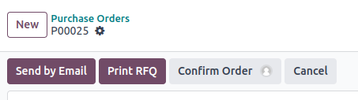
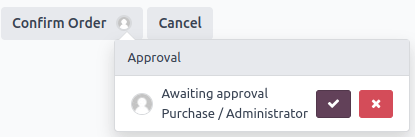

# Quy tắc phê duyệt

Approval rules are used to automate approval processes for actions. They allow you to define
the criteria for when an approval is required before an action can be performed using a button.

## Cấu hình

To add approval rules with Studio, proceed as follows:

1. [Open Studio](../studio.md#studio-access) and switch to the required [view](views.md).
2. Select the button for which you want to add approval rules.
3. In the Properties tab on the left, enable the Set approval rules
   feature.
4. Specify the Allowed Group to limit the approval permission to a specific user
   group.
5. Select the Responsible user to create an activity for a specific user when approval
   is requested from them.
6. Select the Users to notify via internal note.
7. Add a Description to be displayed in the [Approval dialog](#approval-rules-use).

Optionally, you can also add conditions for the approval rule to be applied by clicking the
<i class="fa fa-filter"></i> (filter) icon next to the Allowed Group field.

To add another rule, click Add an approval rule. When there are multiple approval rules,
you can:

- enable Exclusive Approval to require approvers to be different users;
- change the Notification Order of the approval rule so that the Responsible
  and Users to notify are only notified when the previous rule has been approved, and
  their approval is required. If the approval rules have the same Notification Order,
  all users are notified at the same time when the first approval is requested.

Click the <i class="fa fa-trash"></i> (trash) icon next to the Allowed Group field to
delete the approval rule.

## Sử dụng

Once approval rules have been defined for a button:

- A **user avatar** icon is displayed next to the button's label for each approval rule that has
  been defined.
  > 
- When an unauthorized user clicks the button, an error message is displayed in the top-right corner
  and an activity is created for the user specified in the Responsible field.
- Only users from the group defined in the Allowed Group field are authorized to approve
  or reject the action.

Authorized users can:

- approve and perform the action by clicking the button;
- approve the action and allow another user to perform it by clicking the **user avatar** icon next
  to the button's label, then clicking the <i class="fa fa-check"></i> (Approve) button in the
  dialog that opens;
- reject the action by clicking the **user avatar** icon next to the button's label, then clicking
  the <i class="fa fa-times"></i> (Reject) button in the dialog that opens.

