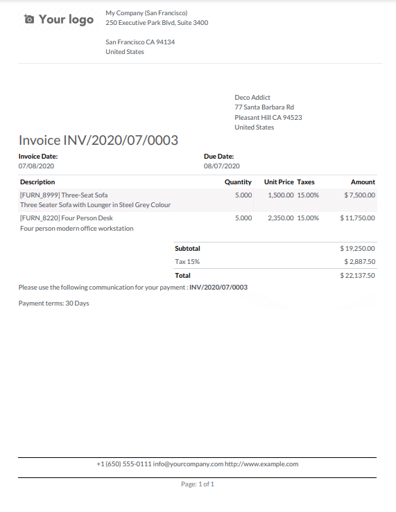
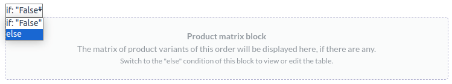
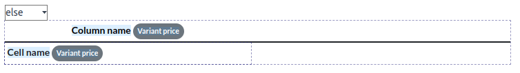
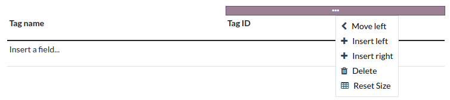

# Báo cáo PDF

With Studio, you can [edit existing PDF reports](#studio-pdf-reports-edit) (e.g., invoices,
quotations, etc.) or [create new ones](#studio-pdf-reports-edit).

## Bố cục mặc định

The default layout of reports is managed outside Studio. Go to Settings, then, in
the Companies section, click Configure Document Layout. Layout settings are
company-specific but apply to all reports.

Use the following settings:

- Layout: Four layouts are available:

  Sáng
  

  Đóng hộp
  

  In đậm
  

  Kẻ sọc
  

- Font: Seven fonts are available: Lato, Roboto, Open Sans, Montserrat, Oswald, Raleway,
  and Tajawal (which supports Arabic and Latin scripts). Go to the
  [Google Fonts website](https://fonts.google.com/) to preview them.

- Company logo: Click the Edit button to upload or change the logo. This
  adds the logo to the company’s record on the *Company* model, which you can access by going to
  Settings and then clicking Update Info in the Companies
  section.

- Colors: Change the primary and secondary colors used to structure reports. The default
  colors are automatically generated based on the colors of the logo.

- Layout background: The following backgrounds are available:
  - Blank: nothing is displayed.
  - Geometric: an image featuring geometric shapes is displayed in the background.
  - Custom: upload a custom background image.

- Company tagline: This is displayed in the header of [external reports](#studio-pdf-reports-header-footer-external). You can add multiple lines of text.

- Company details: These are displayed in the header of [external reports](#studio-pdf-reports-header-footer-external). You can add multiple lines of text.

- Footer: This text is used in the footer of [external reports](#studio-pdf-reports-header-footer-external). You can add multiple lines of text. You can also
  edit the footer using the [report editor](#studio-pdf-reports-edit).

- Paper format: to define the default paper size of reports. You can select
  A4 (21 cm x 29.7 cm), US Letter (21.59 cm x 27.54 cm), or
  QR codes page. This can also be defined for individual reports in the
  Paper format field in [Studio](#studio-pdf-reports-create).

## Creating new PDF reports

To create a new report for a model, access the model, click the **Toggle Studio** button, then click
Reports. Click New and, in the popup window that opens, select the type of
report. This is solely used to determine what is displayed in the header and footer:

- Bên ngoài:
  - The header displays the company's [logo](#studio-pdf-reports-default-layout-logo),
    [tagline](#studio-pdf-reports-default-layout-tagline), and
    [details](#studio-pdf-reports-default-layout-details).
  - The footer displays the values set in the
    [Footer](#studio-pdf-reports-default-layout-footer) field and the page number.
- Internal: The header displays the user's current date and time,
  Company Name, and page number. There is no footer.
- Blank: There is neither a header nor a footer. Click in the upper left corner of the
  page to edit the report.

Once you have created the report, you can start [editing it](#studio-pdf-reports-edit).

## Editing PDF reports

To access the reports available for a model, access the model (e.g., sales orders), click the
**Toggle Studio** button, then click Reports. Select an existing report to open it or
[create a new one](#studio-pdf-reports-create).

#### IMPORTANT
It is strongly recommended to **duplicate** the standard report and perform changes in the
duplicated version. To duplicate a report, hover the mouse pointer on the top right corner
of the report, click the vertical ellipsis icon (⋮), and then select
Duplicate.

### Tùy chọn

Once you've selected or created a report, you can use the options in the left part of the screen to:

- Change the Report name. The new name is applied everywhere (in Studio, under
  the Print button, and in the PDF file name).
- Modify the Paper format. If no value is selected, the format defined in the
  [default layout](#studio-pdf-reports-default-layout-paper) is used.
- Show in print menu: to add the report in the Print menu available from the
  record.
- Reload from attachment: to save the report as an attachment on the record the first
  time it is generated and reload the original version of the report any subsequent time. This is
  legally required for invoices and is mainly used in this case.
- Limit visibility to groups: to limit the availability of the PDF report to specific
  [user groups](../general/users/access_rights.md).
- Edit sources: to modify the report directly in the [XML file](#studio-pdf-reports-xml-editing).
- Reset report: to discard all changes made to the report and reset it to its standard
  version.
- Print preview: to generate and download a report preview.

### Report editor

The report editor allows you to modify the formatting and contents of the report.

#### IMPORTANT
Editing the header and footer of a report impacts all standard and custom reports.

#### Conditional blocks

The dashed rectangles represent **conditional blocks** (*if/else* statements). These are used to
show/hide content based on specific conditions. Click on the block to view the conditions.

Select a value to preview its corresponding output and edit it if necessary.

#### NOTE
Conditions can only be edited in [XML](#studio-pdf-reports-xml-editing).

#### Other content

There are two types of text content in reports:

- Static text, i.e., the text that's not highlighted in blue, which can be modified directly in the
  editor.
- Dynamic text, i.e., the text that's highlighted in blue, which is replaced by field values when
  the report is generated, e.g., the SO number or the quotation date.

You can add content (e.g., fields, lists, tables, images, banners, etc.) to the report using
commands. Type `/` to open the [powerbox](../productivity/knowledge/articles_editing.md#knowledge-powerbox), then type the command's
name or select it from the list.

To add static text to the report, type the text where you want it.

For more advanced changes, you can [edit the report in the XML directly](#studio-pdf-reports-xml-editing).

##### Add a field

To add a field, type `/` and select the Field command. In the list that opens, select
or search for the field; click the right arrow next to the field name to access the list of related
fields if needed. Then, specify the default value and press `Enter`.

##### Add a data table

Data tables are used to display [relational fields](fields.md#studio-fields-relational-fields). To add
a data table, type `/`, select the Dynamic Table command, and select the relation to be
displayed in the table.

#### NOTE
Only relations of type `one2many` or `many2many` can be displayed as data tables.

Once the table has been added, you can add columns using the table tools. Position the cursor on top
of the column, then click the purple rectangle and select an option.

You can then insert the [field of your choice](#studio-pdf-reports-add-field) in the columns. The dialog box that opens shows the source object
for the field (e.g., the *Tag* model) and the list of available fields.

#### NOTE
- The default row automatically iterates over the field's content, generating a row on the report
  for each field value (e.g., one row per tag). You can add static content rows above or below
  the generated rows using the table tools.
- You can also add data tables by [modifying the report's XML](#studio-pdf-reports-xml-editing).

##### Định dạng

To format text in the report, select it, then format it using the options in the
[Trình soạn thảo văn bản](../productivity/knowledge/articles_editing.md#knowledge-text-editor).

> 

### Editing the report's XML

#### WARNING
Modifying the XML directly may result in report issues during [upgrades](../../administration/upgrade.md). If this happens, simply copy your changes from the old
database into your upgraded database.

To edit the report's XML, click Edit sources in the left pane.

#### Ví dụ
