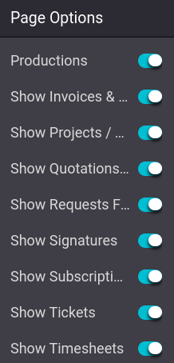

# Tài khoản khách hàng

Having customer accounts on an eCommerce allows customers to access all their documents from a
single place. To access their account, customers must be **logged-in** on the eCommerce website,
click on their **username** in the top-right corner of the screen, and click My Account.
From there, customers can access their quotations, orders,
invoices, etc.

#### NOTE
Customers can only have an account if the [sign in/up at checkout](applications/websites/ecommerce/checkout.md#checkout-sign) option
allows for accounts creation.

#### SEE ALSO
[Quyền truy cập cổng thông tin](applications/general/users/portal.md)

## Hạn chế quyền truy cập

It is possible to allow or restrict the documents to which customers have access through the website
builder. Log in your **own** account with your Odoo database credentials, and go to
Edit ‣ Customize. From the website builder menu, enable or disable the documents
customers can have access to.

## Multi-website account

If you own multiple websites, you can make customer accounts available across **all** websites.
Then, the customer only needs one account. To do so, go to Website ‣ Configuration
‣ Settings ‣ Privacy section, and enable Shared Customer Accounts.
