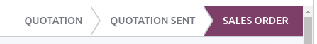

# Order handling

When a customer orders on your eCommerce, there are **three** record types required to be handle in
Odoo:

- [Sales orders](#handling-sales);
- [Delivery orders](#handling-delivery);
- [Invoices & legal requirements](#handling-legal).

## Đơn bán hàng

### Order and payment status

Bước đầu tiên khi khách hàng thêm sản phẩm vào giỏ hàng là tạo báo giá. Đơn hàng có thể được quản lý từ **Trang web** hoặc ứng dụng [Bán hàng](../../sales/sales/). Đơn hàng thương mại điện tử có thể tự động được chỉ định cho một bộ phận bán hàng cụ thể bằng cách vào Trang web ‣ Cấu hình ‣ Cài đặt. Trong phần **Cửa hàng - Quy trình thanh toán**, chọn Bộ phận sales hoặc Chuyên viên sales để xử lý đơn hàng thương mại điện tử.

Orders can be found under Website ‣ eCommerce ‣ Orders/Unpaid Orders. Each
order goes through a different status:

- **Quotation**: a new product is added to the cart, but the customer has *not* gone through the
  checkout process yet;
- **Quotation sent**: the customer has gone through the checkout process and confirmed the order,
  but the payment is not yet confirmed;
- **Order**: the customer has gone through the checkout process, confirmed the order, and the
  payment is received.

### Giỏ hàng bỏ dở

**Giỏ hàng bỏ dở** là đơn hàng mà khách hàng **chưa hoàn tất** quy trình xác nhận thanh toán. Đối với những đơn hàng này, có thể tự động gửi **nhắc nhở qua email** cho khách hàng. Để bật tính năng đó, đi đến Trang web ‣ Cấu hình ‣ Cài đặt và trong phần Email & marketing, hãy bật Tự động gửi email thanh toán bỏ dở. Sau khi bật, bạn có thể cài đặt **khoảng thời gian** mà sau đó email được gửi đi và tùy chỉnh **mẫu email** được sử dụng.

#### NOTE
For abandoned cart emails, the customer must either have entered their contact details during the
checkout process; or be logged-in when they added the product to their cart.

## Lệnh giao hàng

### Delivery flow

Once a quotation has been confirmed, a delivery order is automatically created. The next step is to
process this delivery.

Packing eCommerce orders usually requires picking the product, preparing the packaging, printing the
shipping label(s) and shipping to the customer. Depending on the number of orders, strategy, or
resources, those steps can be considered as one or multiple actions in Odoo.

An automatic email can be sent to the customer when the transfer status in Odoo is “done”. To do so,
enable the feature in the settings of the
[Inventory](../../inventory_and_mrp/inventory/) app.

#### NOTE
If customers are allowed to pay when picking up their order in stores or by wire transfer, the
quotation is **not** be confirmed and the stock is **not** be reserved. Orders must be confirmed
manually to reserve products in stock.

#### SEE ALSO
- [Shipping cost invoicing](../../inventory_and_mrp/inventory/shipping_receiving/setup_configuration/invoicing.md)
- [Print shipping labels](../../inventory_and_mrp/inventory/shipping_receiving/setup_configuration/labels.md)
- [Multi-package shipments](../../inventory_and_mrp/inventory/shipping_receiving/setup_configuration/multipack.md)

### Returns and refunds

Customers can only return an order through an online form. It may not be possible to return products
depending on the return strategy or type of product.

Full refunds can be directly sent to customers from within the order interface. A refund-compatible
payment provider needs to be enabled first.

#### SEE ALSO
- [Returns and refunds](../../sales/sales/products_prices/returns.md)
- [Dịch vụ hậu mãi](../../services/helpdesk/advanced/after_sales.md)
- [Thanh toán online](../../finance/payment_providers/)

## Invoice and legal requirements

The final step of an ecommerce order is to generate the invoice and send it to the customer.
Depending on the type of business (B2B or B2C), an invoice can either be generated automatically
(B2B) or on demand of the customer (B2C). This process can be automated if (and when) the online
payment is [confirmed](#handling-sales).

To automate invoicing, go to Website ‣ Configuration ‣ Settings and in the
Invoicing section, enable Automatic Invoice.
