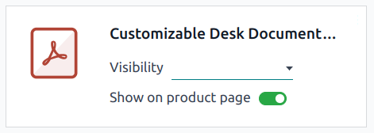
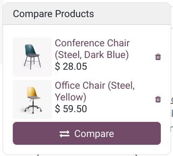

# Sản phẩm

**Odoo eCommerce** allows you to [add products](#ecommerce-products-add-products) and manage
your [product pages](#ecommerce-products-product-page) directly from the Website app. It also
allows you to add [product variants](#ecommerce-products-product-variants) and
[digital files](#ecommerce-products-digital-files),
[translating](#ecommerce-products-translation) the product page content,
[managing stock](#ecommerce-products-stock-management), and enabling
[product comparisons](#ecommerce-products-product-comparison).

## Add products

### Create products

To create a product from the frontend, click + New in the top-right corner, then
Product. Enter the Product Name, Sales Price, the default
Customer Taxes for local transactions, and Save. You can then update the
product's details, add an image, and [customize](#ecommerce-products-customization) the product
page. When you Save, the product page is automatically published.

### Nhập sản phẩm

To [import product data](../../essentials/export_import_data.md#import-data) using XLSX or CSV files, go to
Website ‣ eCommerce ‣ Products, click the <i class="fa fa-cog"></i> (gear)
icon, then [Import records](../../essentials/export_import_data.md#import-data).

## Shop page

To customize the layout of the main Shop page or modify its content, click
Edit. Go to the Blocks tab to add
[building blocks](../website/web_design/building_blocks.md) or to the
Customize tab to change the page layout or add features:

- Layout: Select Grid or List.
  > - Size: Set the number of products displayed per page and line.
  > - Style: Select Default, Cards, Thumbnails, or
  >   Grid.
  > - Image Size: Choose the aspect ratio for the product images:
  >   Landscape (4/3), Default (1/1), Portrait (4/5), or
  >   Vertical (2/3). You can also adjust the display by changing the Fill
  >   options to best fit your design preferences.
- Thanh tìm kiếm: Bật/tắt công tắc để hiển thị thanh tìm kiếm ở đầu trang sản phẩm
  : .
- Prod. Desc.: Toggle the switch to display the product description below the product's
  name.
- Categories: display product categories on the Left, on the
  Top, or both. If Left is selected, you can enable
  Collapse Categories to make the category menu collapsible.
- Datepicker: Toggle the switch to display a date range calendar to check the
  availability of rental products over a specific period. The
  [Rental app](../../sales/rental.md) must be installed to use this feature.
- Attributes: Show product attributes on the Left and/or display a
  <i class="fa fa-sliders"></i> (dropdown toggle) icon at the Top allowing customers to
  filter products based on their attributes.
  - Price Filter: Toggle the switch to display a Price Range bar, which
    allows customers to filter products according to a specific price range by dragging adjustable
    handles.
  - Product Tags: Toggle the switch to display the Product Template Tags on
    the product page and allow customers to filter products using those tags by going to the
    Tags section in the left column.
- Top Bar: Select Sort By to display a dropdown list in the top bar for
  sorting products and/or Layout to allow customers to switch to the grid or list view
  using the related icons.
- Default Sort: Choose how products are sorted by default: Featured,
  Newest Arrivals, Name (A-Z), Price - Low to High, or
  Price - High to Low.
- Nút:
  - Select the <i class="fa fa-shopping-cart"></i> (Shopping cart) option to display an
    <i class="fa fa-shopping-cart"></i> (Add to cart) icon on each product's image, which takes the
    customer to the checkout page.
  - Select the <i class="fa fa-heart-o"></i> (Wishlist) option to display an
    <i class="fa fa-shopping-cart"></i> (Add to wishlist) icon on each product's image allowing
    logged-in customers to save products to a wishlist.
  - Select the <i class="fa fa-exchange"></i> (Compare) option to display the <i class="fa fa-exchange"></i>
    (Compare) icon on each product's image allowing customers to [compare products](#ecommerce-products-product-comparison) based on their attributes.

## Product page

To access a product's page, go to the Shop and click on the product. Click
Edit to [customize](#ecommerce-products-customization) the page or
[edit its images](#ecommerce-products-image-customization).

To access the backend **product form**, click the <i class="fa fa-cog"></i> Product button in the
top-right corner of the product page. Alternatively, navigate to Website ‣
eCommerce ‣ Products and select the product. You can configure the product page from the form
by adding [variants](#ecommerce-products-product-variants), [digital documents](#ecommerce-products-digital-files), or [translating](#ecommerce-products-translation) content.

### Tuỳ chỉnh

To customize a product page, click Edit. Go to the Blocks tab to add
[building blocks](../website/web_design/building_blocks.md).

Go to the Customize tab to modify the page layout or add features:

- Terms and Conditions: Toggle the switch to display a link to your
  [terms and conditions](../../finance/accounting/customer_invoices/terms_conditions.md) on the
  product page.
- Khách hàng:
  > - Đánh giá: Cho phép người dùng cổng thông tin đã đăng nhập gửi đánh giá sản phẩm bằng cách nhấp vào số sao bên dưới tên sản phẩm và chia sẻ trải nghiệm của họ trong phần Nhận xét của khách hàng ở cuối trang. Các nhận xét có thể được xem từ trang sản phẩm bằng cách sử dụng biểu tượng :icon:fa-plus (:guilabel:dấu cộng) bên cạnh tiêu đề Nhận xét của khách hàng hoặc từ cửa sổ trò chuyện trên biểu mẫu sản phẩm. Để giới hạn quyền hiển thị chỉ cho nhân viên nội bộ, hãy tắt công tắc Công khai bên cạnh nhận xét đánh giá.
  > - Share: Add social media and email icon buttons allowing customers to share the
  >   product through those channels.
- Select Quantity: Toggle the switch to allow customers to select the product quantity
  they want to purchase.
- Tax indication: Toggle the switch to indicate if the price is
  [VAT included or excluded](products/price_management.md#ecommerce-price-management-tax-display).
- Variants: Show all possible product [variants](#ecommerce-products-product-variants)
  vertically as a Products List or horizontally as selectable Options to
  compose the variant yourself.
- Product Tags: Toggle the switch to display the Product Template Tags on
  the product page and allow customers to filter products using those tags.
- Giỏ hàng:
  > - Buy Now: Add a <i class="fa fa-bolt"></i> Buy Now option to take the customer to
  >   the checkout page.
  > - Wishlist: Add an <i class="fa fa-heart-o"></i> Add to wishlist option allowing
  >   logged-in customers to save products in a wishlist.
  > - Compare: Add a <i class="fa fa-exchange"></i> Compare option, allowing customers
  >   to [compare products](#ecommerce-products-product-comparison) based on their attributes.
- Specification: Select Bottom of Page to display a detailed list of the
  attributes and their values available for the product. This option only works for products with
  [variants](#ecommerce-products-product-variants) if the
  [Product comparison tool](#ecommerce-products-product-comparison) is enabled in the Website
  Settings.

#### NOTE
- Variants, <i class="fa fa-heart-o"></i> Wishlist, and <i class="fa fa-exchange"></i>
  Compare options must be enabled by going to
  Website ‣ Configuration ‣ Settings, in the Shop - Products
  section.
- Enabled functions apply to all product pages.
- Products with single values for their attributes do not generate variants but are still
  displayed in the Product Specifications.

### Image customization

To customize the images available on the product page, go to the Customize tab:

- Images Width: Changes the width of the product images displayed on the page.
- Layout: The Carousel layout allows customers to navigate from one image to
  the next using the <i class="fa fa-angle-left"></i> (left arrow) or <i class="fa fa-angle-right"></i>
  (right arrow); whereas the Grid displays four images in a square layout.
- Image Zoom: Select the zoom effect for product images: Magnifier on hover
  Pop-up on Click, Both, or None.
- Thumbnails: Align thumbnails on the <i class="fa fa-long-arrow-left"></i> (Left) or
  : at the <i class="fa fa-long-arrow-down"></i> (Bottom).
- Main Image: Click Replace to change the product's main image.
- Extra Images: Add extra images or videos (including via URL) or
  Remove all product images.

#### NOTE
Images must be in PNG or JPG format and with a minimum size of 1024x1024 to trigger the zoom.

## Biến thể sản phẩm

[Product variants](../../sales/sales/products_prices/products/variants.md) are different versions
of the same product, such as various colors or materials, with potential differences in price and
availability.

To configure product variants for a product:

1. Go to Website ‣ Configuration ‣ Settings.
2. Scroll down to the Shop - Products section and enable the
   Product Variants feature.
3. Access the [product forms](#ecommerce-products-product-form) and go to the
   Attributes & Variants tab, where you can add attributes and values, allowing customers
   to configure and select product variants on the product page. For multiple attributes,
   you can combine them to create specific variants.

To display or hide an attribute on the Shop page and allow visitors to filter them,
go to Website ‣ eCommerce ‣ Attributes, click on the attribute, and select
Visible or Hidden in the eCommerce Filter Visibility field.

#### NOTE
Two attribute values are needed to make the filter visible.

#### SEE ALSO
[Product variants](../../sales/sales/products_prices/products/variants.md)

## Digital files

You can link digital files like certificates, eBooks, or user manuals to the products. These
documents are available [before payment](#ecommerce-products-digital-files-before-payment) on
the product page or in the customer portal [after checkout](#ecommerce-products-digital-files-after-payment).

To link a digital file to a product, go to the [product form](#ecommerce-products-product-form)
and click the Documents smart button. Then, click Upload to upload a file
directly, or for additional options, click New, then Upload your file.

### Digital files available before payment

To make the file available on the product page (before payment), leave the Visibility
field blank and toggle the Show on product page switch.

### Digital files available after payment

To make the file available (after payment), set the Visibility field to
Confirmed order and turn off the Show on product page switch.

## Translation

If multiple languages are available on your website, you can translate a product's information
directly on the [product form](#ecommerce-products-product-form). Fields that support multiple
languages are identifiable by their abbreviation language (e.g., EN) next to their field.

The eCommerce-related fields to translate are:

- Product name.
- Out-of-Stock Message (under the Sales tab).
- Sales Description (under the Sales tab).

#### NOTE
- Having untranslated content on a web page may be detrimental to the user experience and
  [SEO](../website/pages/seo.md). You can use the
  [Translate](../website/configuration/translate.md) feature to translate the page's content.
- To check the language(s) of your website, go to Website ‣ Configuration ‣
  Settings and go to the Website Info section.

### Website availability

To set the product's website availability, navigate to the [product form](#ecommerce-products-product-form), go to the Sales tab, and in the
eCommerce shop section, select the Website you wish the product to be
available on. Leave the field blank to make the product available on *all* websites.

#### NOTE
You can make a product available on either *one* website or *all* websites, but selecting only
*some* websites is not possible.

## Quản lý tồn kho

To enable and configure inventory management options, go to Website ‣
Configuration ‣ Settings, scroll down to the Shop - Products section and the
Inventory Defaults sub-section.

#### IMPORTANT
- The **Inventory** app must be installed to see the inventory management options.
- To display the stock level on the product page, the Product Type field must be set
  to Storable in the [product form](#ecommerce-products-product-form).

### Tồn kho

In the Inventory Defaults sub-section, fill in those fields:

- [Kho hàng](../../inventory_and_mrp/inventory/warehouses_storage/inventory_management/warehouses.md).
- Out-of-Stock: Enable Continue Selling to allow customers to place orders
  even when the product is **out of stock**. Leave the box unchecked to **prevent orders**.
- Show Available Qty: Displays the available quantity left under a specified threshold
  on the product page. The available quantity is calculated based on the On hand
  quantity minus the quantity already reserved for outgoing transfers.

## So sánh sản phẩm

To allow website visitors to compare products based on their attributes, go to
Website ‣ Configuration ‣ Settings, scroll down to the
Shop - Products section, and enable Product Comparison Tool.

Biểu tượng <i class="fa fa-exchange"></i> (So sánh) hiện có sẵn trên mỗi thẻ sản phẩm ở trang cửa hàng chính khi khách hàng di chuột qua. Để so sánh sản phẩm, khách hàng có thể nhấp vào tùy chọn <i class="fa fa-exchange"></i> (So sánh) trên các sản phẩm muốn so sánh, sau đó nhấp <i class="fa fa-exchange"></i> So sánh trong cửa sổ bật lên ở cuối trang để xem bảng tóm tắt so sánh.

#### NOTE
- The Product Comparison Tool is only available for products with
  [attributes](#ecommerce-products-product-variants).
- Selecting the <i class="fa fa-exchange"></i> (Compare) option from a product page is also
  possible.

* [Danh mục](products/catalog.md)
* [Quản lý giá](products/price_management.md)
* [Cross-selling and upselling](products/cross_upselling.md)
