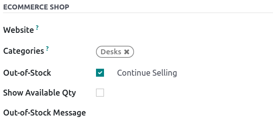
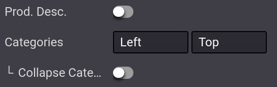
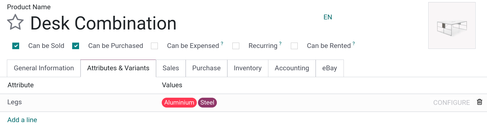
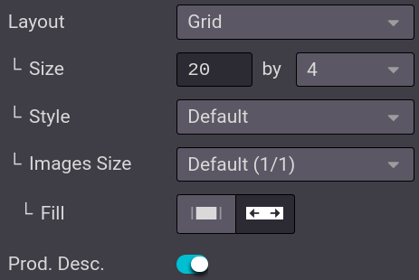
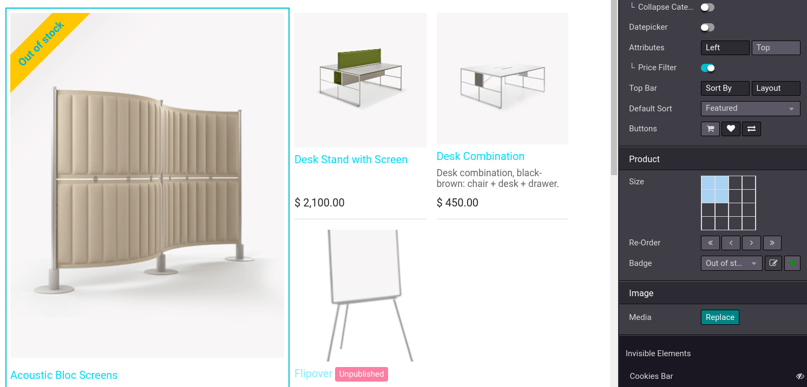
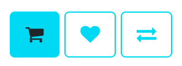

# Danh mục

The eCommerce catalog is the equivalent of your physical store shelves: it allows customers to see
what you have to offer. Clear categories, available options, sorting, and navigation threads help
you structure it efficiently.

## Categorize the product catalog

In Odoo, there is a **specific category model** for your eCommerce. Using eCommerce categories for
your products allows you to add a navigation menu on your eCommerce page. Visitors can then use it
to view all products under the category they select.

To do so, go to Website ‣ eCommerce ‣ Products, select the product you wish to
modify, click on the Sales tab, and select the Categories you want under
eCommerce Shop.

#### NOTE
A single product can appear under multiple eCommerce categories.

Khi các danh mục sản phẩm đã được cấu hình, hãy truy cập **trang cửa hàng chính** và nhấp vào Chỉnh sửa ‣ Tab Tùy chỉnh. Trong tùy chọn Danh mục, bạn có thể bật menu ở Bên trái, ở Trên cùng hoặc cả hai. Nếu chọn danh mục Bên trái, tùy chọn Danh mục đệ quy có thể thu gọn sẽ xuất hiện và cho phép hiển thị menu danh mục Bên trái dưới dạng có thể thu gọn.

#### SEE ALSO
[Sản phẩm](applications/websites/ecommerce/products.md)

### Browsing

The eCommerce category is the first tool to organize and split your products. However, if you need
an extra level of categorization in your catalog, you can activate various **filters** such as
attributes or sort-by search.

#### Thuộc tính

Attributes refer to **characteristics** of a product, such as **color** or **material**, whereas
variants are the different combinations of attributes. Attributes and Variants can be
found under Website ‣ eCommerce ‣ Products, select your product, and
Attributes & Variants tab.

#### SEE ALSO
- [Biến thể sản phẩm](applications/sales/sales/products_prices/products/variants.md)

To enable **attribute filtering**, go to your **main shop page**, click on Edit ‣
Customize tab and select either Left, Top, or both. Additionally, you can
also enable Price Filtering to enable price filters.

#### NOTE
Price Filter works independently from **attributes** and, therefore, can be enabled
on its own if desired.

#### Sort-by search

Bạn có thể cho phép người dùng **sắp xếp danh mục** thủ công bằng thanh tìm kiếm. Từ **trang chính cửa hàng**, nhấp vào Chỉnh sửa ‣ tab Tùy chỉnh; bạn có thể bật hoặc tắt tùy chọn Sắp xếp theo cũng như nút Bố cục. Bạn cũng có thể chọn Sắp xếp mặc định cho nút Sắp xếp theo. Thứ tự sắp xếp mặc định sẽ áp dụng cho *tất cả* danh mục.

The **sorting** options are:

- Nổi bật
- Hàng mới về
- Tên (A-Z)
- Giá - Thấp tới cao
- Giá - Cao tới thấp

Ngoài ra, bạn có thể **chỉnh sửa thủ công** thứ tự sản phẩm trong danh mục bằng cách vào **trang cửa hàng chính** và nhấp vào sản phẩm. Trong phần Sản phẩm của phần Tùy chỉnh, bạn có thể sắp xếp lại thứ tự bằng cách nhấp vào các mũi tên. `<<` `>>` di chuyển sản phẩm **xa** sang phải hoặc trái, và `<` `>` di chuyển sản phẩm theo **một** hàng sang phải hoặc trái. Bạn cũng có thể thay đổi thứ tự sản phẩm trong danh mục tại Trang web ‣ Thương mại điện tử ‣ Sản phẩm và kéo thả các sản phẩm trong danh sách.

## Page design

### Category page

You can customize the layout of the category page using the website builder.

#### IMPORTANT
Editing the layout of the category page is global; editing one category layout affects *all*
category pages.

To do so, go on to your Category page ‣ Edit ‣ Customize. Here, you can choose
the layout, the number of columns to display the products, etc. The Product Description
button makes the product description visible from the category page, underneath the product picture.

### Điểm nổi bật của sản phẩm

Bạn có thể làm nổi bật sản phẩm để chúng dễ nhìn hơn trên trang danh mục hoặc trang sản phẩm. Trên trang bạn chọn, hãy vào Chỉnh sửa ‣ Tùy chỉnh và nhấp vào sản phẩm muốn làm nổi bật. Trong phần Sản phẩm, bạn có thể chọn kích thước hình ảnh sản phẩm bằng cách nhấp vào lưới, đồng thời cũng có thể thêm **ruy-băng** hoặc Huy hiệu. Tính năng này sẽ hiển thị biểu ngữ trên hình ảnh sản phẩm, ví dụ:

- Sale;
- Hết hàng;
- Out of stock;
- Mới.

Alternatively, you can activate the [developer mode](applications/general/developer_mode.md) on the
**product's template**, and under the Sales tab, change or create the ribbon from the
Ribbon field.

#### NOTE
The [developer mode](applications/general/developer_mode.md) is only intended for experienced
users who wish to have access to advanced tools. Using the **developer mode** is *not*
recommended for regular users.

## Tính năng bổ sung

You can access and enable additional feature buttons such as **add to cart**, **comparison list**,
or a **wishlist**. To do so, go to your **main shop page**, and at the end of the
Products Page category, click on the feature buttons you wish to use. All three buttons
appear when hovering the mouse over a product's image.

- Add to Cart: adds a button to
  [add the product to the cart](applications/websites/ecommerce/cart.md);
- Comparison List: adds a button to **compare** products based on their price, variant,
  etc.;
- Wishlist Button: adds a button to **wishlist** the product.

## Add content

You can use **building blocks** to add content on the category page, with a variety of blocks
ranging from Structure to Dynamic Content. Specific areas are defined to use
blocks are defined and highlighted on the page when **dragging-and-dropping** a block.

- If you drop a building block **on top** of the product list, it creates a new category header
  specific to *that* category.
- If you drop a building **on the top** or **bottom** of the page, it becomes visible on *all*
  category pages.
