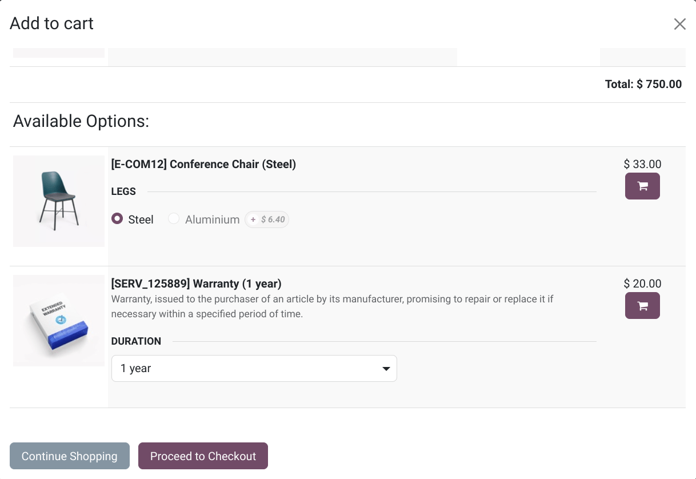
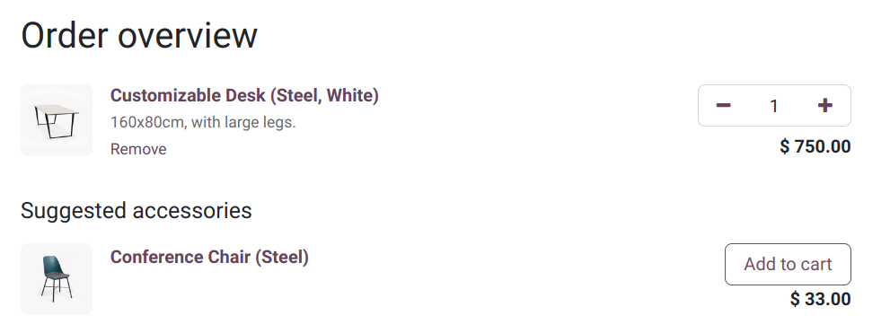
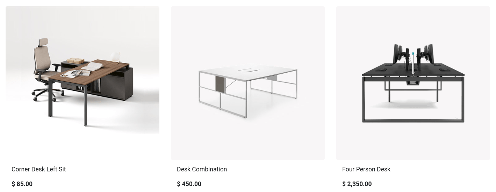

# Cross-selling and upselling

[Cross-selling](#ecommerce-cross-selling) and
[upselling](#ecommerce-cross-upselling-alternative) are sales techniques designed to encourage
customers to purchase additional or higher-priced products and services from your [Danh mục](catalog.md).

## Cross-selling

Cross-selling can be achieved by suggesting
[optional products](#ecommerce-cross-upselling-optional) when items are added to the cart or by
recommending [accessory products](#ecommerce-cross-upselling-accessory) on the checkout page.

### Sản phẩm gốc

**Optional products** are suggested when the customer selects a product and clicks
Add to cart.

To enable **optional products**, go to Website ‣ eCommerce ‣ Products, select a
product, go to the Sales tab, and enter the products you wish to feature in the
Optional Products field.

### Accessory products

**Accessory products** are showcased in the Suggested Accessories section during the
Review Order step, just before proceeding to checkout.

To enable **accessory products**, go to Website ‣ eCommerce ‣ Products, select
a product, go to the Sales tab, and enter the products you wish to feature in the
Accessory Products field.

## Bày bán

You can display **alternative products** at the bottom of the product page as an upselling
technique, encouraging customers to consider a more expensive variant or product than their
initial choice by presenting appealing alternatives.

To enable alternative products, navigate to Website ‣ eCommerce ‣ Products,
select the desired product, and go to the Sales tab. In the
Alternative Products field, add the products you want to feature.

Click Go to Website to view the alternative products displayed at the bottom of the
product page.

To adjust the settings, click Edit and select the related
[building block](../../website/web_design/building_blocks.md). In the Customize
tab, scroll to the Alternative Products section and modify the settings as needed to
tailor the display to your preferences.
