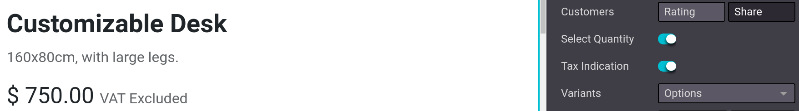
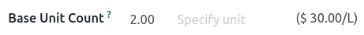
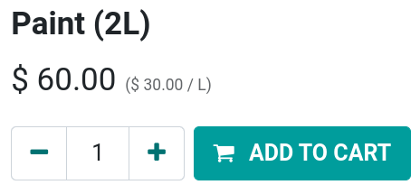
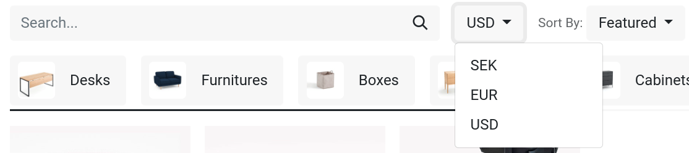
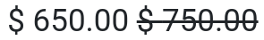

# Quản lý giá

Odoo offers multiple options to select the price displayed on your website, as well as\
condition-specific prices based on set criteria.

## Thuế

### Cấu hình thuế

To add a tax on a product, you can either set a tax in the Customer Taxes field of the**product template** or use[fiscal positions](../../../finance/accounting/taxes/fiscal_positions.md).

#### SEE ALSO

* [Thuế](../../../finance/accounting/taxes.md)
* [AvaTax integration](../../../finance/accounting/taxes/avatax.md)
* [Fiscal positions (tax and account mapping)](../../../finance/accounting/taxes/fiscal_positions.md)

### Hiển thị thuế

Choosing the displayed price tax usually depends on a country's regulations or the type of customer&#x73;**(B2B vs. B2C)**. To select the type of price displayed, go to Website ‣\
Configuration ‣ Settings, scroll down to the Shop - Products category, and select\
Tax Excluded or Tax Included.

* Tax Excluded: the price displayed on the website is **tax-excluded**, and the tax is\
  computed at the cart-review step;
* Tax Included: the price displayed on the website is **tax-included**.

#### NOTE

This setting is **global**, and the tax-display type is the same for (all of) your website(s). It\
is, therefore, not possible to select different tax displays for different websites. This may be\
a significant point of consideration when implementing a database with multiple ecommerce\
websites aimed at varying customer types (i.e., B2B and B2C).

You can choose to display the type of pricing next to the product price by going to\
Website ‣ Site ‣ Homepage ‣ Shop, selecting a product, and then\
Edit ‣ Customize tab and enabling Tax Indication.

#### SEE ALSO

[B2B (tax excluded) and B2C (tax included) pricing](../../../finance/accounting/taxes/B2B_B2C.md)

## Price per unit

It is possible to display a [price per unit](../../../inventory_and_mrp/inventory/product_management/configure/uom.md) on the product page. To do\
that, go to Website ‣ Configuration ‣ Settings and enable Product\
Reference Price under the Shop - Products section. When enabled, ensure an amount is\
set in the Base Unit Count field of the **product template**, and in the\
Sales Price.

The price per unit of measure can be found above the Add to Cart button on the product\
page.

#### NOTE

Pay attention that having the price per unit may be **mandatory** in some countries.

#### SEE ALSO

[Đơn vị tính](../../../inventory_and_mrp/inventory/product_management/configure/uom.md)

### Price configuration: pricelists

Bảng giá là công cụ chính để quản lý giá trên cửa hàng Thương mại điện tử của bạn. Chúng cho phép bạn xác định giá cụ thể cho từng trang web - khác với giá trên mẫu sản phẩm - dựa trên **nhóm quốc gia**, **tiền tệ**, **số lượng tối thiểu**, **thời gian** hoặc **biến thể**. Bạn có thể tạo nhiều bảng giá tùy theo nhu cầu, nhưng bắt buộc phải có ít nhất một bảng giá được cấu hình cho mỗi trang web. Nếu không thêm bảng giá tùy chỉnh nào, Odoo sẽ mặc định sử dụng **Bảng giá công khai** cho tất cả các trang web.

#### SEE ALSO

[Pricelists, discounts, and formulas](../../../sales/sales/products_prices/prices/pricing.md)

#### Cấu hình

Pricelists can be found under Website ‣ eCommerce ‣ Pricelists, but must first\
be activated. For that, head to Website ‣ Configuration ‣ Settings and scroll\
down to the Shop - Products section. There, you can find two options:

* Multiple prices per product;
* Advanced price rules (discounts, formulas).

The **first** option allows you to set different prices per customer _segment_, i.e., registered\
customers, gold customers, regular customers, etc. The **second** option allows you to set _price_\
_change_ rules such as **discounts**, **margins**, **roundings**, etc.

#### Ngoại tệ

If you are selling in **multiple currencies** and have pricelists in foreign currencies, customers\
can select their corresponding pricelist anywhere on the Shop page from the drop-down\
menu next to the **search bar**.

#### SEE ALSO

* [Pricelists, discounts, and formulas](../../../sales/sales/products_prices/prices/pricing.md)
* [Ngoại tệ](../../../sales/sales/products_prices/prices/currencies.md)

### Permanent discount

If you have permanently reduced the price of a product, a popular means to attract customers is the**strikethrough** strategy. The strategy consists in displaying the previous price crossed out and\
the **new discounted price** next to it.

To display a 'striked' price, enable the Comparison Price option under\
Website ‣ Configuration ‣ Settings ‣ Shop - Products category. Then, head to\
the product's template (Website ‣ eCommerce ‣ Products), and in the\
Compare to Price field, enter the **new** price.
