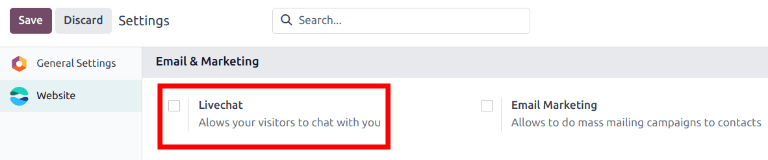
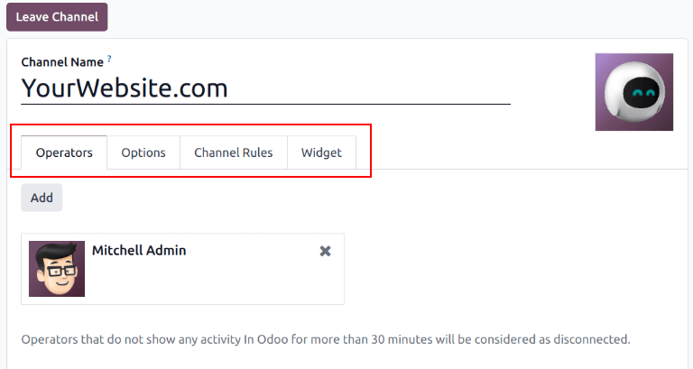
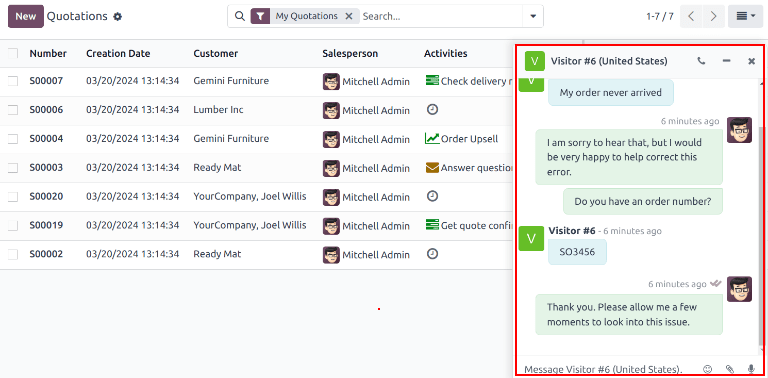
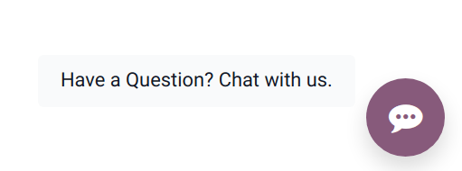
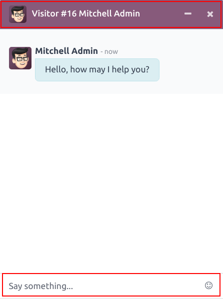
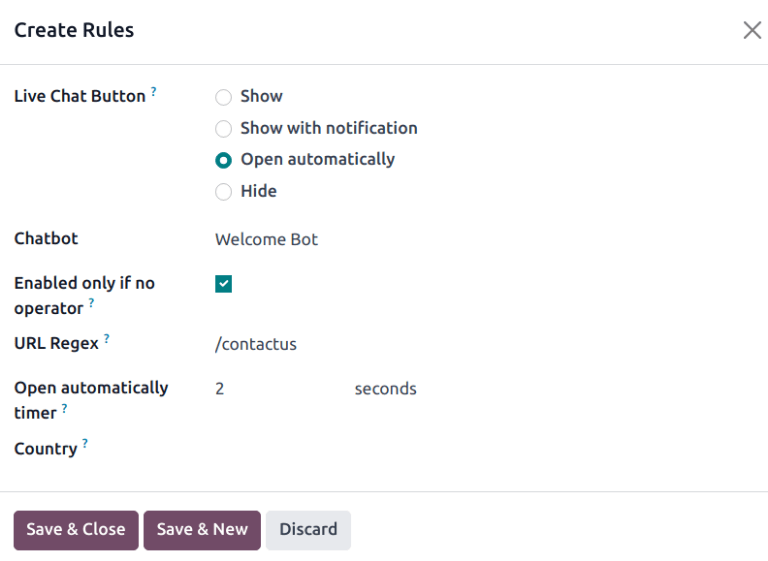
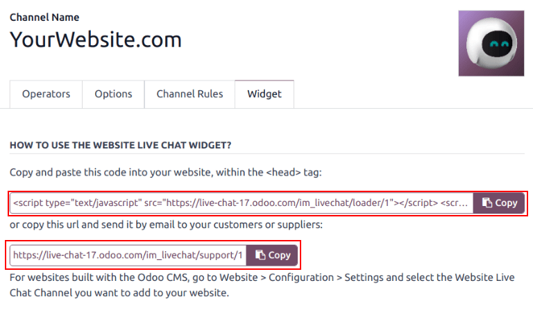

# Trò chuyện Trực tiếp

Odoo **Live Chat** allows users to communicate with website visitors in real-time. With **Live
Chat**, leads can be qualified for their sales potential, support questions can be answered quickly,
and issues can be directed to the appropriate team for further investigation or follow up. **Live
Chat** also provides the opportunity for instant feedback from customers.

## Enable Live Chat

The **Live Chat** application can be installed multiple ways:

- Go to Apps application, search `Live Chat`, and click Install.
- Go to the Helpdesk app ‣ Configuration ‣ Helpdesk Teams list view, select a
  team, and on the team's settings page, click the checkbox next to Live Chat, under the
  Channels section.
- In the Website app, go to Configuration ‣ Settings, scroll to
  the Email & Marketing section, check the box next to Livechat, and click
  Save.
  

#### NOTE
After the **Live Chat** application is installed, a live chat *Channel* is created, by default.

## Create live chat channels

To create a new live chat *Channel*, go to Main Odoo Dashboard ‣ Live Chat app ‣
New. This opens a blank channel detail form. Enter the name of the new channel in the
Channel Name field.

To configure the remaining tabs on the channel detail form ([Operators](#livechat-operators-tab), [Options](#livechat-options-tab), [Channel Rules](#livechat-channel-rules-tab), and [Widget](#livechat-widget-tab)), follow the steps below.

### Operators tab

*Operators* are the users who act as agents and respond to live chat requests from customers. When a
user is added as an operator in a live chat channel, they can receive chats from website visitors
wherever they are in the database. Chat windows open in the bottom-right corner of the screen.

On the channel detail form, click the Operators tab. The user who originally created the
live chat channel has been added as an operator by default.

#### NOTE
Current operators can be edited, or removed, by clicking on their respective boxes in the
Operators tab, which reveals a separate Open: Operators modal. In that
modal, adjust any information, as needed. Then, click Save, or click
Remove to remove that operator from the channel.

Click Add to reveal an Add: Operators pop-up window.

In the pop-up window, scroll to find the desired users, or enter their name in the search bar. Then,
tick the checkbox next to the users to be added, and click Select.

New operators can be created and added to the list directly from this pop-up window, as well, by
clicking New, and filling out the Create Operators form. When the form is
complete, click Save & Close, or Save & New for multiple record creations.

### Options tab

The Options tab on the live chat channel detail form contains the visual and text
settings for the live chat window.

#### Livechat button

The *Livechat Button* is the icon that appears in the bottom-right corner of the website.

Change the text in the Notification text field to update the greeting displayed in the
text bubble when the live chat button appears on the website.

Màu nút trò chuyện trực tiếp thay đổi màu sắc của nút trò chuyện trực tiếp khi hiển thị trên trang web. Để đổi màu, nhấp vào bong bóng màu để mở cửa sổ chọn màu, sau đó nhấp và kéo vòng tròn dọc theo dải màu. Nhấp ra ngoài cửa sổ chọn màu khi hoàn tất. Nhấp vào biểu tượng <i class="fa fa-refresh"></i> (làm mới) bên phải các bong bóng màu để đặt lại màu về lựa chọn mặc định.

#### Cửa sổ Livechat

The *Livechat Window* is the space where the live chat conversation with website visitors takes
place.

Edit the Welcome Message to change the message a visitor sees when they open a new chat
session. This message appears as though it is sent by a live chat operator, and acts as both a
greeting and an invitation to continue the conversation.

Edit the Chat Input Placeholder to alter the text that appears in the box where visitors
type their replies. This message prompts the visitor to initiate the chat.

The *Channel Header* is the colored bar at the top of the chat window. The Channel Header
Color can be changed following the same steps as the [Livechat button](#livechat-livechat-button).

### Channel Rules tab

To configure which website user actions open the live chat window, go to the Channel
Rules tab on the live chat channel detail form.

To create a new channel rule, click Add a line. This opens the Create Rules
pop-up window.

#### Create new rules

Fill out the fields on the Create Rules pop-up window as instructed below, then click
Save & Close.

Nút trò chuyện trực tiếp

The *Livechat Button* is the icon that appears in the bottom-right corner of the website.
Select from one of the following display options:

- Show: displays the chat button on the page.
- Show with notification: displays the chat button, as well as a floating text
  bubble next to the button.
- Open automatically: displays the button, and automatically opens the chat window
  after a specified amount of time (designated in the Open automatically timer
  field, that appears when this option is selected).
- Hide: hides the chat button on the page.

Chatbot

To include a [Chatbot](chatbots.md) on this channel, select it from the drop-down
menu. If the chatbot should only be active when no operators are active, check the box labeled
Enabled only if no operator.

The Enabled only if no operator field is **only** visible if a chatbot is selected
in the Chatbot field.

URL Regex

The *URL Regex* specifies the web pages where this rule should be applied. In the
URL Regex field, input the relative URL of the page where the chat button should
appear.

For example, to apply the rule to the URL, `https://mydatabse.odoo.com/shop`, enter `/shop`
to the URL Regex field.

To apply the rule to *all* pages on the database, enter `/` in the URL Regex
field.

Đồng hồ tính giờ tự động mở

This field designates the amount of time (in seconds) a page should be open before the chat
window opens. This field **only** appears if the Live Chat Button for this rule is
set to Open automatically.

Quốc gia

If this channel should **only** be available to site visitors in specific countries, add them
to the Country field. If this field is left blank, the channel is available to all
site visitors, regardless of location.

#### NOTE
In order to track the geographical location of visitors, *GeoIP* **must** be installed on the
database. While this feature is installed by default on *Odoo Online* databases, *On-Premise*
databases require additional [setup steps](../../../administration/on_premise/geo_ip.md).

### Widget tab

The Widget tab on the live chat channel detail form provides the code for a website
widget. This code can be added to a website to provide access to a live chat window.

To add the widget to a website created on a third-party platform, click the first COPY
button on the Widget tab, and paste the code into the `<head>` tag on the site.

Likewise, to send a live chat session to a customer, click the second COPY button on the
Widget tab. This link can be sent directly to a customer. When they click the link, they
are redirected to a new chat window.

#### SEE ALSO
- [Thảo luận](../../productivity/discuss/)
- [Commands and canned responses](responses.md)
- [Đánh giá](ratings.md)
- [Chatbot](chatbots.md)
- [Participate in live chat](participate.md)

* [Đánh giá](ratings.md)
* [Commands and canned responses](responses.md)
* [Chatbot](chatbots.md)
* [Báo cáo](reports.md)
* [Participate in live chat](participate.md)
