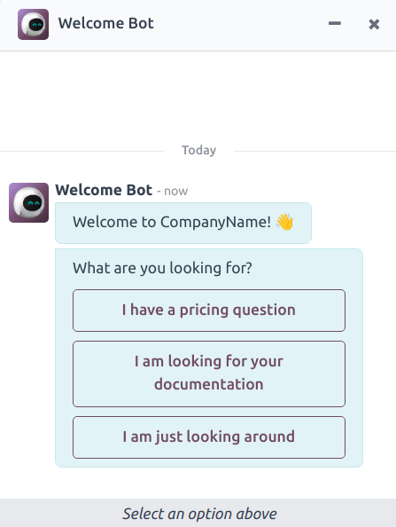
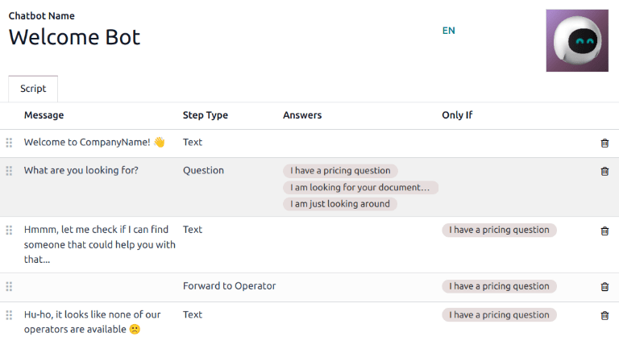
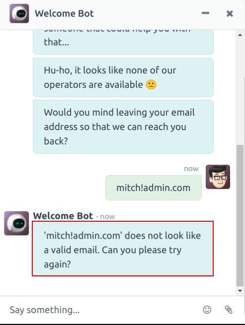
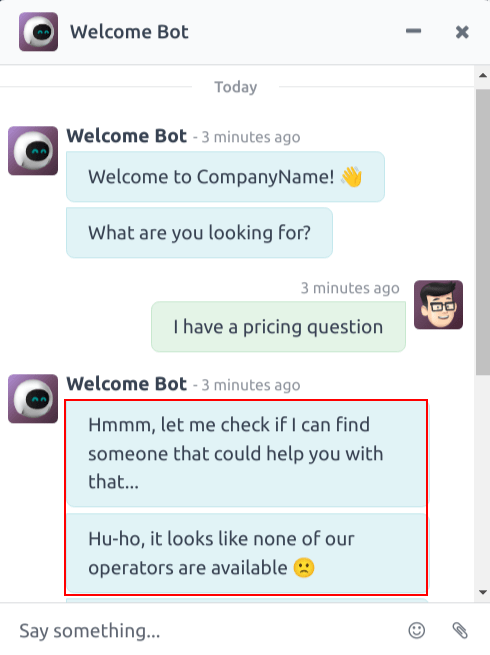
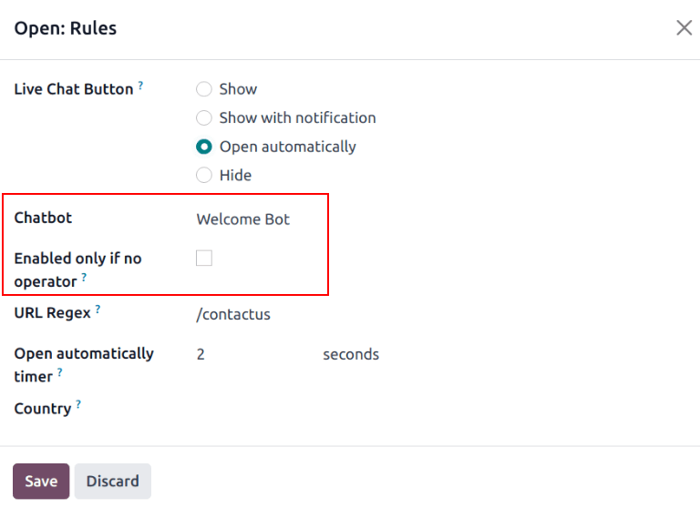

# Chatbot

A *Chatbot* is a program designed to mimic a conversation with a live human. Chatbots are assigned a
script of pre-written steps to follow. The scripts are designed to anticipate a visitor's potential
response, and lead them through a series of questions and answers the same way a live team member
would.

Chatbots can be customized to fill various roles, from customer support, to creating leads, to
collecting contact information. The goal of each chatbot can vary based on several criteria,
including the webpage where it is located, and the information it captures.

## Build a chatbot

Before creating a new chatbot, the *Live Chat* application must first be installed on the database.
This can be done directly from the Apps application, by searching for `Live Chat`
in the Search... bar, and clicking Install.

Once the *Live Chat* application has been installed on the database, go to Live Chat
app ‣ Configuration ‣ Chatbots.

#### NOTE
When the *Live Chat* app is installed, a sample chatbot is created, named *Welcome Bot*. This
chatbot has a preconfigured script that walks through a few basic steps, including asking for a
visitor's email address, and forwarding the conversation to an operator.

*Welcome Bot* can be used as a starting point. The existing steps can be edited or removed, and
new steps can be added to customize the script, as needed.

*Welcome Bot* can be deleted or archived, if necessary.

To create a new chatbot, navigate to the Chatbot page (Live Chat app ‣
Configuration ‣ Chatbots) and click New. This opens a blank chatbot details page.

On the blank chatbot details page, enter a name in the Chatbot Name field and click on
the Edit Image icon in the upper right corner of the form to add a photo.

### Chatbot scripts

After the new chatbot has been created and named, the next step is to create a script. Chatbot
conversations follow an accompanying script. These scripts are comprised of lines of dialog, each
designed to deliver or capture information.

To create a chatbot script, click Add a Line in the Script tab of the
chatbot detail page, and a Create Script Steps modal appears.

This form must be filled out for **each** line of text (dialog) that the chatbot could deliver
during the conversation.

First, enter the content of the message in the Message field. Then, select an option
from the Step Type and Only If drop-down menus.

#### Step types

The Step Type selected depends on the intended purpose of the message. The available
options in the Step Type drop-down menu are detailed below:

##### Văn bản

This step is used for messages where no answer is expected or necessary. Text steps can be used for
greetings, to offer resources, such as documentation, or provide links to specific web pages.

#### IMPORTANT
*Text* step types are only intended to deliver information, and do **not** allow for any visitor
input. As such, they **must** be followed by additional steps to continue the conversation.

##### Câu hỏi

This step asks a question and provides a set of answers. The visitor clicks on one answer, which
either leads to a new step in the conversation, or can lead to an optional link to a new webpage.

Enter the question in the Message field. Then, under the Answer heading,
click Add a Line to create a blank answer line.

Proceed to enter the answer as it should appear to the visitor. To turn the answer into a link that
redirects the visitor when selected, add the URL to the answer line under the Optional
Link heading.

Repeat these steps for every answer to be included for the question.

Click Save & Close or Save & New.

##### Email

This step prompts visitors to provide their email address, which is stored and can be used by team
members later to follow up with additional information.

The **only** accepted inputs for this step type are email addresses that are in a valid format. If a
visitor attempts to enter anything other than a valid email address, the chatbot responds with a
message stating it does not recognize the information submitted.

##### Điện thoại

Similar to email, this step type prompts the visitor to enter their phone number, which can be used
to follow up with additional information, schedule demos, and more.

#### WARNING
Due to the vast number of formats used for phone numbers worldwide, responses to this step type
are **not** validated for formatting, and can include both numbers and special characters.

##### Chuyển tiếp cho người đại diện

This step forwards the conversation to an active live chat operator, so they can continue
assisting the visitor. As the conversation transcript is passed on to the operator, they can pick up
where the chatbot left off. This not only saves time for all parties involved, it can also help
qualify conversations before they reach live operators.

#### NOTE
Nếu không có nhân viên hỗ trợ nào đang hoạt động trên kênh, chatbot sẽ tiếp tục trò chuyện với khách truy cập. Do đó, cần thêm các bước tiếp theo sau bước này để đảm bảo cuộc trò chuyện không kết thúc đột ngột. Các bước bổ sung có thể vừa thông báo cho khách truy cập về việc không có nhân viên hỗ trợ (VD: `Rất tiếc, hiện không có nhân viên hỗ trợ nào có thể tham gia phiên chat.`) vừa tiếp tục cuộc trò chuyện (ví dụ: `Bạn có muốn để lại địa chỉ email không?`).

##### Free Input/Multi-Line

The *free input* step allows visitors to respond to questions without providing pre-written
responses. Information provided in these responses is stored in the chat transcripts.

Choose between Free Input and Free Input (Multi-Line) depending on the type
and amount of information the visitor is asked to provide.

##### Tạo lead

This step creates a lead in the *CRM* application. Select an option from the Sales Team
drop-down field that appears to assign the created lead to a specific team.

#### NOTE
This step is **only** available if the *CRM* application is installed on the database.

##### Tạo phiếu hỗ trợ

This step creates a [ticket](applications/services/helpdesk/overview/receiving_tickets.md) in
the *Helpdesk* application. Select an option from the Helpdesk Team drop-down field that
appears to assign the created ticket to a specific team.

#### NOTE
This step is **only** available if the *Helpdesk* application is installed on the database.

#### Only if

Chatbot scripts operate on an if/then basis, which means the next question presented to the visitor
is determined by the answer provided to the previous question.

To continue the progression of the conversation, the Create Script Steps form for a new
step contains a field labeled Only If. This field is where the progression of questions
is defined.

If a step is intended to follow all of the previous messages, this field can be left empty. However,
if a message should **only** be sent conditionally, based on a previous response, or several
previous responses, those responses **must** be added to this field.

#### IMPORTANT
If any selections are made in the Only If field, they must **all** be selected during
the conversation *before* this step will be included. Only include selections in this field if
they are necessary for this step to be displayed.

### Script testing

To ensure all visitors have a satisfactory experience with the chatbot, each message needs
to lead to a natural conclusion. Chatbot scripts should be tested to confirm there are no dead-ends,
and to understand what the visitor sees when they interact with the chatbot.

#### IMPORTANT
If the visitor provides an answer, or input, that is **not** assigned a corresponding follow-up
response, the conversation stops (*dead-ends*). Since the visitor cannot re-engage the chatbot,
they must restart the conversation by refreshing the chat window, or their browser.

To test the performance of a chatbot, first click on the Test button at the top-left of
the chatbot script page. Then, upon being redirected to the testing screen, answer the chatbot
prompts the same way a potential site visitor would.

When the script has reached an end-point, the message *Conversation ended...Restart* appears at the
bottom of the chat window. To begin the conversation at the beginning of the script, click on
Restart. To return to the script page, click Back to edit mode at the top of
the page.

## Add chatbot to a channel

After a chatbot has been created and tested, it needs to be added to a live chat channel.

First, open the Live Chat application, find the Kanban card for the appropriate
live chat channel, hover over it, and click the ⋮ (three dots) icon to open the
drop-down menu. Click Configure Channel to open the channel detail form.

#### NOTE
To create a new live chat channel, open the Live Chat app and click
New. See [Live Chat](applications/websites/livechat.md) for more information.

Click on the Channel Rules tab. Then, open an existing rule, or create a new one by
clicking Add a line.

On the Create Rules modal, choose the appropriate chatbot in the Chatbot
field.

If the chatbot should **only** be active if there are no live chat operators available, check the
box labeled Enabled only if no operator.

#### SEE ALSO
[Live chat channel rules](applications/websites/livechat.md)
