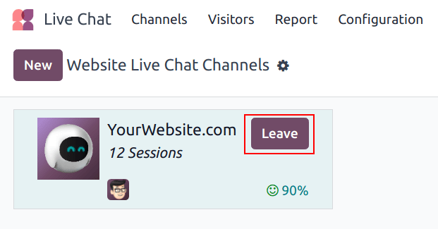
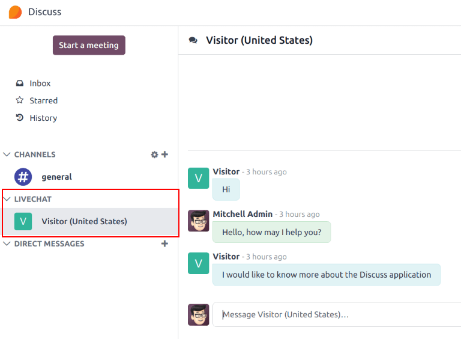

# Participate in live chat

*Operators* are the users who respond to live chat requests from customers and website visitors. The
information below outlines the necessary steps for operators participating in live chat
conversations on an Odoo database.

## Set an online chat name

Before participating in a live chat, operators may choose to update their *Online Chat Name*. This
is the name displayed to site visitors in the live chat conversation.

To update the *Online Chat Name*, click on the user avatar in the top-right corner of any page in
the database. Select My Profile from the drop-down menu to open the profile page. On the
right side of the Preferences tab, locate the Online Chat Name field, and
enter a preferred name.

If a user's Online Chat Name is not set, the name displayed defaults to the user's name
that is designated on their profile page.

## Set online chat languages

If an operator speaks multiple languages, they can add this information to their user profile. This
information can then be used to determine which conversations the operator is assigned. A visitor's
language is determined via their browser's language settings.

#### NOTE
Conversations are assigned to operators based on a number of criteria, including availability and
the number of ongoing conversations. While the operator's main language and additional languages
are taken into consideration, they do **not** supersede all other criteria.

To add *Online Chat Languages*, click on the user avatar in the top-right corner of any page in the
database. Select My Profile from the drop-down menu to open the profile page. On the
right side of the Preferences tab, click into the Online Chat Language
field, and select one or more languages from the drop-down menu.

#### IMPORTANT
Only [languages](../../general/users/language.md) that are enabled on the database can be
selected in the Online Chat Language field.

## Join or leave a channel

To join a live chat channel, go to the Live Chat app ‣ Channels, and click the
Join button on the Kanban card for the appropriate channel.

Any channel where the user is currently active shows a Leave button. Click this button
to disconnect from the channel.

#### IMPORTANT
Operators that do not show any activity in Odoo for more than thirty minutes are considered
disconnected, and subsequently removed from the channel.

## Manage live chat requests

When an operator is active in a channel, chat windows open in the bottom-right corner of the
screen, no matter where they are in the database. This allows them to access other pages and apps,
while still participating in the conversation.

Live chat conversations can also be viewed by navigating to the Discuss app. New
conversations appear in bold under the LIVECHAT heading, located along the left panel.

Click on a conversation in the left panel to select it. This opens the conversation. From this
view, an operator can participate in the chat the same as they would in the normal chat window.

#### SEE ALSO
- [Thảo luận](../../productivity/discuss.md)
- [Trò chuyện Trực tiếp](../livechat.md)
- [Commands and canned responses](responses.md)
