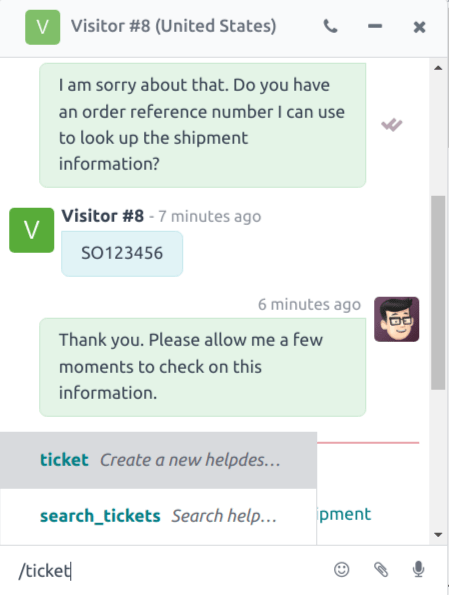
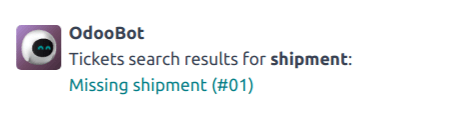
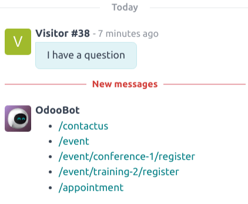
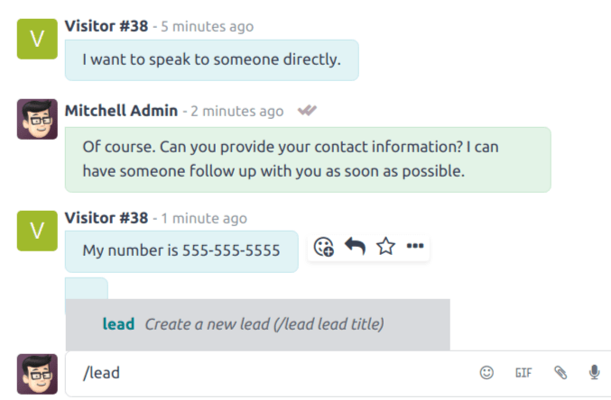
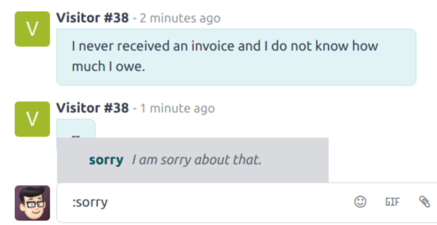

# Commands and canned responses

Trong ứng dụng **Trò chuyện trực tiếp** của Odoo, *lệnh* cho phép người dùng thực hiện các tác vụ cụ thể cả trong cửa sổ trò chuyện lẫn thông qua các ứng dụng Odoo khác. Ứng dụng **Trò chuyện trực tiếp** cũng bao gồm *phản hồi soạn sẵn*. Đây là các thay thế được tùy chỉnh, cấu hình sẵn cho phép người dùng thay thế các phím tắt bằng những câu trả lời dài hơn, được chuẩn bị kỹ lưỡng cho một số câu hỏi và bình luận phổ biến nhất.

Both commands and canned responses save time, and allow users to maintain a level of consistency
throughout their conversations.

## Execute a command

Live chat *commands* are keywords that trigger preconfigured actions. When a live chat *operator*
is participating in a conversation with a customer or website visitor, they can execute a command by
typing `/`, followed by the command.

Commands, and the resulting actions, are only visible in the conversation window for the live chat
operator. A customer does not see any commands that an operator uses in a conversation from their
view of the chat.

More information about each available command can be found below.

### Hỗ trợ

If an operator types `/help` in the chat window, an informative message that includes the potential
entry types an operator can make is displayed.

- Type `@username` to mention a user in the conversation. A notification will be sent to that user's
  inbox or email, depending on their notification settings.
- Type `/command` to execute a command.
- Type `:shortcut` to insert a [canned response](#live-chat-canned-responses).

#### SEE ALSO
- [Thảo luận](../../productivity/discuss.md)
- [Use channels for team communication](../../productivity/discuss/team_communication.md)

### Ticket & search tickets

The `/ticket` and `/search_tickets` commands allow operators to create helpdesk tickets directly
from a conversation, and search through existing tickets by keyword or ticket number.

#### IMPORTANT
The `/ticket` and `/search_tickets` commands can **only** be used if the **Helpdesk** app has
been installed, and *Live Chat* has been activated on a *Helpdesk* team. To activate *Live Chat*,
go to Helpdesk app ‣ Configuration ‣ Helpdesk Teams, and select a team.
Scroll to the Channels section, and check the box labeled, Live Chat.

#### Create a ticket from a live chat

If an operator types `/ticket` in the chat window, the conversation is used to create a *Helpdesk*
ticket.

After entering the `/ticket` command, type a title for the ticket into the chat window, then press
`Enter`.

The newly created ticket will be added to the *Helpdesk* team that has live chat enabled. If more
than one team has live chat enabled, the ticket will automatically be assigned based on the team's
priority.

The transcript from the conversation will be added to the new ticket, under the
Description tab.

To access the new ticket, click on the link in the chat window, or go to the
Helpdesk app and click the Tickets button on the Kanban card for the
appropriate team.

#### Search for a ticket from a live chat

If an operator types `/search_tickets` in the chat window, they can search through *Helpdesk*
tickets, either by ticket number or keyword.

After entering the `/search_tickets` command, type a keyword or ticket number, then press
`Enter`. If one or more related tickets are found, a list of links is generated in the
conversation window.

#### NOTE
Results from the search command will only be seen by the operator, not the customer.

### Lịch sử

If an operator types `/history` in the chat window, it generates a list of the most recent pages the
visitor has viewed on the website (up to 15).

### Lead

By typing `/lead` in the chat window, an operator can create a *lead* in the **CRM** application.

#### IMPORTANT
The `/lead` command can only be used if the **CRM** app has been installed.

After typing `/lead`, create a title for this new lead, then press `Enter`. A link with the lead
title appears. Click the link, or navigate to the CRM app to view the
Pipeline.

#### NOTE
The link to the new lead can only be seen and accessed by the operator, not the customer.

The transcript of that specific live chat conversation (where the lead was created) is added to the
Internal Notes tab of the lead form.

On the Extra Information tab of the lead form, the Source will be listed as
Livechat.

### Nghỉ

If an operator types `/leave` in the chat window, they can automatically exit the conversation. This
command does not cause the customer to be removed from the conversation, nor does it automatically
end the conversation.

#### SEE ALSO
- [Acquire leads](../../sales/crm/acquire_leads.md)
- [Hỗ trợ](../../services/helpdesk.md)

## Câu trả lời soạn sẵn

*Canned responses* are customizable inputs where a *shortcut* stands in for a longer response. An
operator will enter the shortcut, and it is automatically replaced by the expanded *substitution*
response in the conversation.

### Create canned responses

To create a new canned response, go to Live Chat app ‣ Configuration ‣ Canned
Responses ‣ New.

Type a shortcut command in the Shortcut field. Next, click the Substitution
field, and type the message that should replace the shortcut.

### Use canned responses in a live chat conversation

To use a canned response during a live chat conversation, type a colon (`:`) into the chat window,
followed by the shortcut.

