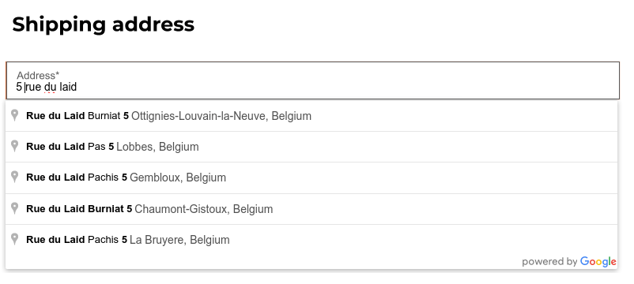

# Address autocomplete

You can use the Google Places API on your website to ensure that your users' delivery addresses
exist and are understood by the carrier. The Google Places API allows developers to access detailed
information about places using HTTP requests. The autocompletion predicts a list of places when the
user starts typing the address.

#### SEE ALSO
- [Google Maps Platform](https://mapsplatform.google.com/maps-products)
- [Google Developers Documentation: Google Places API](https://developers.google.com/maps/documentation/places/web-service/autocomplete)

To do so, go to Website ‣ Configuration ‣ Settings and enable
Address Autocomplete in the SEO section.

Insert your Google Places API key in the API Key field. If you don't have
one, create yours on the [Google Cloud Console](https://console.cloud.google.com/getting-started)
and follow these steps.

## Step 1: Enable the Google Places API

**Create a New Project:**
To enable the **Google Places API**, you first need to create a project. To do so, click
Select a project in the top left corner, New Project, and follow the prompts
to set up your project.

**Enable the Google Places API:**
Go to the Enabled APIs & Services and click + ENABLE APIS AND SERVICES.
Search for "Places API" and select it. Click on the "Enable" button.

#### NOTE
Google's pricing depends on the number of requests and their complexity.

## Step 2: Create API Credentials

Go to [APIs & Services --> Credentials](https://console.cloud.google.com/apis/credentials).

**Create credentials:**
To create your credentials, go to Credentials, click Create Credentials, and
select API key.

#### IMPORTANT
- Save Your API Key: copy your API key and securely store it.
- Do not share it publicly or expose it in client-side code.
