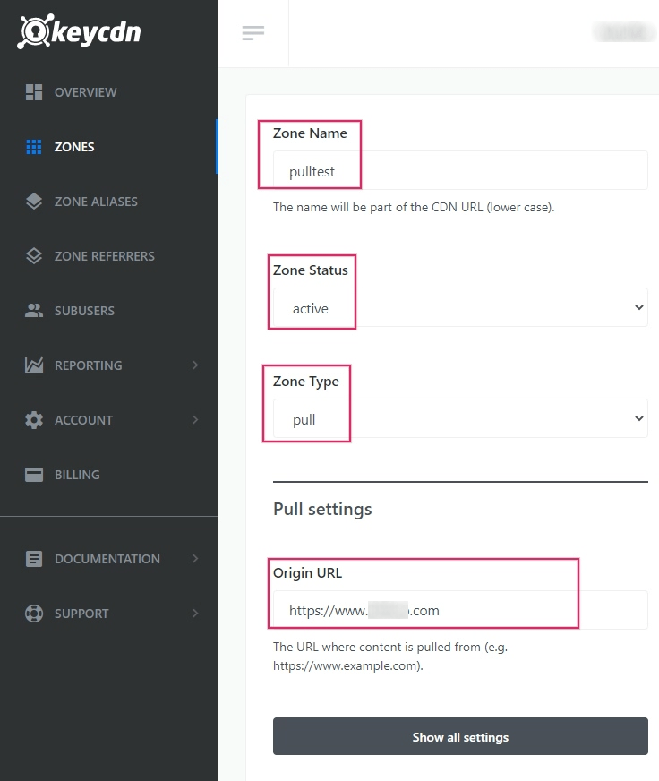

# Cài đặt mạng phân phối nội dung (content network delivery - CDN)

## Triển khai với KeyCDN

A or _content distribution network_, is a geographically\
distributed network of servers that provides high speed internet content. The provides quick, high-quality content delivery for content-heavy websites.

This document will guide you through the setup of a [KeyCDN](https://www.keycdn.com) account with an Odoo powered website.

### Create a pull zone in the KeyCDN dashboard

Trên trang chủ KeyCDN, hãy bắt đầu bằng cách đi đến mục menu Vùng ở bên trái. Trên biểu mẫu, hãy cung cấp giá trị cho Tên vùng, giá trị này sẽ xuất hiện như một phần trong của . Sau đó, đặt Trạng thái vùng thành hoạt động để kích hoạt vùng. Đối với Loại vùng, hãy đặt giá trị thành Pull, và cuối cùng, bên dưới Cài đặt pull, hãy nhập URL gốc— địa chỉ này phải là đầy đủ của cơ sở dữ liệu Odoo.

Under the General Settings heading below the zone form, click the Show all\
settings button to expand the zone options. This should be the last option on the page. After\
expanding the General Settings ensure that the CORS option is\
enabled.

Next, scroll to the bottom of the zone configuration page and Save the changes. KeyCDN\
will indicate that the new zone will be deployed. This can take about 10 minutes.

#### NOTE

A new Zone URL has been generated for your Zone, in this example it is`pulltest-xxxxx.kxcdn.com`. This value will differ for each database.

Copy this Zone URL to a text editor for later, as it will be used in the next steps.

### Configure the Odoo instance with the new zone

In the Odoo Website app, go to the Settings and then activate the
Content Delivery Network (CDN) setting and copy/paste the Zone URL value
from the earlier step into the CDN Base URL field. This field is only visible and
configurable when the [developer mode](../../../general/developer_mode.md#developer-mode) is activated.

#### NOTE

Ensure that there are two _forward slashes_ (`//`) before the CDN Base URL and one\
forward slash (`/`) after the CDN Base URL.

Save the settings when complete.

Now the website is using the CDN for the resources matching the CDN filters regular\
expressions.

Trong mã HTML của website Odoo, việc tích hợp được xác minh hoạt động chính xác bằng cách kiểm tra của hình ảnh. Giá trị _URL Cơ sở CDN_ có thể được xem bằng cách sử dụng tính năng Kiểm tra của trình duyệt web trên trang web Odoo. Tìm bản ghi của nó bằng cách tìm kiếm trong tab Mạng bên trong công cụ lập trình.

### Prevent security issues by activating cross-origin resource sharing (CORS)

A security restriction in some browsers (such as Mozilla Firefox and Google Chrome) prevents a\
remotely linked CSS file to fetch relative resources on this same external server.

If the option isn't enabled in the CDN\
Zone, the more obvious resulting problem on a standard Odoo website will be the lack of _Font_\
_Awesome_ icons because the font file declared in the _Font Awesome_ CSS won't be loaded from the\
remote server.

When these cross-origin resource issues occur, a security error message similar to the output\
below will appear in the web browser's developer console:

`Font from origin 'http://pulltest-xxxxx.kxcdn.com' has been blocked from loading /shop:1 by Cross-Origin Resource Sharing policy: No 'Access-Control-Allow-Origin' header is present on the requested resource. Origin 'http://yourdatabase.odoo.com' is therefore not allowed access.`

Enabling the option in the settings fixes this issue.
