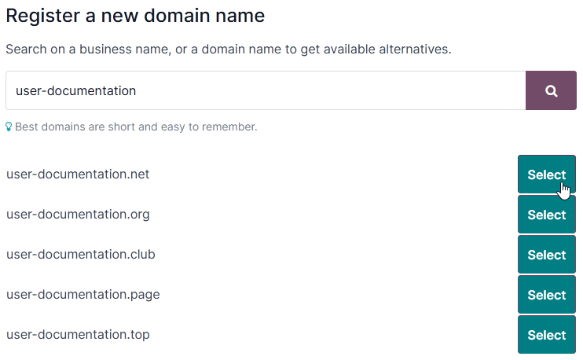

# Tên miền

Domain names are text-based addresses identifying online locations, such as websites. They provide a
more memorable and recognizable way for people to navigate the internet than numerical IP addresses.

**Odoo Online** and **Odoo.sh** databases use a **subdomain** of the `odoo.com` **domain** by
default (e.g., `mycompany.odoo.com`).

However, you can use a custom domain name instead by [registering a free domain name](#domain-name-register) (only available for Odoo Online databases) or by [configuring a
domain name you already own](#domain-name-existing).

#### SEE ALSO
[Odoo Tutorials: Register a free domain name [video]](https://www.odoo.com/slides/slide/register-a-free-domain-name-1663)

## Register a free domain name with Odoo

To register a one-year free domain name for your Odoo Online database, sign in to your account and
go to the [database manager](https://www.odoo.com/my/databases). Click the gear icon
(⚙️) next to the database name and select Domain Names.

Search for the desired domain name and check its availability.

Select the desired domain name, fill in the Domain Owner form, and click
Register. The chosen domain name is directly linked to the database.

Next, you should [map your domain name to your Odoo website](#domain-name-website-map).

#### IMPORTANT
A verification email from `noreply@domainnameverification.net` will be sent to the email address
provided in the Domain Owner form. It is essential to verify your email address to
keep the domain active and receive the renewal quote before expiration.

Việc đăng ký tên miền được miễn phí trong năm đầu tiên. Sau thời gian này, Odoo sẽ tiếp tục quản lý miền với sự hợp tác của **Gandi.net** – đơn vị đăng ký tên miền, và bạn sẽ bị tính phí theo [phí gia hạn của Gandi.net](https://www.gandi.net/en/domain). Odoo gửi báo giá gia hạn hàng năm đến địa chỉ email được khai báo trong mục Chủ sở hữu miền vài tuần trước ngày hết hạn. Miền sẽ được tự động gia hạn sau khi xác nhận thanh toán báo giá.

#### NOTE
- The offer is only available for **Odoo Online** databases.
- The offer is limited to **one** domain name per client.
- The offer is limited to the registration of a **new** domain name.
- The offer is available to *One App Free* plans. Ensure that your website contains enough
  original content for Odoo to verify that your request is legitimate and respects [Odoo's
  Acceptable Use Policy](https://www.odoo.com/acceptable-use). Given the high number of
  requests, it can take Odoo several days to review them.

### Bản ghi DNS

To manage your free domain name  records, open the [database manager](https://www.odoo.com/my/databases), click the gear icon (⚙️) next to the database
name, select Domain Names, and click DNS.

- A: the A record holds the IP address of the domain. It is automatically created and
  **cannot** be edited or deleted.
- CNAME: CNAME records forward one domain or subdomain to another domain. One is
  automatically created to map the `www.` subdomain to the database. If the database is renamed, the
  CNAME record **must** also be renamed.
- MX: MX records instruct servers on where to deliver emails.
- TXT: TXT records can be used for different purposes (e.g., to verify domain name
  ownership).

Any modification to the DNS records can take up to **72 hours** to propagate worldwide on all
servers.

#### NOTE
[Submit a support ticket](https://www.odoo.com/help) if you need assistance to manage your
domain name.

### Hộp thư

The one-year free domain name offer does **not** include a mailbox. There are two options to link
your domain name with a mailbox.

#### Use a subdomain

You can create a subdomain (e.g., `subdomain.yourdomain.com`) to use as an alias domain for the
database. It allows users to create records in the database from emails received on their
`email@subdomain.yourdomain.com` alias.

Để thực hiện, hãy mở [trình quản lý cơ sở dữ liệu](https://www.odoo.com/my/databases), nhấp vào biểu tượng bánh răng (⚙️) bên cạnh tên cơ sở dữ liệu và đi đến Tên miền ‣ DNS ‣ Thêm bản ghi DNS ‣ CNAME. Sau đó, nhập miền phụ mong muốn vào trường Tên (VD: `miền phụ`), miền cơ sở dữ liệu gốc có dấu chấm ở cuối (VD: `mycompany.odoo.com.`) vào trường Nội dung và nhấp Thêm bản ghi.

Then, add the alias domain as your *own domain* by clicking Use my own domain, entering
the alias domain (e.g., `subdomain.yourdomain.com`), clicking Verify, and then
I confirm, it's done.

Finally, go to your database and open the Settings. Under the Alias Domain
field, enter the alias domain (e.g., `subdomain.yourdomain.com`), click Create, and then
Save.

#### Use an external email provider

Để sử dụng nhà cung cấp email bên ngoài, bạn cần cấu hình bản ghi MX. Để thực hiện, hãy mở  [trình quản lý cơ sở dữ liệu](https://www.odoo.com/my/databases), nhấp vào biểu tượng bánh răng (⚙️) bên cạnh tên cơ sở dữ liệu, chọn Tên miền ‣ DNS ‣ Thêm bản ghi DNS ‣ MX. Các giá trị cần nhập vào các trường Tên, Nội dung và Mức độ ưu tiên phụ thuộc vào nhà cung cấp email bên ngoài.

#### SEE ALSO
- [Google Workspace: MX record values](https://support.google.com/a/answer/174125?hl=en)
- [Outlook and Exchange Online: Add an MX record for email](https://learn.microsoft.com/en-us/microsoft-365/admin/get-help-with-domains/create-dns-records-at-any-dns-hosting-provider?view=o365-worldwide#add-an-mx-record-for-email-outlook-exchange-online)

## Configure an existing domain name

If you already have a domain name, you can use it for your Odoo website.

#### WARNING
It is strongly recommended to follow **in order** these three steps to avoid any [SSL
certificate validation](#domain-name-ssl) issues:

1. [Add a CNAME record](#domain-name-cname)
2. [Map your domain name to your Odoo database](#domain-name-db-map)
3. [Map your domain name to your Odoo website](#domain-name-website-map)

### Add a CNAME record

Adding a CNAME record to forward your domain name to the address of your Odoo database is required.

Odoo Online

The CNAME record's target address should be your database's address as defined at its creation
(e.g., `mycompany.odoo.com`).

Odoo.sh

Địa chỉ đích của bản ghi CNAME nên là địa chỉ chính của dự án, có thể tìm thấy trên Odoo.sh bằng cách đi đến Cài đặt ‣ Tên dự án, hoặc đối với một nhánh cụ thể (production, staging hoặc phát triển) thì vào Nhánh ‣ chọn nhánh ‣ Cài đặt ‣ Miền tuỳ chỉnh, rồi nhấp vào Cách thiết lập miền của tôi?. Một thông báo sẽ hiển thị địa chỉ mà bản ghi CNAME của bạn nên nhắm mục tiêu đến.

The specific instructions depend on your DNS hosting service.

#### SEE ALSO
- [GoDaddy: Add a CNAME record](https://www.godaddy.com/help/add-a-cname-record-19236)
- [Namecheap: How to create a CNAME record for your domain](https://www.namecheap.com/support/knowledgebase/article.aspx/9646/2237/how-to-create-a-cname-record-for-your-domain)
- [OVHcloud: Add a new DNS record](https://docs.ovh.com/us/en/domains/web_hosting_how_to_edit_my_dns_zone/#add-a-new-dns-record)
- [Cloudflare: Manage DNS records](https://developers.cloudflare.com/dns/manage-dns-records/how-to/create-dns-records/)

#### IMPORTANT
Odoo only supports subdomains. To use your naked domain name  (`yourdomain.com`), create a redirection 301 to redirect visitors to
`www.yourdomain.com`.

#### Using Cloudflare to secure and redirect a naked domain

To redirect a naked domain with a secure HTTPS connection, we recommend using Cloudflare, as most
DNS hosting services do not offer an easy way to do so.

1. [Sign up and log in to Cloudflare](https://dash.cloudflare.com/sign-up).
2. Enter your domain name on [Cloudflare's dashboard](https://dash.cloudflare.com/login) and
   select Quick scan for DNS records.
3. Choose a plan (the free plan is sufficient).
4. Follow Cloudflare's instructions and recommendations to complete the activation.
5. Add a CNAME record to redirect your naked domain (`yourdomain.com`) to the `www` subdomain
   (e.g., `www.yourdomain.com`) by clicking DNS in the navigation menu, then clicking
   the Add record button, and using the following configuration:
   - Type: CNAME
   - Name: `@` (or `yourdomain.com`)
   - Target: e.g., `www.yourdomain.com`
   - Proxy status: Proxied

   
6. Add another second CNAME record to redirect the `www` subdomain (e.g., `www.yourdomain.com`) to
   your database address (e.g., `mycompany.odoo.com`) using the following configuration:
   - Type: CNAME
   - Name: e.g., `www.yourdomain.com`
   - Target: e.g., `mycompany.odoo.com`
   - Proxy status: DNS only

   
7. Define a redirect rule to permanently redirect (301) your naked domain (e.g., `yourdomain.com`)
   to both `http://` and `https://` by going to Rules ‣ Create rule ‣ Products,
   and clicking Create a Rule under Redirect Rules:
   - Enter any Rule name.
   - Under the If incoming requests match... section, select Custom filter
     expression and use the following configuration:
     - Field: Hostname
     - Operator: equals
     - Value: e.g., `yourdomain.com`
   - Under the Then... section, use the following configuration:
     - Type: Dynamic
     - Expression: e.g., `concat("https://www.yourdomain.com", http.request.uri.path)`
     - Status code: 301
     - Preserve query string: enabled

   
8. Go to SSL/TLS and set the encryption mode to Full.
   

### Map a domain name to an Odoo database

#### WARNING
Ensure you have [added a CNAME record](#domain-name-cname) to your domain name's DNS
**before** mapping your domain name to your Odoo database.

Failing to do so may prevent the validation of the [SSL certificate](#domain-name-ssl) and
could result in a *certificate name mismatch* error. Web browsers often display this as a
warning, such as  *"Your connection is not private"*.

If you encounter this error after mapping the domain name to your database, wait up to five
days, as the validation may still happen. If not, you can [submit a support ticket](https://www.odoo.com/help), including screenshots of your CNAME records.

Odoo Online

Open the [database manager](https://www.odoo.com/my/databases), click the gear icon
(⚙️) next to the database name, and go to Domain Names ‣ Use my
own domain. Then, enter the domain name (e.g., `www.yourdomain.com`), click
Verify and I confirm, it's done.

Odoo.sh

On Odoo.sh, go to Branches ‣ select your branch ‣ Settings ‣ Custom
domains, type the domain name to add, then click Add domain.

#### SEE ALSO
[Odoo.sh branches: settings tab](../../../../administration/odoo_sh/getting_started/branches.md#odoosh-gettingstarted-branches-tabs-settings)

#### SSL encryption (HTTPS protocol)

**SSL encryption** allows visitors to navigate a website through a secure connection, which appears
as the *https://* protocol at the beginning of a web address rather than the non-secure *http://*
protocol.

Odoo generates a separate SSL certificate for each domain [mapped to a database](#domain-name-db-map) using [Let's Encrypt's certificate authority and ACME protocol](https://letsencrypt.org/how-it-works/).

#### NOTE
- Certificate generation may take up to 24 hours.
- Several attempts to validate your certificate are made for five days after you map your domain
  name to your database.
- If you use another service, you can keep using it or change to Odoo's.

#### IMPORTANT
No SSL certificate is generated for naked domains .

#### Web base URL of a database

#### NOTE
If the Website app is installed on your database, skip this section and continue from the
[Map a domain name to a website](#domain-name-website-map) section.

The *web base URL* or root URL of a database affects your main website address and all the
links sent to your customers (e.g., quotations, portal links, etc.).

To make your custom domain name the *web base URL* of your database, access your database using your
custom domain name and log in as an administrator .

#### IMPORTANT
Nếu bạn truy cập cơ sở dữ liệu bằng địa chỉ Odoo gốc (VD: `mycompany.odoo.com`), *URL web cơ sở* của cơ sở dữ liệu sẽ được cập nhật tương ứng. Để ngăn chặn việc tự động cập nhật *URL web cơ sở* khi quản trị viên đăng nhập vào cơ sở dữ liệu, hãy kích hoạt [chế độ lập trình viên](../../../general/developer_mode.md#developer-mode), đi đến Cài đặt ‣ Kỹ thuật ‣ Tham số hệ thống ‣ Mới, sau đó nhập `web.base.url.freeze` làm Khóa và `Đúng` làm Giá trị.

#### NOTE
Bạn cũng có thể thiết lập URL web cơ sở thủ công. Để thực hiện, hãy kích hoạt [chế độ lập trình viên](../../../general/developer_mode.md#developer-mode), đi đến Cài đặt ‣ Kỹ thuật ‣ Tham số hệ thống, tìm khóa `web.base.url` (tạo mới nếu cần) và nhập địa chỉ đầy đủ của trang web làm giá trị (VD: `https://www.yourdomain.com`). URL phải bao gồm giao thức `https://` (hoặc `http://`) và *không* kết thúc bằng dấu gạch chéo (`/`).

### Map a domain name to an Odoo website

Mapping your domain name to your website is different than mapping it to your database:

- It defines your domain name as the main one for your website, helping search engines to index your
  website correctly.
- It defines your domain name as the base URL for your database, including portal links sent by
  email to your customers.
- If you have multiple websites, it maps your domain name to the appropriate website.

Go to Website ‣ Configuration ‣ Settings. If you have multiple websites, select
the one you want to configure. In the Domain field, enter the address of your website
(e.g., `https://www.yourdomain.com`) and Save.

#### WARNING
Mapping your domain name to your Odoo website prevents Google Search from indexing your original
database address (e.g., `mycompany.odoo.com`).

If both addresses are already indexed, it may take some time before the indexation of the second
address is removed from Google Search. You can use the [Google Search Console](https://search.google.com/search-console/welcome) to fix the issue.

#### NOTE
If you have multiple websites and companies on your database, make sure to select the right
Company under Website ‣ Configuration ‣ Settings. Doing so
indicates Odoo which URL to use as the [base URL](#domain-name-web-base-url) according to
the company in use.
