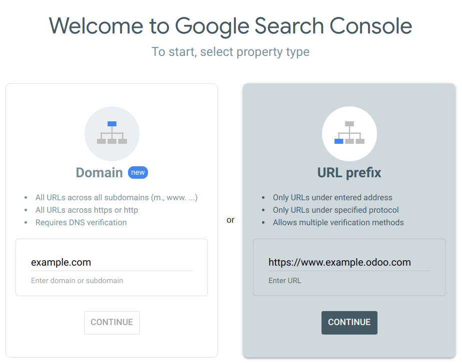
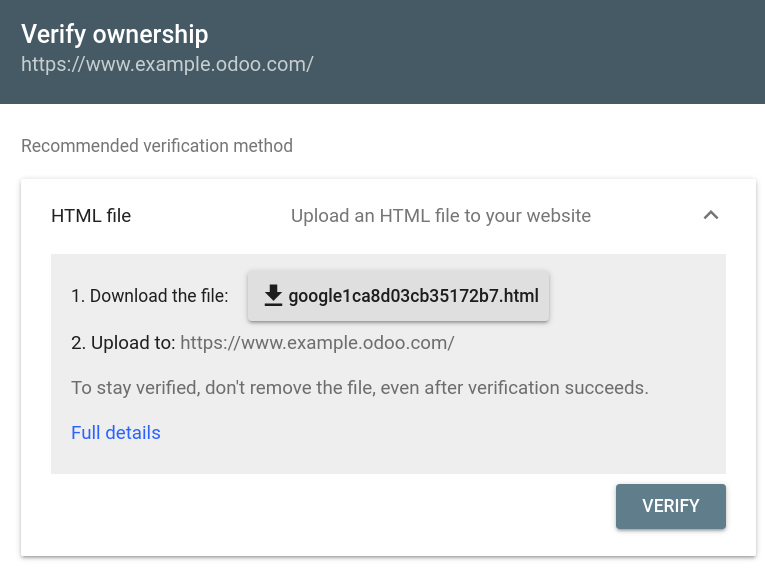
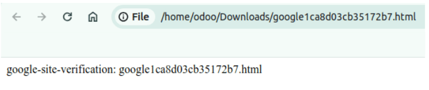
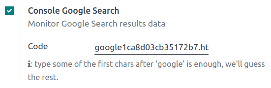

# Google Search Console

Google Search Console is a free web service provided by Google that allows website owners to
monitor, maintain, and troubleshoot their site's presence in Google Search results. It offers
valuable insights into how Google views and interacts with your site, helping you optimize its
performance.

To enable Google Search Console for your website, go to [Google Search Console](https://search.google.com/search-console/welcome). Then, select the property type
[Domain property](#gsc-domain) or [URL prefix property](#gsc-url-prefix).

## Domain property

A domain property in Search Console tracks all versions of your website, including subdomains and
protocols (http/https). This comprehensive view allows you to analyze your overall website's search
performance and make informed decisions to optimize its visibility. Enter the domain, e.g.,
`example.com` and click Continue.

#### NOTE
- The domain property type can only be verified via
  [DNS record](https://support.google.com/webmasters/answer/9008080?hl=en#domain_name_verification&zippy=%2Chtml-tag).
- Google suggests creating at least one domain property to represent your site, as it is the most
  complete view of your website information.

## URL prefix property

Loại xác minh này thường đơn giản hơn do bạn có nhiều phương pháp xác minh khác nhau, như sử dụng tài khoản Google Analytics hoặc Tag Manager hiện có. Việc xem riêng một phần trang web của bạn cũng hợp lý. Ví dụ: nếu làm việc với nhà tư vấn về một phần cụ thể trên trang web, bạn có thể xác minh riêng phần này để hạn chế truy cập dữ liệu. Nhập URL, ví dụ `https://www.example.odoo.com` và nhấp Tiếp tục.

## Site ownership verification

Before using Google Search Console for your website, you must verify your site ownership. This
verification process is a security measure that protects both you and Google. It ensures that only
authorized users have access to sensitive data and that you have control over how your website is
treated in Google Search.

Five methods are available to do this:

1. [HTML file upload](#gsc-html-file-upload)
2. [DNS record](https://support.google.com/webmasters/answer/9008080?hl=en#domain_name_verification&zippy=%2Chtml-tag)
3. [HTML tag](https://support.google.com/webmasters/answer/9008080?hl=en#meta_tag_verification&zippy=%2Chtml-tag)
4. [Google Analytics tracking code](https://support.google.com/webmasters/answer/9008080?hl=en#google_analytics_verification)
5. [Google Tag Manager container snippet](https://support.google.com/webmasters/answer/9008080?hl=en#google_tag_manager_verification)

#### NOTE
The best method for you depends on your comfort level and technical expertise. For beginners,
using a file upload or HTML tag might be easiest. Those options are convenient if you already use
Google Analytics or Tag Manager. You need to access your domain registrar's settings for domain
verification.

### HTML file upload

This method involves uploading an HTML file provided by Google containing the verification code you
have to put in your Odoo's Website Settings. Google verifies ownership by checking for this code.

1. Once you added your website URL under the URL prefix option and clicked continue,
   expand the HTML file section where you find a download <i class="fa fa-download"></i> button.
   
2. Download your HTML verification file and copy the verification code (e.g., `google123abc.html`).
   
3. In your Odoo database, go to Website ‣ Configuration ‣ Settings,
   and enable Google Search Console in the SEO section. Paste the
   verification code (e.g., `google123abc.html`) in the dedicated field.
   
4. In Google Search Console, click Verify. If you perform the steps above correctly,
   verification should be done immediately.

#### SEE ALSO
[Tên miền](applications/websites/website/configuration/domain_names.md)
