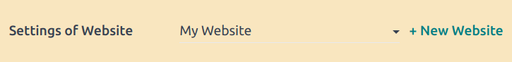
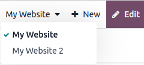
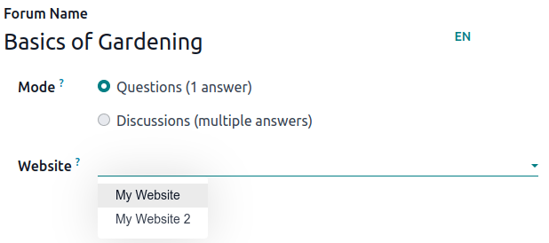
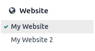
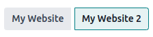

# Multiple websites

Odoo cho phép bạn tạo nhiều trang web khác nhau từ cùng một cơ sở dữ liệu. Điều này rất hữu ích, chẳng hạn nếu bạn có nhiều thương hiệu hoạt động dưới cùng một tổ chức, hoặc muốn tạo các trang web riêng biệt cho từng sản phẩm/dịch vụ, hoặc cho các đối tượng khác nhau. Trong những trường hợp này, việc có các trang web riêng giúp tránh gây nhầm lẫn và dễ dàng hơn trong việc điều chỉnh chiến lược tiếp cận số, nhắm đúng đối tượng mục tiêu.

Each website can be designed and configured independently with its own [domain name](applications/websites/website/configuration/domain_names.md), [theme](applications/websites/website/web_design/themes.md), [pages](applications/websites/website/pages.md), [menus](applications/websites/website/pages/menus.md), [languages](applications/websites/website/configuration/translate.md), [products](applications/websites/ecommerce/products.md), assigned sales team, etc. They can also
[share content and pages](#multi-website-website-content).

## Website creation

To create a new website, proceed as follows:

1. Go to Website ‣ Configuration ‣ Settings.
2. Click + New Website.
   
3. Specify the Website Name and Website domain. Each website must be
   published under its own [domain](applications/websites/website/configuration/domain_names.md).
4. Adapt the Company name, Languages and Default language
   if needed.
5. Click the Create button.

You can then start building your new website.

#### NOTE
By default, all website-related apps that you have installed (e.g. **eCommerce**,
**Forum**, **Blog**, etc.) and their related website pages are also available on the
new website. You can remove them by amending the website's menu.

## Switching websites

To switch from one website to another, click the menu next to the +New button in the
top right corner and select the website you want to switch to.

#### NOTE
When you switch websites, you are redirected to the homepage of the other website.

## Website-specific configuration

Most website settings are website-specific, which means they can be enabled/disabled per website. To
adapt the settings for a website, go to Website ‣ Configuration ‣ Settings.
Select the desired website in the field Settings of Website at the top of the
Settings page, in the **yellow** banner. Then, adapt the options for that specific
website.

#### NOTE
- Websites are created with the default settings; the settings are not copied from one website to
  the other.
- In a [multi-company environment](applications/general/companies.md), each website can be
  linked to a specific company in your database so that only company-related data (e.g.,
  products, jobs, events, etc.) is displayed on the website. To display company-specific data,
  set the desired company in the Company field.

### Content availability

Theo mặc định, các trang, sản phẩm, sự kiện,... được tạo từ frontend (sử dụng nút :guilabel: `+Mới`) chỉ khả dụng trên trang web mà nó được tạo. Tuy nhiên, các bản ghi được tạo từ backend sẽ khả dụng trên tất cả các trang web theo mặc định. Tính khả dụng của nội dung có thể được thay đổi trong backend, tại trường :guilabel: `Trang web`. Ví dụ, đối với sản phẩm, đi đến :menuselection: `Thương mại điện tử --> Sản phẩm`, sau đó chọn sản phẩm và đi đến tab :guilabel: `Bán hàng`. Đối với diễn đàn, hãy vào :menuselection: `Cấu hình --> Diễn đàn`, sau đó chọn diễn đàn.

Records and features can be made available:

- On all websites: leave the Website field empty;
- Only on one website: set the Website field accordingly;
- On some websites: in this case, you should duplicate the item and set the Website
  field.

#### Website pages

To modify the website on which a page is to be published, proceed as follows:

1. Go to Website ‣ Site ‣ Pages.
2. Open the search panel and select the website on which the page is currently published.
   
3. Tick the check box next to the page(s) you want to change.
4. Click the Website field and select the website, or empty it to publish the page on
   all websites.

#### NOTE
Each website must have its own homepage; you may not use the same homepage for several websites.

## eCommerce features

eCommerce features such as products, eCommerce categories, pricelists, discounts, payment providers,
etc. can be restricted to [a specific website](#website-field).

### Tài khoản khách hàng

You can [allow your customers to use the same account](applications/websites/ecommerce/customer_accounts.md) on all of your websites by enabling the Shared
Customer Accounts check box in the website settings.

### Định giá

Products can be priced differently based on the website using [pricelists](applications/websites/ecommerce/products/price_management.md#ecommerce-pricelists). The following configuration is required:

1. Go to Website ‣ Configuration ‣ Settings.
2. Scroll down to the Shop - Products section and select the Pricelists
   option Multiple prices per product.
3. Click Pricelists to define new pricelists or edit existing ones.
4. Select the pricelist or click New to create a new one, then select the
   Configuration tab and set the Website field.

## Báo cáo

### Phân tích

Each website has its own [analytics](applications/websites/website/reporting/analytics.md#analytics-plausible). To switch between websites, click
the buttons in the upper right corner.

### Other reporting data

Other reporting data such as eCommerce dashboard data, online sales analyses and visitors can be
grouped by website if necessary. Open the search panel and select Group by --> Website.
