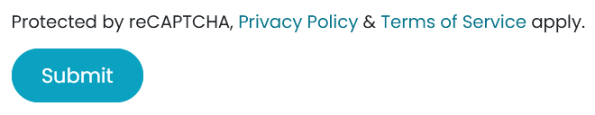
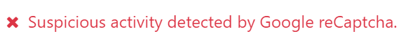

# Forms spam protection

[Cloudflare Turnstile](#cloudflare-turnstile) and [Google reCAPTCHA v3](#google-recaptcha)
protect website forms against spam and abuse. They attempt to distinguish between human and bot
submissions using non-interactive challenges based on telemetry and visitor behavior.

#### IMPORTANT
We recommend using **Cloudflare Turnstile** as reCAPTCHA v3 may not be compliant with local data
protection regulations.

#### NOTE
All pages using the Form, Newsletter Block, Newsletter Popup
snippets, and the eCommerce Extra Step During Checkout form are protected by both
tools.

#### SEE ALSO
- [Cloudflare Turnstile's documentation](https://developers.cloudflare.com/turnstile/)
- [Google's reCAPTCHA v3 guide](https://developers.google.com/recaptcha/docs/v3)

## Cloudflare Turnstile configuration

### Trên Cloudflare

- [Create](https://dash.cloudflare.com/sign-up) a Cloudflare account or use an existing one and
  [log in](https://dash.cloudflare.com/login).
- On the dashboard navigation sidebar, click Turnstile.
- On the Turnstile Sites page, click Add Site.
- Add a Site name to identify it easily.
- Enter or select the website's Domain (e.g., *example.com* or *subdomain.example.com*).
- Select a Widget Mode:
  - The Managed mode is **recommended**, as visitors can be prompted to check a box
    confirming they are human if deemed necessary by Turnstile.
    
  - For the Non-interactive and Invisible modes, visitors are never
    prompted to interact. In Non-interactive mode, a loading widget can be displayed to
    warn visitors that Turnstile protects the form; however, the widget is not supported by Odoo.

    #### NOTE
    If the Turnstile check fails, visitors are not able to submit the form, and the following
    error message is displayed:
    
- Nhấp Tạo.

The generated keys are then displayed. Leave the page open for convenience, as copying the keys in
Odoo is required next.

### Trên Odoo

- From the database dashboard, click Settings. Under Integrations, enable
  Cloudflare Turnstile and click Save.
- Open the Cloudflare Turnstile page, copy the Site Key, and paste it into the
  CF Site Key field in Odoo.
- Open the Cloudflare Turnstile page, copy the Secret Key, and paste it into the
  CF Secret Key field in Odoo.
- Nhấp Lưu.

## reCAPTCHA v3 configuration

#### WARNING
reCAPTCHA v3 may not be compliant with local data protection regulations.

### Trên Google

Open [the reCAPTCHA website registration page](https://www.google.com/recaptcha/admin/create). Log
in or create a Google account if necessary.

On the website registration page:

- Give the website a Label.
- Leave the reCAPTCHA type on Score based (v3).
- Enter one or more Domains (e.g., *example.com* or *subdomain.example.com*).
- Under Google Cloud Platform, a project is automatically selected if one was already
  created with the logged-in Google account. If not, one is automatically created. Click
  Google Cloud Platform to select a project yourself or rename the automatically created
  project.
- Agree to the terms of service.
- Nhấp Gửi.

A new page with the generated keys is then displayed. Leave it open for convenience, as copying the
keys to Odoo is required next.

### Trên Odoo

- From the database dashboard, click Settings. Under Integrations, enable
  reCAPTCHA if needed.

  #### WARNING
  Do not disable the reCAPTCHA feature or uninstall the Google reCAPTCHA
  integration module, as many other modules would also be removed.
- Open the Google reCAPTCHA page, copy the Site key, and paste it into the
  Site Key field in Odoo.
- Open the Google reCAPTCHA page, copy the Secret key, and paste it into the
  Secret Key field in Odoo.
- Change the default Minimum score (`0.70`) if necessary, using a value between `1.00`
  and `0.00`. The higher the threshold is, the more difficult it is to pass the reCAPTCHA, and vice
  versa.  Out of the 11 levels, only the following four score levels are available by default:
  `0.1`, `0.3`, `0.7` and `0.9`.
- Nhấp Lưu.

#### SEE ALSO
[Interpret reCAPTCHA scores - Google documentation](https://cloud.google.com/recaptcha/docs/interpret-assessment-website#interpret_scores)

You can notify visitors that reCAPTCHA protects a form. To do so, open the website editor and
navigate to the form. Then, click somewhere on the form, and on the right sidebar's
Customize tab, toggle Show reCAPTCHA Policy found under the Form
section.

#### NOTE
If the reCAPTCHA check fails, the following error message is displayed:

