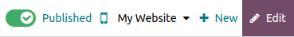
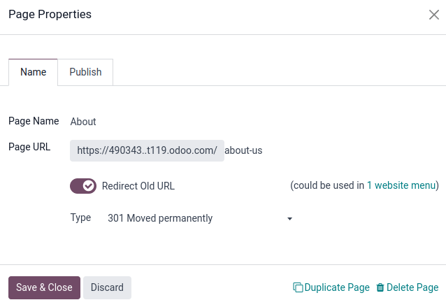

# Trang

Odoo allows you to create pages for your website and customize their content and appearance to your
needs.

Trang **tĩnh** có nội dung ổn định, như trang chủ. Bạn có thể tạo thủ công các trang mới, xác định URL của chúng, điều chỉnh các [thuộc tính](#website-page-properties),... Ngược lại, trang **động** được tạo tự động. Tất cả các trang được Odoo tạo tự động, ví dụ khi bạn cài đặt ứng dụng hoặc phân hệ (như `/shop` hoặc `/blog`) hoặc đăng sản phẩm hay blog mới, đều là trang động và được quản lý khác biệt.

## Tạo trang

Website pages can be created from the **frontend** and the **backend**. To create a new website
page, proceed as follows:

> 1. - Either open the **Website** app, click + New in the top-right corner, then select
>      Page;
>    - Or go to Website ‣ Site ‣ Pages and click New.
> 2. Enter a Page Title; this title is used in the menu and the page's URL.
> 3. Nhấp Tạo.
> 4. Customize the page's content and appearance using the website builder, then click
>    Save.
> 5. [Publish](#website-un-publish-page) the page.

#### NOTE
Disable Add to menu if the page should not appear in the menu.

## Quản lý trang

### Đăng/huỷ đăng trang

Pages need to be published to make them accessible to website visitors. To publish or unpublish a
page, access it and toggle the switch in the upper-right corner from Unpublished
to Published, or vice versa.

#### NOTE
It is also possible to:

> - publish/unpublish a page from the [page properties](#website-page-properties), where you
>   can define a publishing date and/or restrict the page's visibility if needed;
> - publish/unpublish several pages at once: go to Website ‣ Site ‣ Pages,
>   select the pages, then click Action and select Publish or
>   Unpublish.

### Trang chủ

When you create a website, Odoo creates a dedicated Home page by default, but you can
define any website page as your homepage. To do so, go to Website ‣ Configuration
‣ Settings, then, in the Website info section, define the URL of the desired page in
the field Homepage URL (e.g., `/shop`).

Alternatively, you can define any [static page](#website-page-type) as your homepage by going
to Website ‣ Site ‣ Properties. Select the Publish tab and enable
Use as Homepage.

### Page properties

To modify a [static page's](#website-page-type) properties, access the page you wish to
modify, then go to Site ‣ Properties.

The Name tab allows you to:

- rename the page using the Page Name field;
- modify the Page URL. In this case, you can redirect the old URL to the new one if
  needed. To do so, enable Redirect Old URL, then select the Type of
  [redirection](#website-url-redirection):
  - 301 Moved permanently: to redirect the page permanently;
  - 302 Moved temporarily: to redirect the page temporarily.

  

You can further adapt the page's properties in the Publish tab:

- Show in Top Menu: Disable if you don't want the page to appear in the menu;
- Use as Homepage: Enable if you want the page to be the homepage of your website;
- Indexed: Disable if you don't want the page to be shown in search engine results;
- Published: Enable to publish the page;
- Publishing Date: To publish the page at a specific moment, select the date,
  click the clock icon to set the time, then click the green check mark to validate your selection.
- Visibility: Select who can access the page:
  - Tất cả
  - Signed In
  - Restricted Group: Select the [user access group(s)](../../../general/users/access_rights.md) in the Authorized group field.
  - With Password: Enter the password in the Password field.

#### Duplicating pages

To duplicate a page, access the page, then go to Site ‣ Properties and click
Duplicate Page. Enter a Page Name, then click OK. By default,
the new page is added after the duplicated page in the menu, but you can remove it from the menu or
change its position using the [menu editor](menus.md).

#### Xoá trang

To delete a page, proceed as follows:

1. Access the page, then go to Site ‣ Properties and click Delete
   Page.
2. Một cửa sổ bật lên sẽ xuất hiện trên màn hình với tất cả liên kết tham chiếu đến trang bạn muốn xóa, được sắp xếp theo danh mục. Để đảm bảo khách truy cập trang web không truy cập vào trang lỗi 404, bạn phải cập nhật tất cả liên kết trên trang web tham chiếu đến trang đó. Để thực hiện việc này, hãy mở rộng một danh mục, sau đó nhấp vào liên kết để mở liên kết đó trong một cửa sổ mới. Ngoài ra, bạn có thể thiết lập [chuyển hướng](#website-url-redirection) cho trang đã xóa.
3. Once you have updated the links (or set up a [redirection](#website-url-redirection)),
   select the I am sure about this check box, then click OK.

### URL redirect mapping

Mapping chuyển hướng URL là việc chuyển hướng người truy cập và công cụ tìm kiếm đến một URL khác với URL họ yêu cầu ban đầu. Kỹ thuật này được sử dụng để tránh liên kết hỏng khi bạn [xóa trang](#website-delete-page), [thay đổi URL](#website-page-properties) hoặc di chuyển trang web từ nền tảng khác sang [miền](../configuration/domain_names.md) Odoo. Nó cũng có thể được dùng để cải thiện trang/seo.

To access existing URL redirections and create new ones, [activate the developer mode](../../../general/developer_mode.md) and go to Website ‣ Configuration ‣
Redirects.

#### NOTE
- A redirect record is added automatically every time you [modify a page's URL](#website-page-properties) and enable Redirect Old URL.
- You can set up redirections for [static and dynamic pages](#website-page-type).

To create a new redirection, click the New button, then fill in the fields:

- Name: Enter a name to identify the redirect.
- Action: Select the type of redirection:
  > - 404 Not found: visitors are redirected to a 404 error page when they try to access
  >   an unpublished or deleted page.
  > - 301 Moved Permanently: for permanent redirections of unpublished or deleted
  >   [static pages](#website-page-type). The new URL is shown in search engine results, and the
  >   redirect is cached by browsers.
  > - 302 Moved Temporarily: for short-term redirections, for example, if you are
  >   redesigning or updating a page. The new URL is neither cached by browsers nor shown in search
  >   engine results.
  > - 308 Redirect/Rewrite: for permanent redirections of existing [dynamic pages](#website-page-type). The URL is renamed; the new name is shown in search engine results and is
  >   cached by browsers. Use this redirect type to rename a dynamic page, for example, if you wish
  >   to rename `/shop` into `/market`.
- URL from: Enter the URL to be redirected (e.g., `/about-the-company`) or search for
  the desired [dynamic page](#website-page-type) and select it from the list.
- URL to: For 301, 302, and 308 redirects, enter the URL to be redirected to. If you want
  to redirect to an external URL, include the protocol (e.g., `https://`).
- Website: Select a specific website.
- Sequence: To define the order in which redirections are performed, e.g., in the case
  of redirect chains (i.e., a series of redirects where one URL is redirected to another one, which
  is itself further redirected to another URL).

Toggle the Activate switch to deactivate the redirection.

#### IMPORTANT
404, 301, and 302 redirections are meant to migrate traffic from
[unpublished](#website-un-publish-page) or [deleted](#website-delete-page) pages
to *new* pages, while the 308 redirect is used for *permanent* redirections of *existing* pages.

#### SEE ALSO
- [Google documentation on redirects and search](https://developers.google.com/search/docs/crawling-indexing/301-redirects)
- [Search Engine Optimization (SEO)](seo.md)

* [Menu](menus.md)
* [Search Engine Optimization (SEO)](seo.md)
