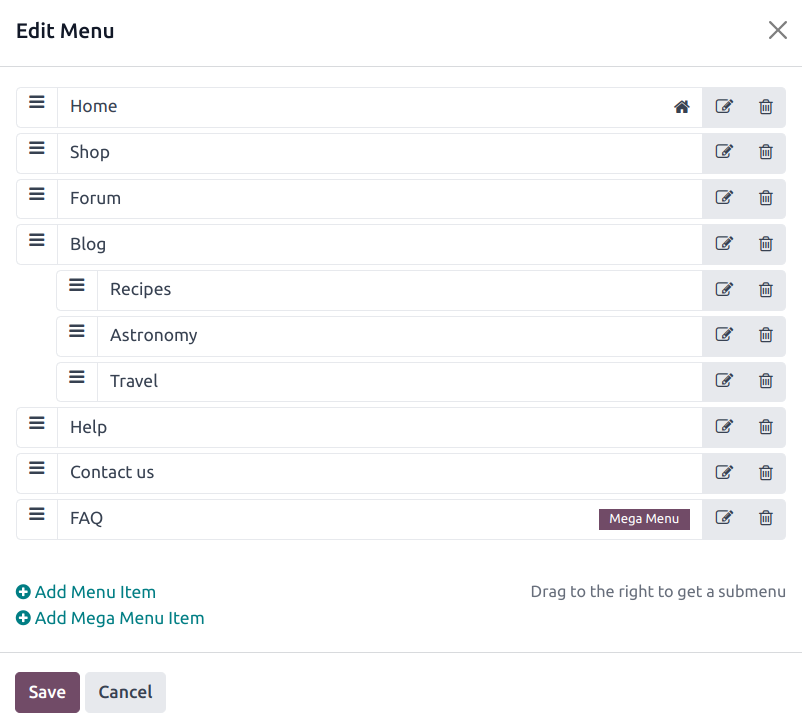
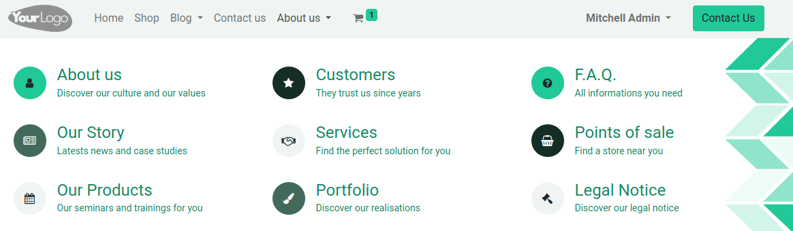

# Menu

Menus are used to organize your website’s content and help visitors navigate through your web pages
effectively. User-friendly and well-structured website menus also play a crucial role in improving
[search engine rankings](applications/websites/website/pages/seo.md).

Odoo allows you to customize the content and appearance of your website's menu to your needs.

## Trình chỉnh sửa menu

The menu editor allows you to edit your website's menu and add [regular menu items](#website-regular-menus) and [mega menus](#website-mega-menus).

To edit your website's menu, go to Website ‣ Site ‣ Menu Editor. From there,
you can:

- **rename** a menu item or change its URL using the Edit Menu Item icon;
- **delete** a menu item using the Delete Menu Item icon;
- **move** a menu item by dragging and dropping it to the desired place in the menu;
- **create a regular drop-down menu** by dragging and dropping the sub-menu items to the right,
  underneath their parent menu.

#### NOTE
You can also access the menu editor by clicking Edit, selecting any menu item and
clicking the Edit Menu icon.

### Adding regular menu items

By default, pages are added to the menu as regular menu items when [they are created](applications/websites/website/pages.md). You can also add regular menu items from the menu editor by clicking Add
Menu Item. Enter the Name and URL of the related page in the pop-up window that appears
on the screen and click OK.

### Adding mega menus

Menu chính tương tự như menu thả xuống, nhưng thay vì danh sách tiểu menu đơn giản, chúng lại hiển thị một bảng chia thành các nhóm tùy chọn điều hướng. Do đó, chúng phù hợp với các trang web có lượng nội dung lớn, vì chúng có thể giúp đưa tất cả trang trên trang web của bạn vào menu trong khi vẫn cho phép tất cả mục menu hiển thị cùng một lúc. Menu chính cũng có thể được cấu trúc trực quan hơn so với menu thả xuống thông thường, ví dụ, thông qua bố cục, kiểu chữ và biểu tượng.

To create a mega menu, go to Website ‣ Site ‣ Menu Editor and click
Add Mega Menu Item. Enter the Name of the mega menu in the pop-up, click
OK, then Save.

To adapt the options and layout of the mega menu, click it in the navigation bar, then click
Edit. Mega menus are composed of building blocks, which means you can customize each
component individually using inline formatting, as well as the options available in the
Customize tab in the website builder. For example, you can:

- edit the text directly in the building block;
- edit a menu item's URL by selecting the menu item, then clicking the Edit link button
  in the small preview pop-up. Type `/` to search for a page on your website, or `#` to search for
  an existing custom anchor.
  
- move a menu item by dragging and dropping the related block to the desired position in the mega
  menu;
- delete a menu item by deleting the related block.

## Header and navigation bar appearance

To customize the appearance of your website's menu, click Edit, then select the
navigation bar or any menu item. You can then adapt the fields in the Header and
Navbar sections in the Customize tab in the website builder.
