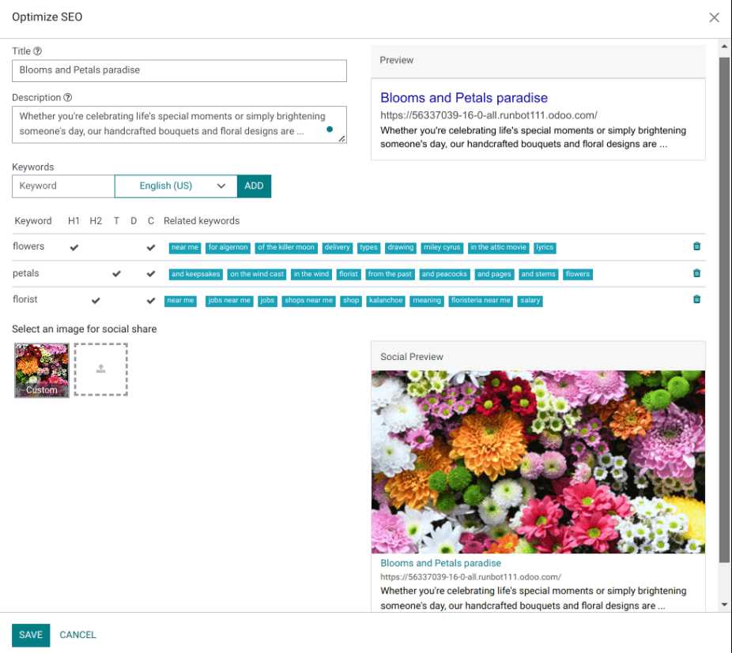
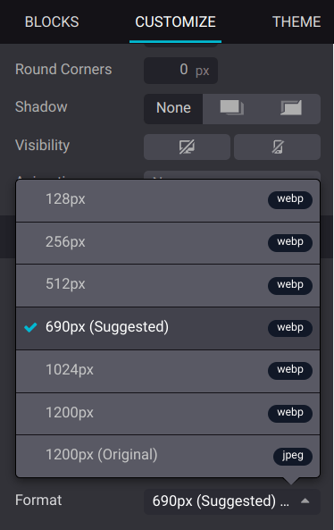
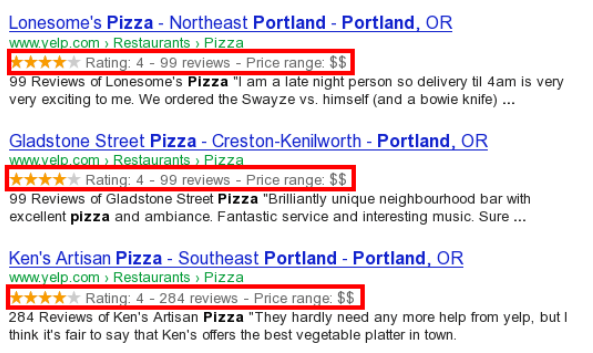

# Search Engine Optimization (SEO)

Search Engine Optimization, often abbreviated as SEO, is a digital marketing strategy to improve a
website's visibility and ranking in search engine results (e.g., in Google). It involves optimizing
various elements on your website, including its content, social sharing, URLs, images, and page
speed.

#### NOTE
- Odoo provides several modules to help you build your website content, such as
  [eCommerce](../../ecommerce.md), [Blog](../../blog.md), [eLearning](../../elearning.md), and [Forum](../../forum.md).
- All Odoo [themes](../web_design/themes.md) rely on the CSS Framework [Bootstrap](https://getbootstrap.com/) to render efficiently according to the device: desktop, tablet,
  or mobile, which positively impacts ranking in search engines.

## Content optimization

To optimize a webpage's SEO, access the page, then go to Website ‣ Site ‣
Optimize SEO.

### Meta tags

Meta tags are HTML elements that provide information about a webpage to search engines and website
visitors. They play a crucial role in SEO by helping search engines understand the content and
context of a webpage and attract visitors with appealing content. There are two types of meta tags
in Odoo:

- Title tags specify a webpage's title and are displayed as a clickable link in search
  engine results. They should be concise, descriptive, and relevant to the page's content. You can
  update the title tag of your webpage or keep it empty to use the default value based on the page’s
  content.
- Description tags summarize the webpage's content, often displayed in search engine
  results below the title. They are used to encourage the user to visit the page. You can update
  the description tag of your webpage or keep it empty to use the default value based on the page’s
  content.

#### NOTE
The Preview card displays how the title and description tags should appear in search
results. It also includes the URL of your page.

### Các từ khóa

Keywords are one of the main elements of SEO. A website that is well optimized for search engines
speaks the same language as potential visitors, with keywords for SEO helping them to connect to
your site.

Bạn có thể nhập các từ khóa quan trọng vào trường Từ khóa và nhấp THÊM để xem cách chúng được sử dụng ở các cấp độ khác nhau trong nội dung (H1, H2, tiêu đề trang, mô tả trang, nội dung trang) cùng với các tìm kiếm liên quan trên Google. Công cụ này cũng đề xuất các từ khóa phù hợp để tăng lưu lượng truy cập web. Trang web của bạn càng chứa nhiều từ khóa thì càng tốt.

### Image for social share

When you share your page on social media, your logo image is selected, but you can upload any other
image by clicking the upward arrow.

#### NOTE
- The Social Preview card displays how the page's information would appear when
  shared.
- If you change the title of a blog post or the name of a product, the changes apply
  automatically everywhere on your website. The old link still functions when external websites
  use a [301 redirect](../pages.md#website-url-redirection), maintaining the SEO link juice.

## Hình ảnh

The size of images has a significant impact on page speed, which is an essential criterion for
search engines to optimize SEO ranking.

Odoo tự động nén các hình ảnh được tải lên và chuyển đổi chúng sang định dạng `Webp`. Với định dạng tệp này, ảnh có kích thước nhỏ hơn, giúp tăng tốc độ tải trang và do đó cải thiện thứ hạng SEO. Tất cả hình ảnh được sử dụng trong [giao diện](../web_design/themes.md) chính thức của Odoo cũng được nén theo mặc định. Nếu bạn đang sử dụng một giao diện từ bên thứ ba, có thể giao diện đó cung cấp hình ảnh không được nén hiệu quả.

**To modify an image** from your website, select the image, click Edit, then go to the
Customize tab, and adapt the Format in the Image section.

#### IMPORTANT
Thẻ alt được sử dụng để cung cấp ngữ cảnh cho nội dung mà hình ảnh hiển thị, giúp các trình thu thập dữ liệu của công cụ tìm kiếm hiểu và lập chỉ mục hình ảnh một cách chính xác. Từ góc độ SEO, việc thêm từ khóa thẻ alt vào trường Mô tả là rất quan trọng. Mô tả này sẽ được thêm vào mã HTML của hình ảnh và sẽ hiển thị khi hình ảnh không thể được hiển thị.

## Advanced features

### Structured data markup

Structured data markup is used to generate rich snippets in search engine results. It is a way for
websites to send structured data to search engine robots, helping them understand your content and
create well-presented search results.

By default, Google supports many [rich snippets](https://developers.google.com/search/blog/2009/05/introducing-rich-snippets)
for content types, including Reviews, People, Products, Businesses, Events, and Organizations.

Microdata là một tập hợp thẻ, xuất hiện cùng HTML5, giúp công cụ tìm kiếm hiểu rõ hơn nội dung của bạn và hiển thị nó một cách phù hợp. Odoo triển khai microdata theo [đặc tả](https://schema.org/docs/gs.html) của schema.org cho sự kiện, sản phẩm thương mại điện tử, bài đăng diễn đàn và địa chỉ liên hệ. Điều này cho phép trang sản phẩm của bạn hiển thị trên Google với các thông tin bổ sung như giá cả và đánh giá sản phẩm:

### robots.txt

A robots.txt file tells search engine crawlers which URLs the crawler can access on your site, to
index its content. This is used mainly to avoid overloading your site with requests.

When indexing your website, search engines take a first look at the robots.txt file. Odoo
automatically creates one robot.txt file available on `mydatabase.odoo.com/robots.txt`.

By editing a robots.txt file, you can control which site pages are accessible to search engine
crawlers. To add custom instructions to the file, go to Website ‣ Configuration
‣ Settings, scroll down to the SEO section, and click Edit robots.txt.

### Sơ đồ trang web

The sitemap points out website pages and their relation to each other to search engine robots. Odoo
generates a `/sitemap.xml` file, including all URLs. For performance reasons, this file is cached
and updated every 12 hours.

#### NOTE
If your website has a lot of pages, Odoo automatically creates a Sitemap Index file, respecting
the [sitemaps.org protocol](http://www.sitemaps.org/protocol.html), grouping sitemap URLs in
45000 chunks per file.

Every sitemap entry has three attributes that are computed automatically:

- `<loc>`: the URL of a page.
- `<lastmod>`: last modification date of the resource, computed automatically based on the related
  object. For a page related to a product, this could be the last modification date of the product
  or the page.
- `<priority>`: modules may implement their priority algorithm based on their content (for example,
  a forum might assign a priority based on the number of votes on a specific post). The priority of
  a static page is defined by its priority field, which is normalized (16 is the default).

### Hreflang HTML tags

Odoo automatically includes `hreflang` and `x-default` tags in the code of your website's
multilingual pages. These HTML attributes are crucial in informing search engines about a specific
page's language and geographical targeting.

#### SEE ALSO
[Dịch thuật](../configuration/translate.md)
