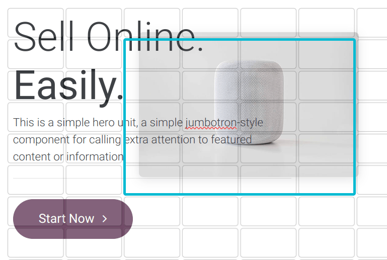
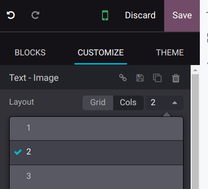
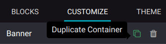
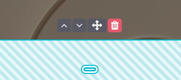
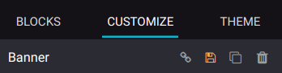
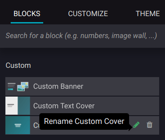
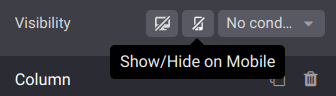

# Khối dựng

Building blocks let you design your website quickly by dragging and dropping them onto your web
pages. Four types of building blocks are available depending on their use:
[Structure](structure.md), [Features](features.md),
[Dynamic Content](dynamic_content.md), and
[Inner Content](inner_content.md).

#### SEE ALSO
[Odoo Tutorial: Design your first webpage](https://www.odoo.com/slides/slide/design-your-website-images-and-motion-6931?fullscreen=1)

## Adding a building block

To add a building block to your website page, click Edit, select the desired building
block, and drag and drop it to your page. You can add as many blocks as needed.

To edit the content of a building block, click on it and go to the Customize tab, where
available features depend on the block you selected.

## Color preset and background

You can customize and apply color presets to building blocks. To proceed, select a building block,
go to the Customize tab, click the Background button, and select a
Preset.

When you modify a color preset, all elements using it are automatically updated to match the new
configuration.

#### SEE ALSO
[Website themes](../themes.md)

## Layout: grid and columns

You can choose between two layout styles for most building blocks: [grid](#building-blocks-grid) or [columns (cols)](#building-blocks-cols). To change the default
layout, go to the Customize tab. Under the Banner section, select
Grid or Cols as the Layout.

### Lưới

The Grid layout allows you to reposition and resize elements, such as images or text, by
dragging and dropping them.

### Cột

Choosing the Cols layout allows you to determine the number of elements per line within
the block. To do so, select the block to modify, click the Cols Layout, and
adjust the number.

By default, **on mobile devices**, one element is visible per line to ensure that content remains
easily readable and accessible on smaller screens. To adjust the value, click the <i class="fa fa-mobile"></i>
(mobile icon) at the top of the website editor and adapt the number of columns.

## Duplicating a building block

You can duplicate a building block by clicking on the duplicate icon. Once duplicated, the new block
appears on your website beneath the original one.

## Reordering a building block

To reorder a building block, select it and click the up arrow to move it before the previous block
or click the down arrow to move it after.

You can also use the drag-and-drop icon to move a block manually.

## Saving a custom building block

You can save a customized building block and reuse it elsewhere. To do so, select it, navigate to
the Customize tab, and click the <i class="fa fa-floppy-o"></i> (floppy disk) icon to
save it.

Saved building blocks are available in the Custom section of the Blocks tab.
Click the <i class="fa fa-pencil"></i> (pen) icon to edit their name.

## Chế độ hiển thị

### Visibility on desktop/mobile

You can hide specific elements depending on the visitor's device. To do so, select the element to
hide, and in the Customize tab, scroll down to Visibility, and click the
Show/Hide on Mobile or the Show/Hide on Desktop icon.

### Conditional visibility

You can also hide or show building blocks using other conditions. To do so, select an element, go to
Visibility, click No condition, and select Conditionally
instead. Then, configure the condition(s) to apply by selecting Visible for or
Hidden for and which Records will be impacted.

#### SEE ALSO
[Link Tracker](../../reporting/link_tracker.md)

### Invisible elements

Depending on the visibility settings, some elements can become hidden from your current view. To
make a building block visible again, go to the Invisible Elements section at the bottom
of the configurator and select a building block.

## Mobile view customization

You can customize building block elements for the mobile view without impacting the desktop view.
To do so, open the website editor, click the <i class="fa fa-mobile"></i> (mobile) icon at the top,
and select the building block element. Then, you can:

- reorder the elements by clicking the <i class="fa fa-angle-left"></i> <i class="fa fa-angle-right"></i>
  (left/right arrow) icons;
- edit the [Cols](#building-blocks-cols) and [Visibility](#building-blocks-visibility)
  features in the Customize tab of the website editor.

* [Cấu trúc lương](structure.md)
* [Tính năng](features.md)
* [Dynamic content](dynamic_content.md)
* [Nội dung bên trong](inner_content.md)
