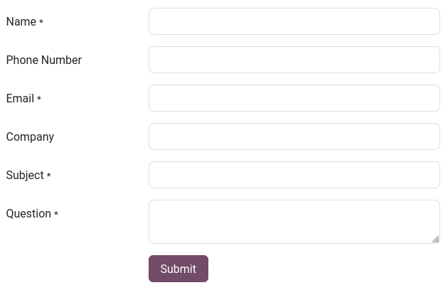
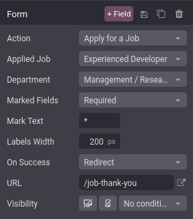
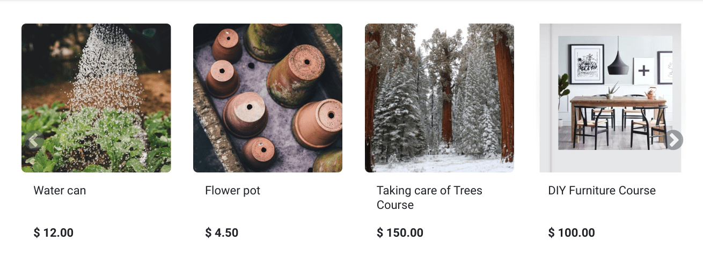
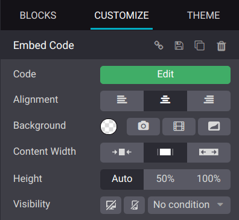

# Dynamic content

The Dynamic Content [building blocks](./), such as
[Form](#website-dynamic-content-form), [Products](#website-dynamic-content-products),
[Embed Code](#website-dynamic-content-embed-code), or [Blog Posts](../../../blog.md), help
you create interactive and visually appealing layouts for your web [pages](../../pages/).

#### NOTE
To add a building block, click Edit, select the desired building block under the
Blocks tab, and drag and drop it onto the page. To access its settings, click it and
go to the Customize tab, where the available options depend on the type of block
selected.

## Biểu mẫu

The Form block is used to collect information from website visitors and create records
in your database.

### Tác vụ

By default, submitting the form **sends you an email** containing what the visitor entered.
Depending on the apps installed on your database, new actions that can automatically create records
become available:

- Apply for a Job (Recruitment)
- Create a Customer (eCommerce)
- Create a Ticket (Helpdesk)
- Create an Opportunity (CRM)
- Subscribe to Newsletter (Email Marketing)
- Create a Task (Project)

Select another action with the Action field found under the Customize tab's
Form section.

By default, actions redirect visitors to a *thank you* page after submitting the form. Use the
URL field to change where they are redirected. It is also possible to let visitors stay
on the form's page by selecting Nothing or Show Message under the
On Success field.

### Trường

To add a new field to the form, click the + Field button found next to the Customize
tab's Form or Field section. By default, new fields are *text* fields. To
change the type, use the Type field and select an option under the Custom
Field heading.

It is also possible to select an Existing Field from a database and use the data it
contains. The fields available depend on the selected action.

## Sản phẩm

The Products block is available after installing the eCommerce app. It is used to
display a selection of products sold on your website.

By default, the block displays the Newest Products. To change which products are shown,
go to the Customize tab's Products section and select as Filter
the Recently Sold Products or Recently Viewed Products option.

In addition, it is possible to display products from a single category only by selecting one with
the Category field.

## Mã nhúng

Embedding code allows you to integrate content from third-party services into a page, such as videos
from YouTube, maps from Google Maps, social media posts from Instagram, etc.

After adding the block to a page, click the Edit button found under the
Customize tab's Embed Code section and enter the code, replacing the code
used to show the block's instructions.
