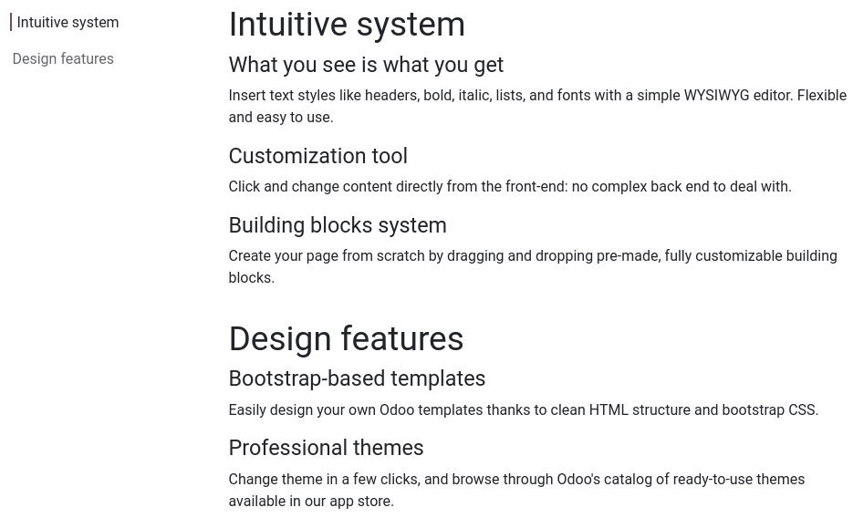

# Tính năng

The Features [building blocks](../building_blocks.md) allow you to list multiple
items next to each other.

The [Table of Content](#features-table-of-content) and the [Call to Action](#features-call-to-action) blocks are presented below.

#### NOTE
To add a building block, click Edit, select the desired building block under the
Blocks tab, and drag and drop it onto the page. To access its settings, click it and
go to the Customize tab, where the available options depend on the type of block
selected.

## Table of content

The Table of Content block is used to list many different items grouped under several
headings. A clickable index is available to navigate quickly between the different categories.

## Call to action

The Call to Action block is used to prompt visitors to take a specific action, such
as signing up for a newsletter or contacting you.

To change the button's link, select it, go to the Customize tab's Inline
Text section and replace `/contactus` with another URL.
