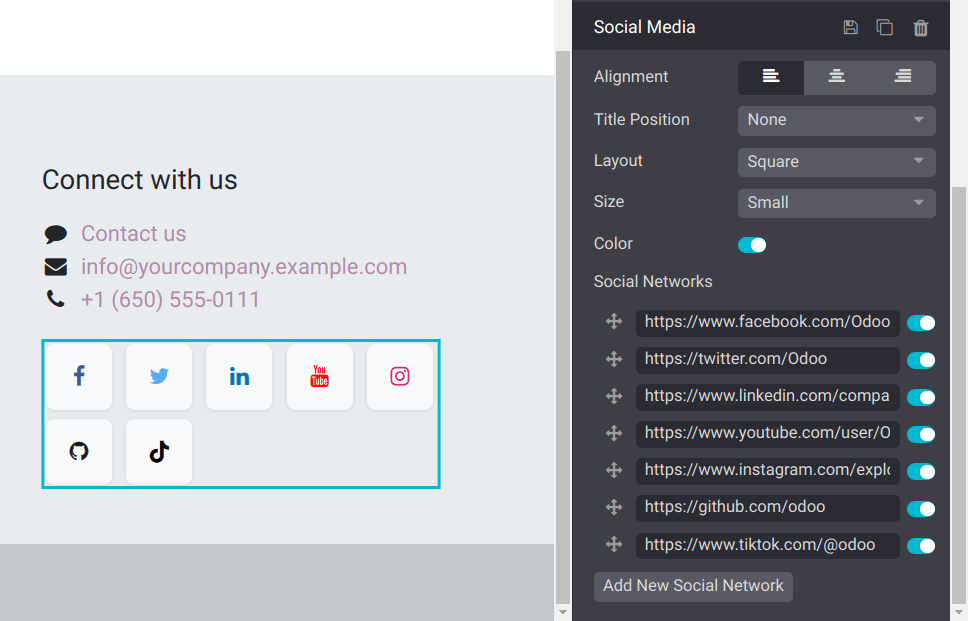

# Nội dung bên trong

The Inner content [building blocks](./) allow you to add elements
such as videos, images, and [social media buttons](#inner-content-social-media), into
pre-existing blocks.

#### NOTE
To add a building block, click Edit, select the desired building block under the
Blocks tab, and drag and drop it onto the page. To access its settings, click it and
go to the Customize tab, where the available options depend on the type of block
selected.

## Mạng xã hội

The Social Media block inserts clickable buttons leading to your social network's URL.
By default, the buttons display the icons of seven major social networks. You can click
Add New Social Network to create a new button and switch the buttons next to a URL to
turn them on or off.

#### NOTE
Bạn không thể chỉnh sửa các biểu tượng mặc định nhưng có thể chỉnh sửa những biểu tượng đã thêm bằng cách nhấp Thêm mạng xã hội mới. Để thực hiện, chọn biểu tượng, sau đó nhấp nút Thay thế trong phần Biểu tượng của tab Tùy chỉnh, và chọn một trong các biểu tượng có sẵn hoặc nhấp tab Hình ảnh để tải lên hình ảnh hoặc thêm URL.
