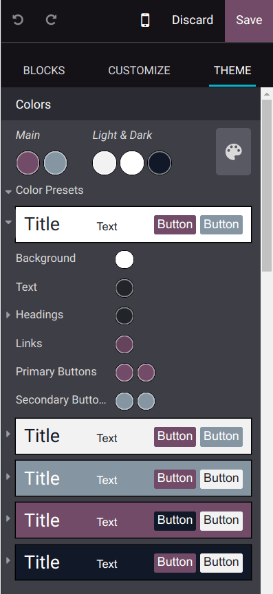
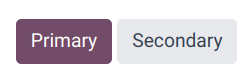

# Chủ đề trang web

Odoo cung cấp nhiều chủ đề để tô điểm trang web của bạn, bao gồm màu sắc, phông chữ và bố cục. Khi thiết lập trang web của bạn bằng công cụ cấu hình trang web của Odoo, bạn sẽ được yêu cầu chọn một chủ đề phù hợp với phong cách mong muốn của mình. Nếu bạn muốn thay đổi các tùy chọn chủ đề sau này, hãy vào trình tạo trang web bằng cách nhấp vào nút Chỉnh sửa và truy cập vào tab Chủ đề. Các phần sau đây có sẵn:

- Colors: The website builder relies on palettes composed of five colors: two
  Main colors and three Light & Dark colors.

  You can also customize the Color Presets that have been defined automatically by the
  website builder according to the five colors defined above. Click the arrow next to a color preset
  to update it. Each color preset contains colors for your building block's Background,
  Text, Headings, Links, Primary Buttons, and
  Secondary Buttons.
  

  **To apply a color preset** to a building block of your site, select it, go to the
  Customize tab, click the Background button, and select the preset.

  #### NOTE
  Changing a color preset automatically updates the colors of both the default preset and the
  building blocks where the preset is used.
- Website: From this section, you can Switch Theme,
  [Add a Language](../configuration/translate.md), select the Page Layout, and
  customize the Background by uploading your own image.
- Paragraph: Customize the formatting of your website's paragraph `
` elements.
- Headings: Customize the formatting of your headings.
- Button: Customize the Primary Style and Secondary Style
  buttons.
  
- Link: To edit the style of the hyperlinks available on your website.
- Input Fields: Customize fields where you can enter data, e.g., a search bar or a form.
- Advanced: You can hide the header bar of your website using the
  Show Header button, inject [head and body code](../reporting/analytics.md#analytics-google-tag-manager),
  enter your Google Map Custom Key, change the colors of the Success,
  Info, Warning, and Error pop up messages by clicking the
  related Status Colors buttons, and customize the Grays elements of your
  site.
