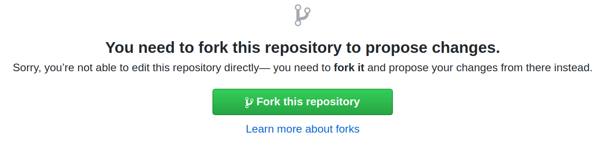
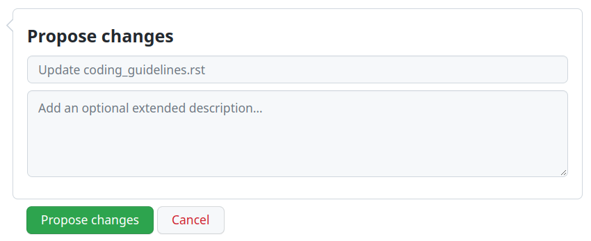

# Documentation

* [Content guidelines](content_guidelines.md)
* [RST guidelines and cheat sheet](rst_guidelines.md)

This introductory guide will help you acquire the tools and knowledge needed to contribute to the
documentation.

Read the [introduction to the reStructuredText language](#contributing-documentation-rst-intro)
if you are not familiar with it. Then, there are two courses of action to start contributing to the
documentation:

- **For minor changes**, such as adding a paragraph or fixing a typo, we recommend **using the
  GitHub interface**. This is the easiest and fastest way to submit changes, and it is suitable for
  non-technical people. Jump directly to the [Contributing to the documentation](#contributing-documentation-first-contribution)
  section to get started.
- **For more complex changes**, such as adding a new page, it is necessary to **use Git** and work
  from a local copy of the documentation. Follow the instructions in the
  [Environment setup](#contributing-documentation-setup) section first to prepare your environment.

#### SEE ALSO
[Discover other ways to contribute to Odoo](../)

<a id="contributing-documentation-rst-intro"></a>

## reStructuredText (RST)

The documentation is written in **reStructuredText** (RST), a [lightweight markup language](https://en.wikipedia.org/wiki/Lightweight_markup_language) consisting of regular text augmented
with markup, which allows including headings, images, notes, and so on.  is easy to use, even if you are not familiar with it.

#### IMPORTANT
Be mindful of our [content](content_guidelines.md) and
[RST](rst_guidelines.md) guidelines as you write documentation. This ensures
that the documentation stays consistent and facilitates the approval of changes by the Odoo team.

<a id="contributing-documentation-setup"></a>

## Environment setup

The instructions below help you prepare your environment for making local changes to the
documentation and then push them to GitHub. Skip this section and go to
[Contributing to the documentation](#contributing-documentation-first-contribution) if you have already completed this step or want
to make changes from the GitHub interface.

1. First, [create a GitHub account](https://github.com/join). Odoo uses GitHub to manage the
   source code of its products, and this is where you will submit your changes.
2. [Generate a new SSH key and register it on your GitHub account](https://docs.github.com/en/authentication/connecting-to-github-with-ssh).
3. Go to [github.com/odoo/documentation](https://github.com/odoo/documentation) and click on the
   Fork button in the top right corner to create a fork () of the
   repository on your account. This creates a copy of the codebase to which you can make changes
   without affecting the main codebase. Skip this step if you work at Odoo.
4. [Install Git](https://git-scm.com/book/en/v2/Getting-Started-Installing-Git). It is a command-line
   () tool that allows tracking the history of changes made to a file and, more
   importantly, working on different versions of that file simultaneously. It means you do not need to
   worry about overwriting someone else’s pending work when making changes.

   Verify that the installation directory of Git is included in your system's `PATH` variable.

   Linux and macOS

   Follow the [guide to update the PATH variable on Linux and macOS](https://unix.stackexchange.com/a/26059) with the installation path of Git (by default
   `/usr/bin/git`).

   Windows

   Follow the [guide to update the PATH variable on Windows](https://www.howtogeek.com/118594/how-to-edit-your-system-path-for-easy-command-line-access/)
   with the installation path of Git (by default `C:\Program Files\Git`).
5. Configure Git to identify yourself as the author of your future contributions. Enter the same
   email address you used to register on GitHub.
   ```console
   $ git config --global user.name "Your Name"
   $ git config --global user.email "youremail@example.com"
   ```
6. Clone the sources with Git and navigate into the local repository.
   ```console
   $ git clone git@github.com:odoo/documentation.git
   $ cd documentation
   ```
7. Configure Git to push changes to your fork rather than to the main codebase. In the commands
   below, replace `<your_github_account>` with the name of the GitHub account on which you created
   the fork. Skip this step if you work at Odoo.
   ```console
   $ git remote add dev git@github.com:<your_github_account>/documentation.git
   ```
8. Configure Git to ease the collaboration between writers coming from different systems.

   Linux and macOS
   ```console
   $ git config --global core.autocrlf input
   $ git config commit.template `pwd`/commit_template.txt
   ```

   Windows
   ```console
   $ git config --global core.autocrlf true
   $ git config commit.template %CD%\commit_template.txt
   ```
9. Install the latest release of [Python](https://wiki.python.org/moin/BeginnersGuide/Download)
   and [pip](https://pip.pypa.io/en/stable/installation/).
10. Install the Python dependencies of the documentation with pip.
    ```console
    $ pip install -r requirements.txt
    ```

    Verify that the installation directory of the Python dependencies is included in your system's
    `PATH` variable.

    Linux and macOS

    Follow the [guide to update the PATH variable on Linux and macOS](https://unix.stackexchange.com/a/26059) with the installation path of the Python
    dependencies (by default `~/.local/bin`).

    Windows

    Follow the [guide to update the PATH variable on Windows](https://www.howtogeek.com/118594/how-to-edit-your-system-path-for-easy-command-line-access/)
    with the installation path of the Python dependencies.
11. Install Make.

    Linux
    ```console
    $ sudo apt install make -y
    ```

    macOS

    Follow the [guide to install Make on macOS](https://formulae.brew.sh/formula/make)

    Windows

    Follow the [guide to install Make on Windows](https://www.technewstoday.com/install-and-use-make-in-windows).
12. [Install pngquant](https://pngquant.org/).
13. You are now ready to [make your first contribution](#contributing-documentation-first-contribution) with Git.

<a id="contributing-documentation-first-contribution"></a>

## Contributing to the documentation

Contribute from the GitHub interface

1. First, [create a GitHub account](https://github.com/join). Odoo uses GitHub to manage the
   source code of its products, and this is where you will submit your changes.
2. Verify that you are browsing the documentation in the version that you intend to change.
   The version can be selected from the dropdown in the top menu.
3. Head to the page that you want to change and click on the Edit on GitHub button
   in the top right corner of the page.
4. Click on the Fork this repository button to create a fork () of the repository on your account. This creates a copy of the codebase to which you
   can make changes without affecting the main codebase. Skip this step if you work at Odoo.
   
5. Make the desired changes while taking care of following the [content](content_guidelines.md) and [RST](rst_guidelines.md)
   guidelines.
6. Scroll to the bottom of the page and fill out the small form to propose your changes. In
   the first text box, write a very short summary of your changes. For instance, "Fix a typo"
   or "Add documentation for invoicing of sales orders." In the second text box, explain *why*
   you are proposing these changes. Then, click on the Propose changes button.
   
7. Review your changes and click on the Create pull request button.
8. Tick the Allow edits from maintainer checkbox. Skip this step if you work at
   Odoo.
9. Review the summary that you wrote about your changes and click on the Create
   pull request button again.
10. At the bottom of the page, check the mergeability status and address any issues.
11. As soon as your  is ready for merging, a member of the Odoo team
    is automatically assigned for review. If the reviewer has questions or remarks, they will
    post them as comments and you will be notified by email. Those comments must be resolved
    for the contribution to go forward.
12. Once your changes are approved, the reviewer merges them and they appear online the next
    day.

Contribute with Git

#### IMPORTANT
Some steps of this guide require to be comfortable with Git. Here are some [tutorials](https://www.atlassian.com/git/tutorials) and an [interactive training](https://learngitbranching.js.org/) if you are stuck at some point.

Now that your environment is set up, you can start contributing to the documentation. In a
terminal, navigate to the directory where you cloned the sources and follow the guide below.

1. Choose the version of the documentation to which you want to make changes. Keep in mind
   that contributions targeting an [unsupported version of Odoo](../../administration/supported_versions.md) are not accepted. This guide assumes that the changes
   target the documentation of Odoo 17, which corresponds to branch
   `17.0`.
2. Create a new branch starting from branch 17.0. Prefix the branch name with the
   base branch: `17.0-...`. If you work at Odoo, suffix the branch name with your
   Odoo handle: `17.0-...-xyz`.
3. Make the desired changes while taking care of following the [content](content_guidelines.md) and [RST](rst_guidelines.md)
   guidelines.
4. Compress all PNG images that were added or modified.
   ```console
   $ pngquant path/to/image.png
   $ mv path/to/image-fs8.png path/to/image.png
   ```
5. Write a [redirect rule](https://github.com/odoo/documentation/tree/17.0/redirects/MANUAL.md) for every RST
   file that were renamed.
6. Build the documentation with **make**. Then, open `_build/index.html` in a web
   browser to browse the documentation with your changes.
7. Commit your changes. Write a clear commit message as instructed in the [Git guidelines](../development/git_guidelines.md).
   ```console
   $ git add .
   $ git commit
   ```
8. Push your changes to your fork, for which we added the remote alias `dev`.

   If you work at Odoo, push your changes directly to the main codebase whose remote alias is
   `origin`.
9. Open a  on GitHub to submit your changes for review.
   1. Go to the [compare page of the odoo/documentation codebase](https://github.com/odoo/documentation/compare).
   2. Select **17.0** for the base.
   3. Click on compare across forks.
   4. Select **<your_github_account>/odoo** for the head repository. Replace
      `<your_github_account>` with the name of the GitHub account on which you created the
      fork. Skip this step if you work at Odoo.
   5. Review your changes and click on the Create pull request button.
   6. Tick the Allow edits from maintainer checkbox. Skip this step if you work at
      Odoo.
   7. Complete the description and click on the Create pull request button again.
10. At the bottom of the page, check the mergeability status and address any issues.
11. As soon as your  is ready for merging, a member of the Odoo team
    is automatically assigned for review. If the reviewer has questions or remarks, they will
    post them as comments and you will be notified by email. Those comments must be resolved
    for the contribution to go forward.
12. Once your changes are approved, the reviewer merges them and they appear online the next
    day.
